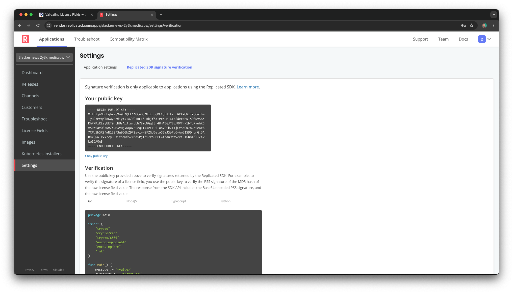

The Replicated SDK provides an in-cluster API for the Replicated Platform. One
of its core features is access to the complete customer license. We're going
to run some simple shell commands against the SDK to show how your team can
validate entitlements as part of your application.

Everything we're doing in this lab you would generally do as part of your
application code. We're using shell commands here since Replicated customers
work with many different programming languages, but everyone knows `curl` and
its friends.

The Replicated SDK
==================

The SDK runs alongside your application and enables access to the Replicated
Platform without having to make calls outside of the cluster. It in turn
connects to the vendor portal periodically to check for updates. Each update
check includes telemetry information we use to help you better understand your
customer's installation. See [Closing the Support Information Gap](https://play.instruqt.com/replicated/tracks/closing-infromation-gap) for more information.

The SDK is your mechanism for interacting with the platform from your
application. You can use it to get information about the currently installed
version, check for updates, and interact with the license. You can also send
custom metrics that supplement the default telemetry. Slackernews already
includes the Replicated SDK, so we won't need to add it to the chart. To learn
more about including it in your application, try the [Distributing Your
Application with
Replicated](https://play.instruqt.com/replicated/tracks/distributing-with-replicated)
lab.

Interacting with the SDK
========================

Since we're going to use shell commands to call the SDK, let's use the "Netshoot"
image from Nicola Kabar. This image contains a lot of network troubleshooting
tools and tools you need to work with them. That means it has `curl`, `jq`, and
other commands that make it easier to work with APIs from the command line.

```
kubectl run -n slackernews sdk-client -it --image nicolaka/netshoot
```

Let's get the license fields for the Slackernews application.

```
curl -s http://replicated:3000/api/v1/license/fields | jq .
```

This result will show the expiration date and the field you added in the
previous step of the lab.

```
{
  "expires_at": {
    "name": "expires_at",
    "title": "Expiration",
    "description": "License Expiration",
    "value": "",
    "valueType": "String",
    "signature": {
      "v1": "HlS3RIiNVGLqijbt2fvbTJyvXKNRxiMqlhS6FkJDL80NprYIc8pRQxfJRj15QtN85bJrybcqgJQfeG3mto29+EFzdic/mGhqiEp8NbMGQDMAM1UrSR7OY/9g38ljogUAUx0I9KOpdDVeXSJEAyw5GxHFrjtXYjb+5Zc4Ed4WxijmfQsUbBHQ4qWqV84x0BYAzoQ2VRiIjt7B5tWDJ2h3j8zExE98qt5RrxcaGe7Ori/6dFVUYVCUg2InCYN5oR5CiJMTgmFdgmAje368JJHVny/jxsqEd+od9rvhgF0r8ksqlR9FpzdYB4L2eA4jQd4qeJK+v7DoDNKmQCd+hJbKDA=="
    }
  },
  "member_count_max": {
    "name": "member_count_max",
    "title": "Member Count",
    "value": 100,
    "valueType": "Integer",
    "signature": {
      "v1": "d4oAFJ8trT1SVwnDa5xkURT25TD3gQwaS/urGMaAC4vOx+nKItEgI8jLySyM4ST6X+7MkJ4r4Sb9qpL9+JzeSkZA+pNGqZonebg7MaLHme3sAmw7v4+TPn+MO53fdEnVPhsZj33m6EUQvhORhxOQlVqwjVjlTbHBWidmnUaQkUr7RXLPhVL6RQJxwde6yaObifxY0Ux2BL6nbxTIwMh/yBchx8GR+gHyi6MdEBbT80P3AxzOAVPflpK2y2eX84b8wST9zHel4dL+FTPftXdqVbJB/99TIFmeiKONCi7JMq+6rGiXqgOgPg0h5YVgiS1UlLML47IrBT74Rq+EGnAE6g=="
    }
  }
}
```

To get a single field, add the field name to the URI.

```
curl -s http://replicated:3000/api/v1/license/fields/member_count_max | jq .
```

This will give you the value for the "Member Count" entitlement you added to
the license earlier.

```
{
  "name": "member_count_max",
  "title": "Max Member Count",
  "value": 100,
  "valueType": "Integer",
  "signature": {
    "v1": "ttq5sqIQbY3U+LgbqEKMQuKn5UO5r3tvHnc18Cp1JPEUGX7f6X7ZjkKO4UkTHqlyC3ZFxVc0e6FVDH02+Qw4b9biPShFIPz0wzoWdGzzuNGWVfGUIQKXYR3WXLapKaaOeeJLM6c/Z90MzW9cwxBrUVbyAzaBagBPoegL0/PpKhM2NUKpDYeDHPRHnFgANXDE+5IoB3EG4lSBivkWnioAmWZIbVcHHZTZbE9Bwdh6Tmo/J3NUFcSBUjaS23vk5y8pVQ9otefxt5DVUvZb3r6RST/xzAOLKvk0tZExRb2X/CzdmiFJct3g9sJXPMzQe/RBPUUQFtbJa+K1aHKgyK4AmA=="
  }
}
```

When you call the SDK from your code you can access the value in the `value`
field. Here in the shell we just change our `jq` expression a little bit.

```
curl -s http://replicated:3000/api/v1/license/fields/member_count_max | jq .value
```

Disconnect from the client pod for now. We'll use it again when we validate the
signed value.

```
exit
```

Verifying License Signatures
============================

You may not want to trust that value without verifying it. It's not likely your
customer is trying to circumvent your license, but it's possible that value was
changed whether out of curiosity or malice. That's why the license and its
fields are signed.

The "Settings" page for the application in the Vendor Portal shows your public
key and provides example code in a few programming languages. The key is also
available from the Vendor Portal API. Let's take a quick look. If you're not
still logged in use the following username and password to log back in.

Username: `[[ Instruqt-Var key="USERNAME" hostname="shell" ]]`<br/>
Password: `[[ Instruqt-Var key="PASSWORD" hostname="shell" ]]`

Navigate to "Settings" in the left menu, then select the "Replicated SDK
signature verification" tab.



To save you some time, the lab setup grabbed the public key for your
application and save it in the file `signing-key.pub`. We're going to use this
key along with the information from the SDK to verify that the member count has
not been tampered with. Copy the public key file to the `sdk-client` pod we
created earlier.

```
kubectl -n slackernews cp signing-key.pub sdk-client:signing-key.pub
```

Reconnect to the pod so we can verify the signature.

```
kubectl attach -n slackernews sdk-client -c sdk-client -i -t
```

We'll need both the signature and a hash of the member count entitlement to
validate the value is legitimate. First let's hash the value.

```
curl -s http://replicated:3000/api/v1/license/fields/member_count_max | jq -j .value | openssl dgst -md5 -binary > member_count_max.md5
```

And next the signature.

```
curl -s http://replicated:3000/api/v1/license/fields/member_count_max | jq -r .signature.v1 | base64 -d > signature.bin
```

Now we can verify that the signature is valid.

```
openssl pkeyutl -verify -in member_count_max.md5 -sigfile signature.bin -pubin -inkey signing-key.pub -pkeyopt digest:md5 -pkeyopt rsa_padding_mode:pss
```

The result `Signature Verified Successfully` confirms that the value matches
the one you set on the Vendor Portal. For your own application, you can use the
appropriate HTTP/REST client and cryptographic libraries to perform the same
validation before trusting an entitlement value.

You should also be cautious with your public key (even though it's a public
key). Making it easy for your customer to replace would re-introduce the
opportunity to tamper with the license. As an example, Slackernews compiles the
key into it's binary rather than rely on a Kubernetes secret.
