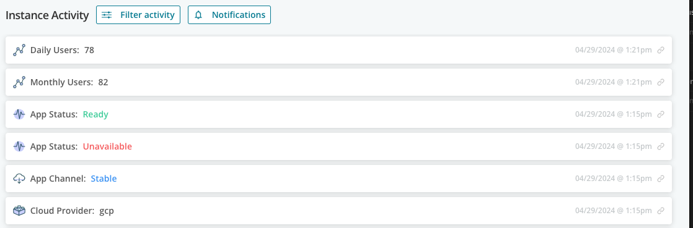

Telemetry is a core feature of the Replicated SDK. The lab [Closing the Support
Information
Gap](https://play.instruqt.com/replicated/tracks/closing-infromation-gap)
discusses the standard telemetry. You can also send telemetry values that are
specific to your application. One use of this is to keep track of license
entitlements so you can proactively discuss upgrade opportunities with you
customers.

Like the previous section, This part of the lab also describes something you'd
usually do as part of your application code. We're using shell commands to
avoid having to use a language that not everyone is familiar with.

Sending Custom Metrics
======================

We'll continue using `curl` from the `nicolaka/netshoot` image to call the
SDK. Run a new pod with that container and connect to it.

```
kubectl run -n slackernews sdk-client -it --image nicolaka/netshoot
```

We're going to send two metrics that Slackernews could be interested in given
their user-based licensing model: daily active users and monthly active users.
We send both since the more stable monthly user makes sense from a compliance
perspective but the daily number is a useful trend. The Slackernews team can
use changes in the daily number to proactively connect with Nitflex. This can
help create a timely upsell or avoid an unexpected churn.

Your application will send metrics by posting a message to the
`/api/v1/custom-metrics` endpoint on the SDK. You can send as many metrics as
you want, but each message must contain all of your custom metrics. Each metric
is a field a `data` object, and all values must be scalar.

Let's send our two metrics, there will be no return message so let's send

```
curl -X POST -H "Content-Type: application/json" \
    -d '{"data": { "dailyUsers": 78, "monthlyUsers": 82 } }' \
  http://replicated:3000/api/v1/app/custom-metrics
```

You'll get an empty string (`""`) as a response if you've typed the command
correctly. Let's log into the vendor portal and check the metrics we've
submitted.

Viewing Your Metrics
====================

Your vendor portal login should still be active, but if your session has
expired use the following username and password to log back in.

Username: `[[ Instruqt-Var key="USERNAME" hostname="shell" ]]`<br/>
Password: `[[ Instruqt-Var key="PASSWORD" hostname="shell" ]]`

Navigate to the "Customers" page and select the single instance for your
Nitflex customer. When you pull up the instances details you'll see the metrics
you sent above the stream of telemetry events from your instance.


You should also see the events for each metric near the top of the event
stream.



Accessing Metrics Programmatically
==================================

You can access telemetry events using the Replicated Vendor API. This includes
the custom metrics you've sent for your entitlements. Since this something you
do as the software vendor, we'll use the Replicated CLI to run it in your local
shell. Exit the shell from your `sdk-client` pod if you haven't already done
so.

The CLI doesn't provide direct access to the event stream, but the `api`
subcommand allows us to call any API endpoint directly. Events are shown per
application, collected across all customers and instances. You can narrow down
the events you access using the following filters:

* _Date_. You can use the `before` and `after` query parameters to specify
  events before or after a specific date.
* _Customer_. The `customerIDs` filter takes a comma-delimited list of customer
  IDs (not names) and restricts the results to those customers. You can easily
  find customer IDs with the `replicated customers ls` command.
* _Event Type_. To limit your view to a specific type or types of event, use
  the `eventTypes` filter. It also takes a comma-delimited list.

Let's skip the date filter and use the other two filters to limit our event
stream to Nitflex and the two customer metrics we send for our entitlements.
The event types are the same as the keys we used when we sent the metrics:
`dailyUsers` and `monthlyUsers`.

We also need the application ID and customer ID.

```
replicated app ls
```

Copy the first column and set it in the variable `app_id`.

```
export APP_ID=[[ Instruqt-Var key="APP_ID" hostname="shell" ]]
```

Do the same thing for the customer.

```
replicated customer ls
```

Set the variable `customer_id`

```
export CUSTOMER_ID=[[ Instruqt-Var key="CUSTOMER_ID" hostname="shell" ]]
```

Now that we have everything we need, let's use the `replicated` command to see
the events we sent.

```
replicated api get /v3/app/${APP_ID}/events\?customerIDs=${CUSTOMER_ID}\&eventTypes=dailyUsers,monthlyUsers \
  | jq .
```

You'll see the full event info from your two metrics. If you get an error that
the `replicated` command was not found, make sure you exited the shell from
your pod.

```
[
  {
    "customerId": "2fmesxEDU1ZnLnyQ8lzgZoOGoPS",
    "instanceId": "8a8046a2-cac8-4637-b7b5-88d18cb35460",
    "appId": "2fmefiZM7NrzbP4pNoldpnbVpFq",
    "reportedAt": "2024-04-29T17:21:31.508",
    "fieldName": "dailyUsers",
    "isCustom": true,
    "newValue": "78",
    "previousValue": ""
  },
  {
    "customerId": "2fmesxEDU1ZnLnyQ8lzgZoOGoPS",
    "instanceId": "8a8046a2-cac8-4637-b7b5-88d18cb35460",
    "appId": "2fmefiZM7NrzbP4pNoldpnbVpFq",
    "reportedAt": "2024-04-29T17:21:31.508",
    "fieldName": "monthlyUsers",
    "isCustom": true,
    "newValue": "82",
    "previousValue": ""
  }
]
```

🏁 Finish
=========

Your now tracking Nitflex's usage against their entitlements and explored the
scope of how the Replicated platform helps you protect your assets and
intellectual property.
