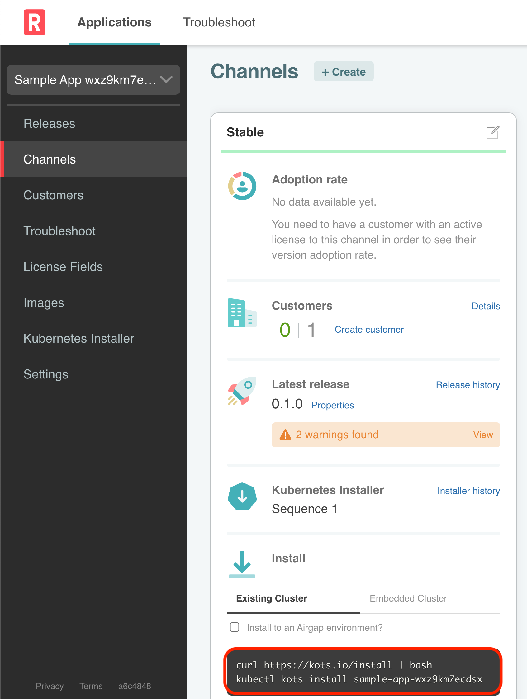
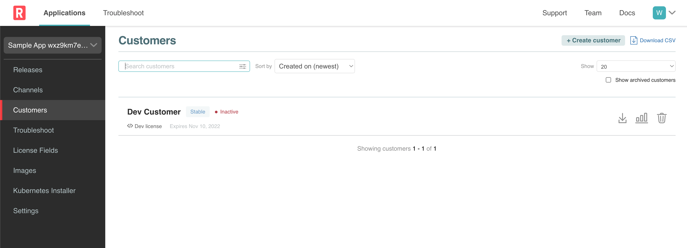
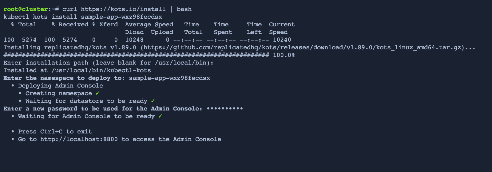

## Log in to Vendor Portal

If you are still logged in to the Vendor Portal from the previous challenge, continue to the next section. If you are not logged in to Vendor Portal, click on the **Vendor** tab to lauch a new window and log in again with your credentials.

```
username: [[ Instruqt-Var key="USERNAME" host="cluster" ]]
password: [[ Instruqt-Var key="PASSWORD" host="cluster" ]]
```

## Retrieve the Install Command

Navigate to **Channels** if not there already. The release we are going to use has been promoted to the **Stable** channel so let's use that install command. Since we already have a cluster setup, we are going to use the **existing cluster** command highlighted below:

<p align="center"></img></p>

## Download the License File

Navigate to **Customers** where we should have our `Dev Customer` there. Click on the download icon highlighted in red below to download the license file.

<p align="center"></img></p>

## Install the Admin Console

Head over to the **Cluster** tab and paste the install command which should look something like:

```shell
curl https://kots.io/install | bash
kubectl kots sample-app-xxxxxxxxxx
```

Use the default namespace and set the password, keeping in mind that you will need it throughout the lab.

<p align="center"></img></p>

Once you see the port forward to the admin console as shown above, you have completed this challenge.

