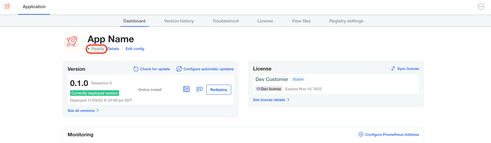
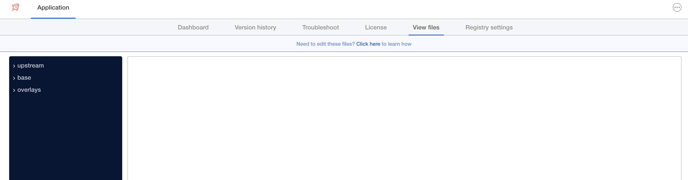
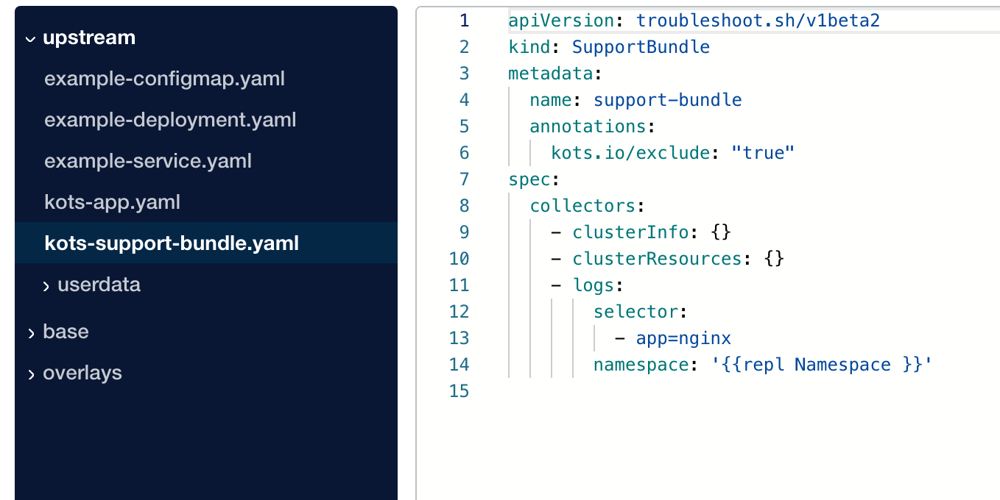

**Deploy the Application**

To access the Admin Console, click on the **Admin Console** tab. This should open a browser set to the Admin Console log in page. Use the password you set during the install in the previous challenge.

If you need to reset the password, head over to the **Cluster** and run the [reset-password](https://docs.replicated.com/reference/kots-cli-reset-password) command. By the default, the namespace is the application slug, which is in the format of `sample-app-[PARTICIPANT_ID]`.

Once logged in, upload the license file we downloaded in the previous challenge.

Wait for the application to be `ready` as shown below:

</img>

**Exploring the View Files Tab**

Now that our application is deployed, head over to the **View Files** tab in the Admin Console.
rdk-

</img>

You should see a file tree similar to the one shown below:

</img>

Please refer to our [docs](https://docs.replicated.com/enterprise/updating-patching-with-kustomize#about-the-directory-structure) for a more detailed explanation of what each of these folders contain. In a nutshell:

  * **upstream**: Contains the manifests and Helm Charts for this release. If you are using templating, these have not been merged in yet, so the manifests and helm charts look same as they look in the Vendor Portal. This lab will focus on making updates to the application files in this directory only.

  * **base**: Contains the templated manifests. If you are using templating, these manifest include the run time value. If your application includes Helm Charts, you can see how the chart is templated out. This is a great place to see how the manifests and helm charts are being templated out before being deployed.

  * **overlays**: This is where you can [patch a deployed application](https://docs.replicated.com/enterprise/updating-patching-with-kustomize#patch-an-application). If you have a customer that requires a custom configuration change, you can use this to patch their instance and have the change persist through upgrades.

Please stay logged in to the Admin Console as you we will use it in the next challenge.

This Challenge is complete! Click on **Next** to move on to the next challenge, where we will make some changes.

