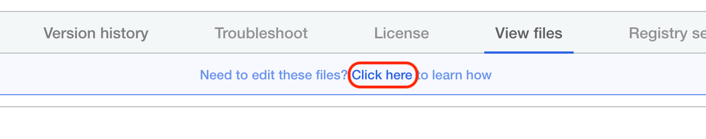
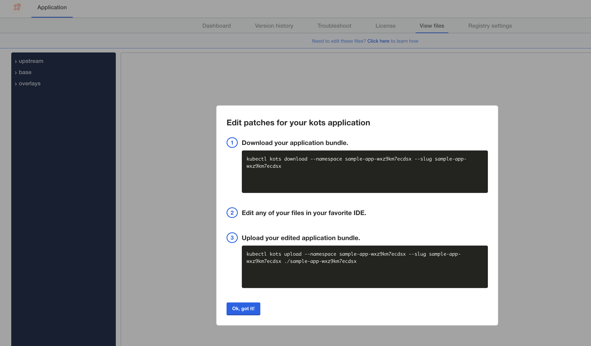
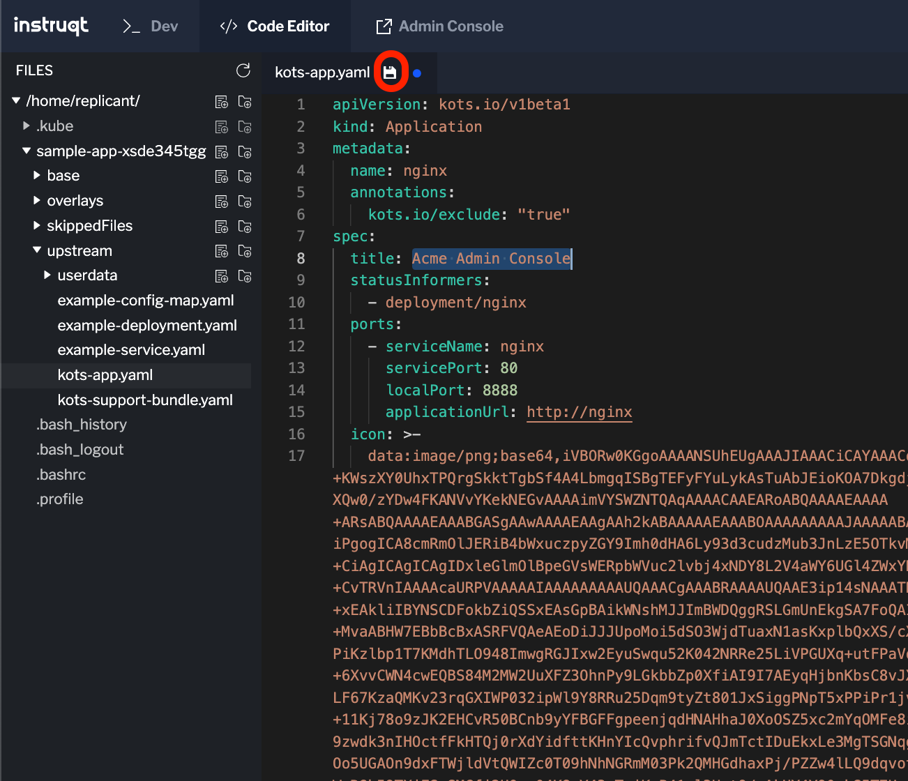
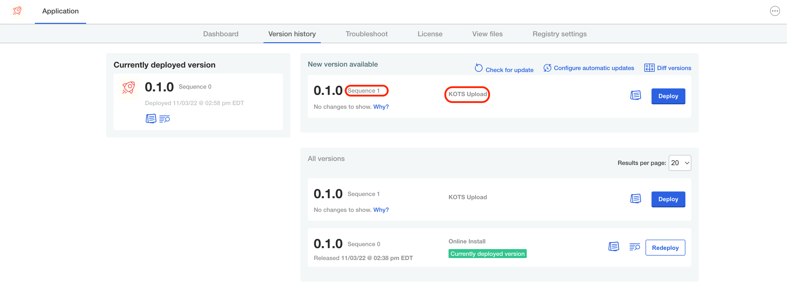
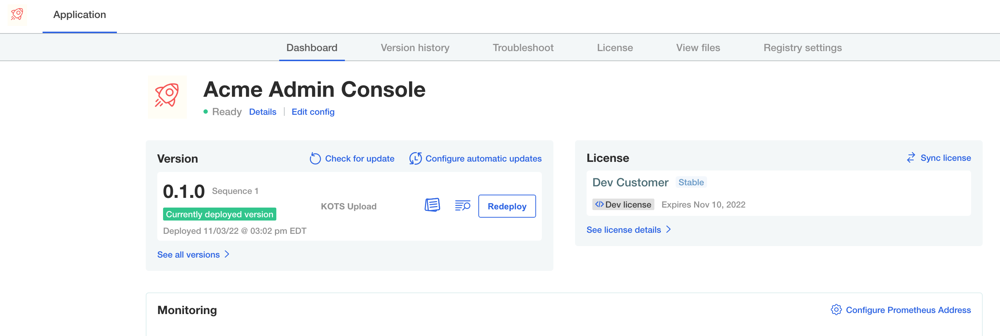

## Set Up our Dev Environment

We need to set up our Dev Environment. Head over to the **Dev** tab where you should have a shell ready to go. To ensure we have access to the cluster run the following command:

```bash
kubectl get nodes
```

To download the files to work on head over back to the **Admin Console**, specifically the **View Files** tab. You can obtain the command to download the files by clicking on the link highlighted in red below:

<p align="center"></img></p>

Clicking on this link should open a dialog similar to this one:

<p align="center"></img></p>

Copy the first command and then paste it on the command prompt in the **Dev** tab. The Command is in the format of:

```bash
kubectl kots download --namespace <your-namespace> --slug <your-app-slug>
```

You should see output similar to this:

```bash
• Connecting to cluster ⠋
  • Connecting to cluster ✓

    The application manifests have been downloaded and saved in /Users/demo-user/rapid-dev-1amk4rzv5pxc

After editing these files, you can upload a new version using

      kubectl kots upload --namespace rapid-dev-1amk4rzv5pxc --slug rapid-dev-1amk4rzv5pxc /Users//Users/demo-user/rapid-dev-1amk4rzv5pxc/rapid-dev-1amk4rzv5pxc

```

Make a note of the upload command as we will use it to upload our changes.

You may also see an error similar to this:

```shell
 • KOTS CLI version 1.88.0 does not match API version 1.89.0. To update, run:
  $ curl https://kots.io/install/1.89.0 | bash

```

You can ignore this message.

## Update the App

Now head over to the **Code Editor** where you should see the directory created.  Feel free to browse and explore the other directories, but for this lab we will work solely in the `upstream` directory. Let's make a small cosmetic change to this app. Select the **kots-app.yaml** file and let's update the **title** field.

<p align="center"></img></p>

In the screenshots for this lab, we have changed the title to **Acme Admin Console** but feel free to rename it to something else.

Save your changes using the save icon highlighted in red in the above screenshot. Then, head back over to the **Dev** tab and use the upload command that was displayed in the terminal, should look something like this:

```bash
    kubectl kots upload --namespace rapid-dev-1amk4rzv5pxc --slug rapid-dev-1amk4rzv5pxc /Users//Users/demo-user/rapid-dev-1amk4rzv5pxc/rapid-dev-1amk4rzv5pxc

```

## Deploy the Update

The `kots upload` command created a new local version which is now ready to be deployed. Head back to the **Admin Console** and select the **Version history** tab where you should see our release staged, ready to be deployed. Note how the `sequence` has increased and the change type is **KOTS Upload**:

<p align="center"></img></p>

Once the new version is deployed, head over to the **Dashboard** tab to see the change:

<p align="center"></img></p>

If you see the new application title, congratulations! you have completed this challenge.