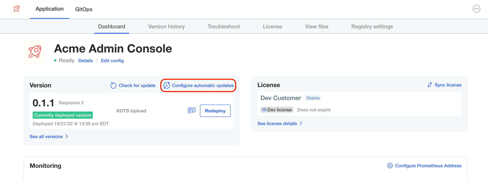

Not all your changes are going to involve the **Admin Console** so how can we bypass it altogether to deploy our changes? In this lab, let's explore how to do just that. In our example, we are going to add a new `Deployment` to our application and then will check that its pod is properly scheduled after we update the applicaiton without going to the Admin Console to deploy our change.

There are two options for us to have a new version deployed without us having to click on the **Deploy** button:
1. Set up Automatic Updates in the Admin Console
2. Use the KOTS CLI to deploy the update

In this lab, we'll configure the Admin Console to automatically deploy the change, but will cover the KOTS CLI command at the end as well.

## Set up Automatic Updates

Head over to the **Admin Console** tab and click on the **Configure automatic updates** link highlighted below:

<p align="center"></img></p>

Select the option to automatically deploy the app.


## Update the App

Head over to the **Code Editor** tab where we edited the **kots-app.yaml** file. This time we want to create a new file, so click on the new file icon in the editor in the **manifests** folder. Paste the contents below to create our deployment.

```yaml
apiVersion: apps/v1
kind: Deployment
metadata:
  name: busybox-deployment
  labels:
    app: busybox
spec:
  replicas: 1
  selector:
    matchLabels:
      app: busybox
  template:
    metadata:
      labels:
        app: busybox
    spec:
      containers:
      - name: busybox
        image: busybox
        imagePullPolicy: IfNotPresent
        command: ['sh', '-c', 'echo Container 1 is Running ; sleep 3600']
```

Save your changes and head over to the **Dev** tab. Let's upload the changes again. Remember that you can get the command from the **View files** tab in the Admin console.

Since we enabled automatic updates, our change should be applied without having to use the Admin Console. To check that we in fact have our new deployment run `kubectl get deployments -n <your-namespace>`, you should see the new deployment:


If you see the new deployment, congratulations! You have completed this challenge. Click on **Next** to continue

