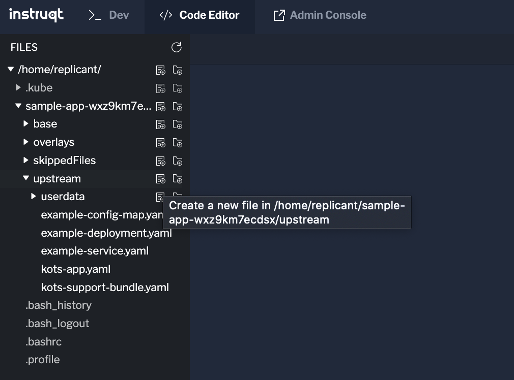
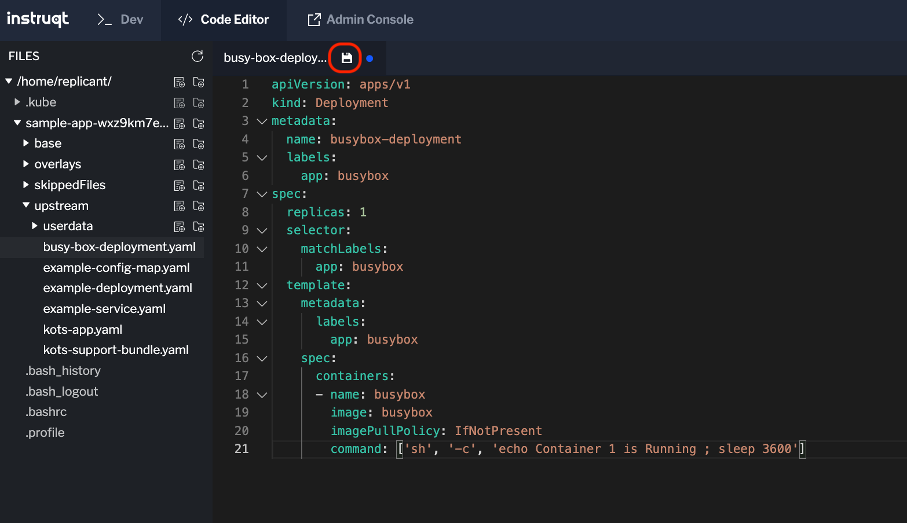

Not all your changes are going to involve the **Admin Console** so how can we bypass it altogether to deploy our changes? In this lab, let's explore how to do just that. In our example, we are going to add a new `Deployment` to our application and then will check that its pod is properly scheduled after we update the applicaiton without going to the Admin Console to deploy our change.

## Update the App

Head over to the **Code Editor** tab where we edited the **kots-app.yaml** file. This time we want to create a new file, so click on the new file icon in the editor in the **manifests** folder.

<p align="center"></img></p>

Paste the contents below to create our deployment.

```yaml
apiVersion: apps/v1
kind: Deployment
metadata:
  name: busybox-deployment
  labels:
    app: busybox
spec:
  replicas: 1
  selector:
    matchLabels:
      app: busybox
  template:
    metadata:
      labels:
        app: busybox
    spec:
      containers:
      - name: busybox
        image: busybox
        imagePullPolicy: IfNotPresent
        command: ['sh', '-c', 'echo Container 1 is Running ; sleep 3600']
```

Save your changes by clicking on the icon highlighted below.

<p align="center"></img></p>

Let's upload the changes again, so head over to the **Dev** tab. Remember that you can get the command from the **View files** tab in the Admin console.

Now we are going to use the `kots upstream upgrade` to deploy the change.

```shell
$ kubectl kots upstream upgrade --namespace <your-namespace> $REPLIACTED_APP --deploy
```

The output should look something like this:

```
  • Checking for application updates ✓

  • There are no application updates available, ensuring latest is deployed

  • To access the Admin Console, run kubectl kots admin-console --namespace sample-app-swhcp1e9nlcj

  • Currently deployed release: sequence 2, version 0.1.0
  • Deploying release: sequence 3, version 0.1.0
  • KOTS CLI version 1.88.0 does not match API version 1.89.0. To update, run:
  $ curl https://kots.io/install/1.89.0 | bash
```

To check the changes were deployed, get the deployments for your namespace

```shell

kubectl get deployments -n <your-namespace>
NAME                 READY   UP-TO-DATE   AVAILABLE   AGE
kotsadm              1/1     1            1           19m
nginx                1/1     1            1           16m
busybox-deployment   1/1     1            1           7m50s
replicant@shell:~$
```

If you see the new deployment, congratulations! You have completed this challenge. Click on **Next** to continue

