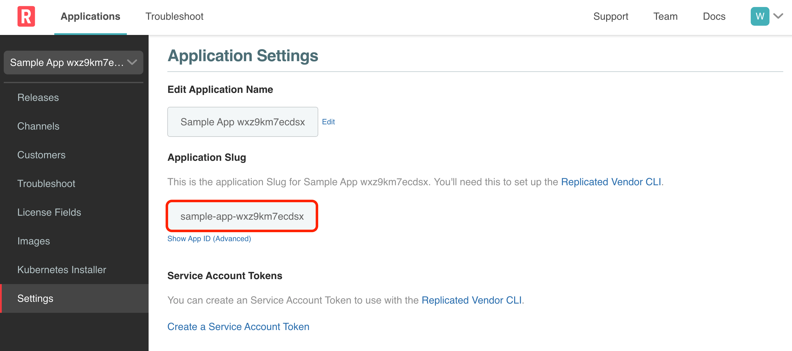
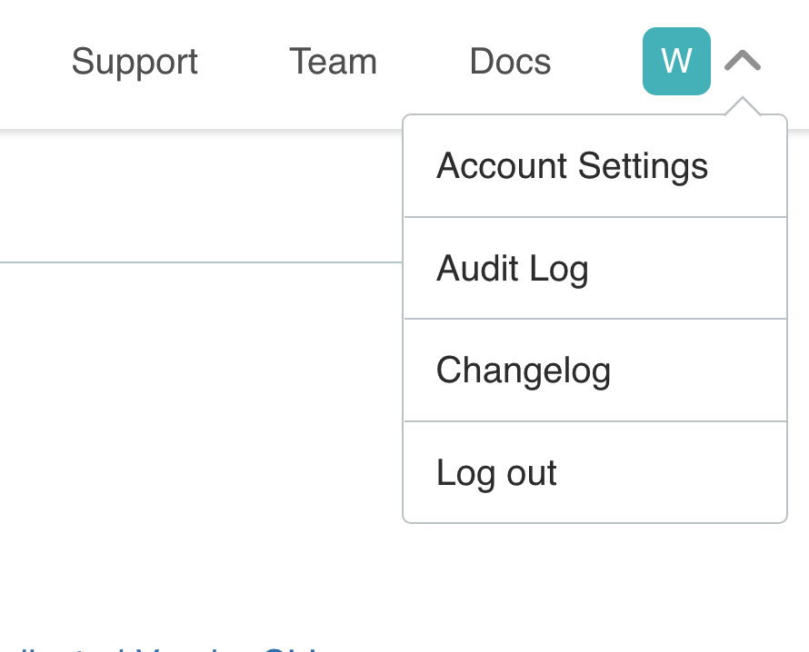
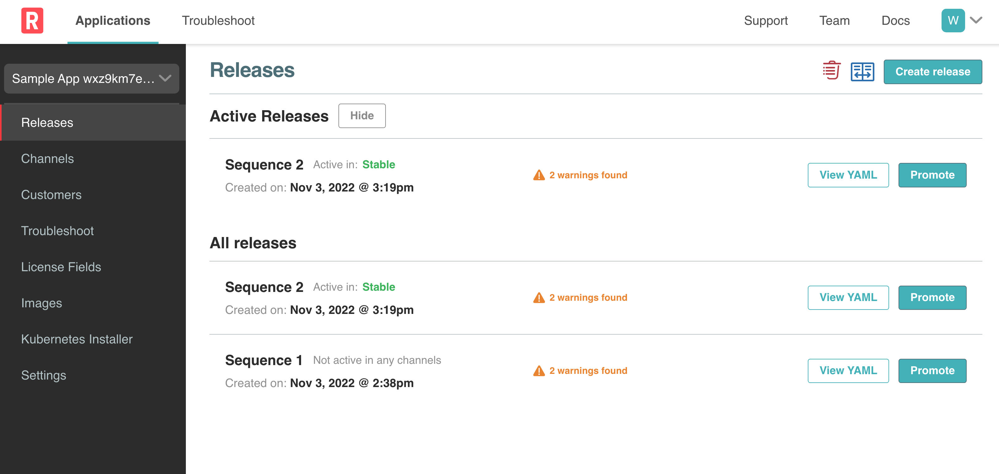
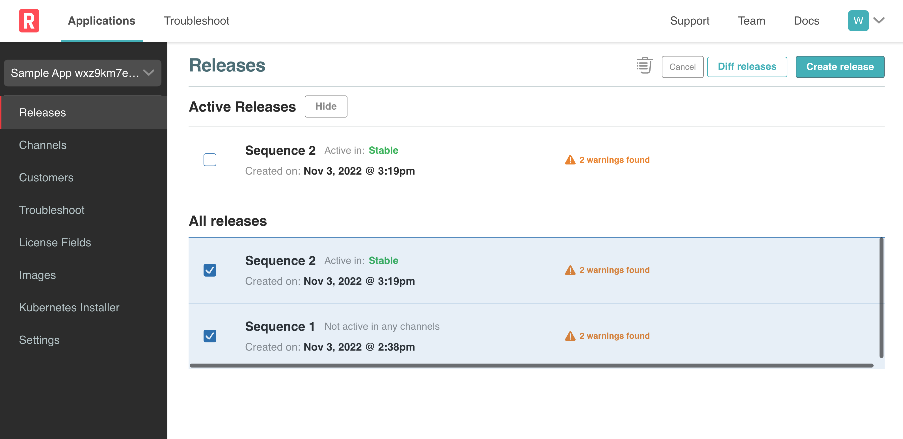

## Set the Application Slug

We will use the Application Slug to set the `REPLICATED_APP` environment varilable used by the `replicated` cli to know which application to update. To access the Application Slug, navigate to **Settings** and copy the value highlighted in red below:

To set the environment variable run the command `export REPLICATED_APP=<your-app-slug>` on the **Dev** tab.

<p align="center"></img></p>

## Set the Api Token

We will use the API Token to set the `REPLICATED_API_TOKEN` environment variable used by the `replicated` cli to authenticate access to the vendor portal. To access the API Token, click on the user profile and click on **Account Settings**.

<p align="center"></img></p>

Scroll down until you see **API Tokens**. Create a new Read/Write token with whatever name you choose.

To set the environment variable run the command `export REPLICATED_API_TOKEN=<your-api-token>` on the **Dev** tab.

## Set the Manifests directory

The **Upstream** directory includes the **userdata** sub directory which we don't want to include in our release. Let's create a new directory called **Manifests**


First let's make sure you are in the `sample-app-...` directory. Once there, let's create the **manifests** directory:

```bash
mkdir manifests
```
Now let's copy the yaml files here. Note that since our application only contains manifests, we only need to copy files with a `.yaml` extension. If the application contained any Helm Charts, then those would need to copied as well.

```bash

cp upstream/*.yaml manifests

```

To verify that the files were copied, you can list the contents:

```bash
ls manifests
```

Create the release by running the following command

```bash
replicated release create replicated release create --version 0.1.1 --promote Stable --yaml-dir manifests

```

To verify that our new relase in Vendor Portal contains all of our changes, head over to the **Vendor Portal** tab and go to **Releases** where you should see the new release.

<p align="center"></img></p>

To check the updates you can diff the releases:

<p align="center"></img></p>

If your changes are there, then everyone else is ready to consume your changes!