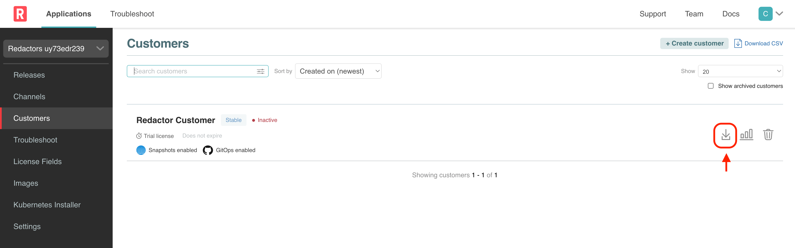
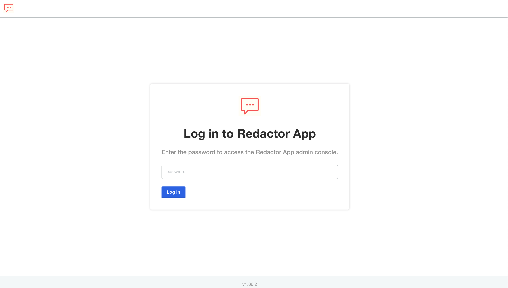
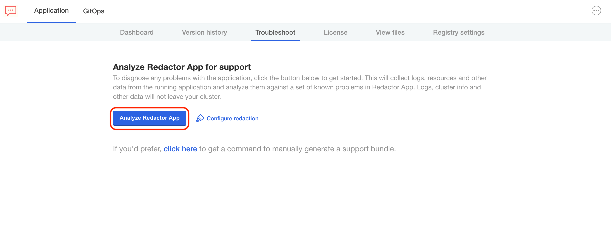
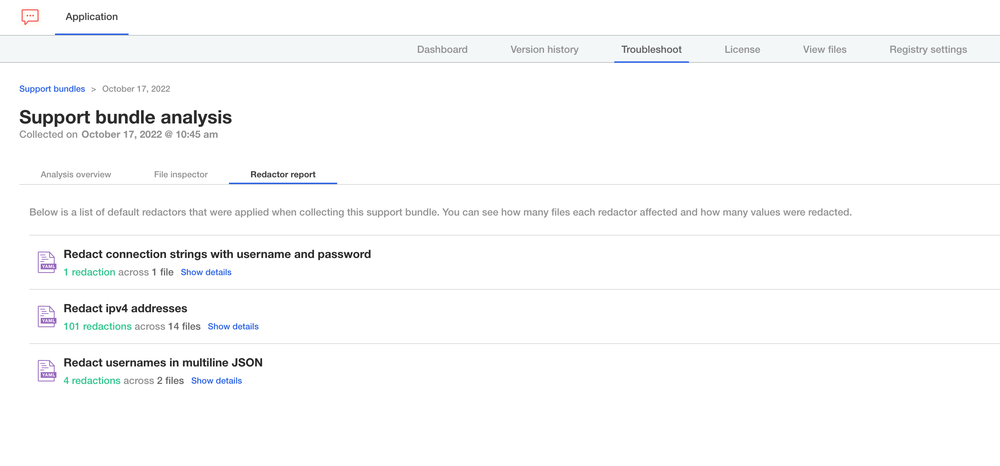
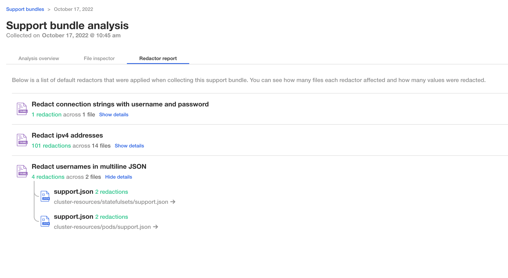
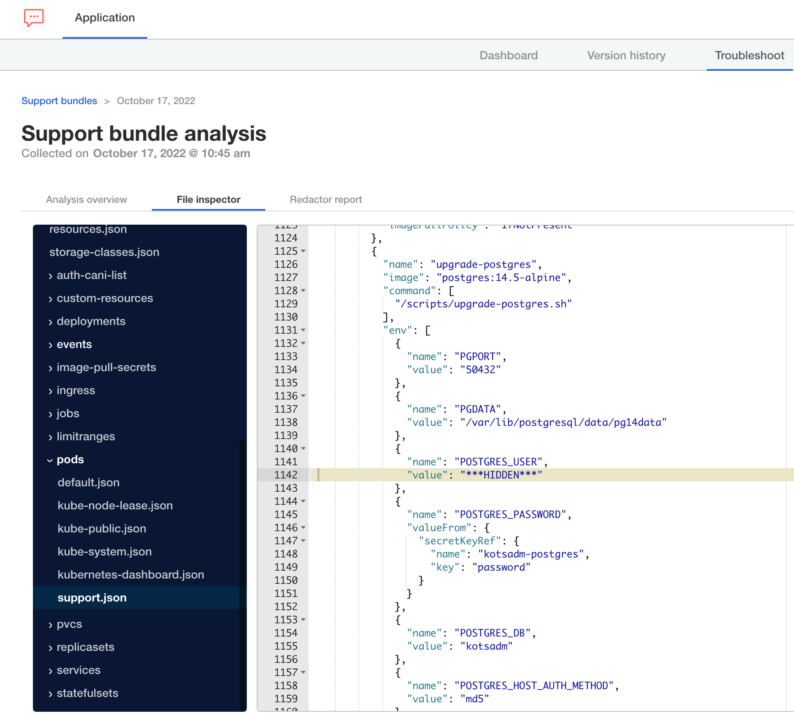
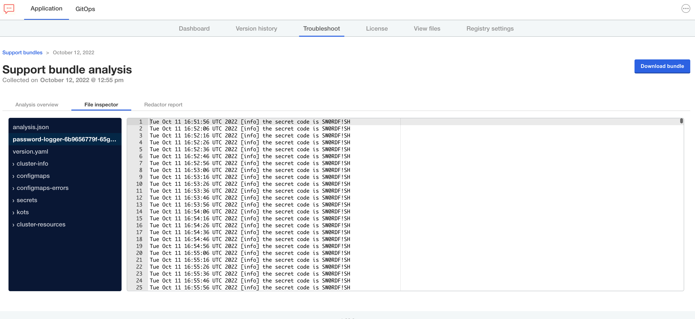

## About Redactors

[Redactors](https://troubleshoot.sh/docs/redact/) allow end users to programatically control which information is included in support bundles and which types of information are excluded. They can be used to prevent sensitive data like usernames, IP addresses, and password from being accidentally leaked in support bundles.

We'll explore how Redactors work and learn the workflows that end customers can use to review and customize redaction of support bundles. We'll study an app that has a container that logs sensitive information, and how to ensure that information is excluded from support bundles.

In this lab, the Applicatin Installer is already deployed. So you can download the license from the Vendor Portal (`Redactors Customer`), upload the license in the Application Installer and go through the initial installation.

### 1. Download the license

On the **Vendor** tab, login to the Vendor Portal using the credentials shown on the **Shell** tab.

Once logged in, navigate to **Customers** and find the customer already created for you.

<p align="center"></img></p>

Click on the icon highlighted above to download the license.

### 2. Install the application

The password for the application installer is your `PARTICIPANT_ID`, which can be obtained running the following in the **Shell** tab:

```
echo $INSTRUQT_PARTICIPANT_ID
```

In this lab, the Admin Console is already deployed and will be working exclusively in the Admin Console. The password for the Admin Console is your `PARTICIPANT_ID`, which we obtained above.


Make sure to save this password as you may need to log back in if your session expires.

Go to the **Application Installer** tab (external window) and login.

<p align="center"></img></p>

 Upload the license and follow the prompts to deploy the application. Once deployed you should arrive at the screen shown below.

<p align="center"></img></p>

### Redactors Overview

In order to look at redactors, we need to generate a support bundle. Click on the **Troubleshoot** tab and click on **Analyze Redactors App**

<p align="center"></img></p>

When it's done, head over to the **Redactor Report** tab.

<p align="center"></img></p>

You'll notice the following redaction rules are applied automatically

* Redact connection strings with username and password
* Redact database connection strings in mutiline JSON
* Redact ipv4 addresses
* Redact password environment variables in multiline JSON
* Redact usernames in multiline JSON
* Redact values for environment variables with names beginning with 'user'

Clicking on **Show details** will show you where redactions were perfomed

<p align="center"></img></p>

Clicking into each file will show you where data was redacted

<p align="center"></img></p>

On our same support bundle, navigate to the **File Inspector** tab and find the application logs.

<p align="center"></img></p>

You'll notice there's a secret being logged.

```shell
Tue Oct 21 19:54:00 UTC 2022 [info] the secret code is SW0RDF!SH
```

Next, we'll write a custom redactor to remove this from the support bundle.
