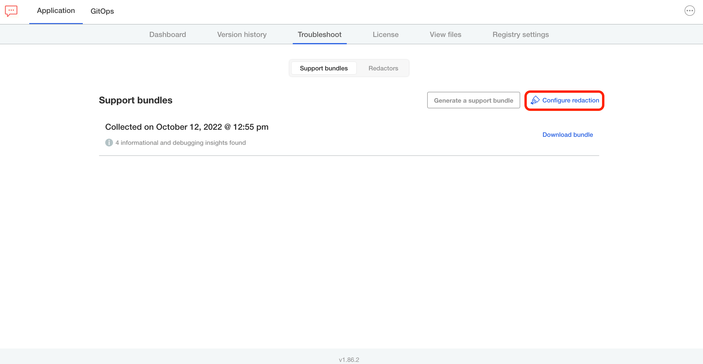
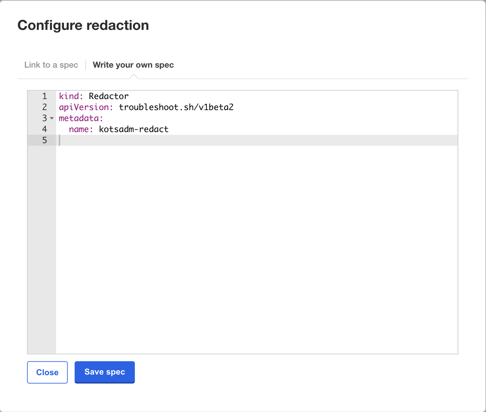
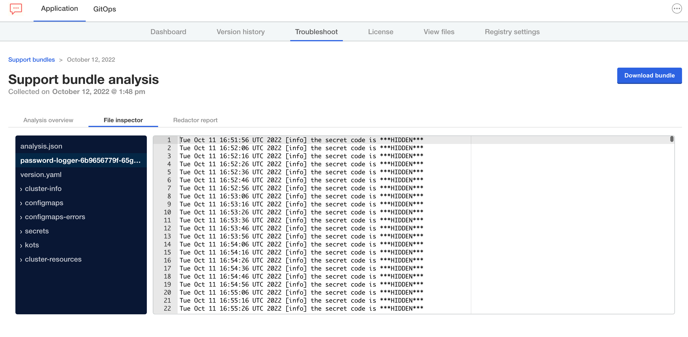

Custom redactors can be added both by a Vendor in a release and their end customer in the Admin Console. In this lab we are going to learn how to add it from the Admin Console as the feedback loop is shorter. Keep in mind that the file we create in this lab could be also included as part of a release.

Navigate back to the Application Installer tab to access the Admin Console. Provide your password if your session expired. Once in the Admin Console, go to the **Troubleshoot** tab and select **Configure redaction**:

<p align="center"></img></p>

While a URL to a hosted redactor is possible, we'll use the **Write your own spec** option:

<p align="center"></img></p>

Use the following content for your redactor:

```yaml
kind: Redactor
apiVersion: troubleshoot.sh/v1beta2
metadata:
  name: kotsadm-redact
spec:
  redactors:
    - name: hide-secret-code
      removals:
        regex:
          - redactor: (the secret code is )(?P<mask>.*)
```
Save the redactor, and you should see a green check confirming the redactor has been saved.

## Testing

Once you've edited the redaction settings, let's collect another support bundle to see how our new redactor was applied.

<p align="center"></img></p>

When you've completed this successfully, you should see the secret removed from your bundle:

```text
Thu Apr 29 10:39:52 UTC 2021 [info] the secret code is ***HIDDEN***
```

If you see the above result, **Congratulations** you have completed this lab.

Feel free to try more complex redactors or complete the track.
