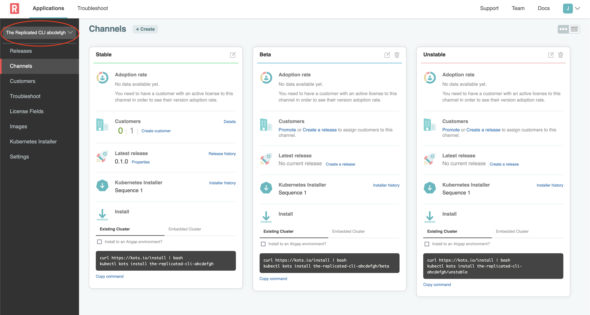

👋 Introduction
===============

This exercise is designed to give you a sandbox to ensure you have a basic understanding how to work with the Replicated CLI.

* **What you will do**:
  * Use the Replicated CLI to validate and release your application
  * Find your installation command and install to an existing cluster
  * Iterate on your work and deploy an updated release
* **Who this is for**: This lab is for anyone who works with app code, docker images, k8s yamls, or does field support for multi-prem applications
  * Full Stack / DevOps / Product Engineers
  * Support Engineers
  * Implementation / Field Engineers
* **Prerequisites**:
  * Basic working knowledge of Kubernetes
* **Outcomes**:
  * You will build a working understanding of how to release and deploy a kubernetes application packaged with Replicated using kots.


🚀 Let's start
==============

### 1. Vendor Portal login

To access the Vendor Portal, you will need your participant id. If you go to the Shell tab, it will show you the username and password to be used for the Vendor tab. It will be of the following format:

```
Username: `[[ Instruqt-Var key="USERNAME" hostname="kubernetes-vm" ]]`<br/>
Password: `[[ Instruqt-Var key="PASSWORD" hostname="kubernetes-vm" ]]`
```

Once you have the credentials, you can login into the Vendor tab and you should land on the Channels. Channels allow you to manage who has access to which releases of your application.


### 2. Configure environment

Once registered, your application will be automatically selected:

<p></p>

Now, you'll need to set up environment variables to interact with vendor.replicated.com and instance.

`REPLICATED_APP` should be set to the app slug from the Settings page.

<p align="center"></img></p>

Next, create a `read/write` User API token from your [Account Settings](https://vendor.replicated.com/account-settings) page:
> Note: Ensure the token has "Write" access or you'll be unable create new releases.

<p align="center"></img></p>

Once you have the values,
set them in your environment.

```
export REPLICATED_API_TOKEN="[[ Instruqt-Var key="REPLICATED_API_TOKEN" hostname="shell" ]]"
export REPLICATED_APP="[[ Instruqt-Var key="REPLICATED_APP" hostname="shell" ]]"
```

You can ensure this is working with

```
replicated release ls
```

### 2. Saving your lab setup

The lab environment you are working in is a little bit different
than your own workstation. Because of the lab structure, we need
to take an extra step to support the next challenges. You would
not need to do this in a real-world environment. If you run the below command, it will persist the environment variables between challenges.

```bash
save_lab_setup
```
