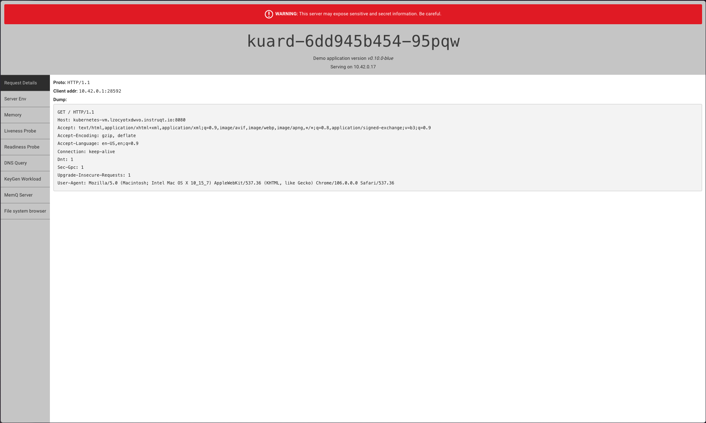

💡 Installing your release
==========================

This challenge may seem familiar if you've already run through
the "Hello World" track.  We're going to go through the same
steps to install using Replicated's command line tooling.

### 1. Getting the install command

Each channel for  your application has a custom install command.
You can view the install command either in the vendor portal or
using the `replicated` command line tool. Let's get it using the
CLI.

```
replicated channel inspect Stable
```

We're going to install into an existing Kubernetes cluster.
You'll find that one listed first, with the label `EXISTING`.


```
ID:             2FKLzwElQOFuHs6YlYEvZ6ncNEo
NAME:           Stable
DESCRIPTION:
RELEASE:        4
VERSION:        0.0.1
EXISTING:

    curl -fsSL https://kots.io/install | bash
    kubectl kots install the-replicated-cli-abcdefgh

EMBEDDED:

    curl -fsSL https://k8s.kurl.sh/the-replicated-cli-abcdefgh | sudo bash

AIRGAP:

    curl -fSL -o the-replicated-cli-abcdefgh.tar.gz https://k8s.kurl.sh/bundle/the-replicated-cli-abcdefgh.tar.gz
    # ... scp or sneakernet the-replicated-cli-abcdefgh.tar.gz to airgapped machine, then
    tar xvf the-replicated-cli-abcdefgh.tar.gz
    sudo bash ./install.sh airgap
```

Your outputs will be in the same format but a bit different, since you'll
be installing your own application.

The command you'll use will look like this:

```
curl -fsSL https://kots.io/install | bash
kubectl kots install [[Instruqt-Var key="REPLICATED_APP" hostname="shell"]]
```

We'll come back to that in a later step.

### 2. Download a Customer License

A customer license (downloadable as a `.yaml` file) is required
to install any KOTS application. We're going to use the command-line
to both create a customer and to download their license file.

```
replicated customer create --name "Replicant" --channel Stable
```

once the customer is created, we'll download their license file to use
as part of the install.

```
replicated customer download-license --customer "Replicant" > license.yaml
```

### 3. Run your install

When you looked up your install command, you saw something
like this. You won't run this full command in this example,
because we've done some setup ahead of time.

```
curl -fsSL https://kots.io/install | bash
kubectl kots install [[Instruqt-Var key="REPLICATED_APP" hostname="shell"]]
```

This command installs the `kots` plugin to `kubectl` and then
starts the install of your application. It then sets up a port
forward to the admin console, where you finish the install. We
are going to skip the console element and work entirely from
the command line.

Our shell already has the `kots` plugin installed, so we can
skip the first line. We are also going to embelish the second
line a little bit to provide a password and license files so
that your customer would generally enter into the admin console.
Most customers won't install from the command line, but since
this is the command line lab let's see how it would go.

We're also setting the password for the admin console that
Replicated provides for managing the application. Since we're
setting it on the command-line, let's use `this-is-unsafe` as
a reminder not to leak secrets in the real world.

```
kubectl kots install [[Instruqt-Var key="REPLICATED_APP" hostname="shell"]] --namespace kuard \
  --shared-password this-is-unsafe --license-file ~/license.yaml \
  --no-port-forward
```

#### 4. Check your application

Click on the "Example Application" tab to see you application running.
_Be prepared, it gives a giant security warning because it shows a bunch
of details about the cluster it's running in. Nothing is wrong and your
browser/laptop/workstation is completely safe._




🏁 Finish
=========

Congratulations! You've finished the "Replicated CLI" track.
