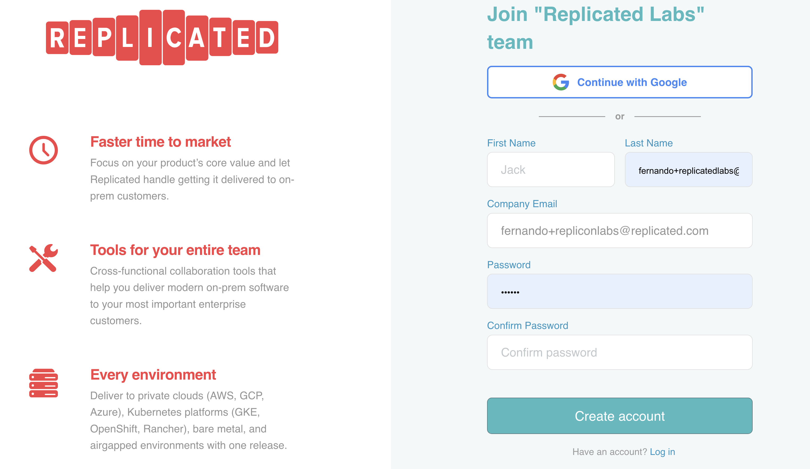

🚀 Let's start
==============

### Check Your Email!

If you previously already done any tracks and accepted the invite for the Vendor Portal, you can skip this and go to the next section.

You should have received an invite via email to log into https://vendor.replicated.com -- you'll want to accept this invite and set your password.

**Important Note:** It is important to logout of any existing session in the Replicated vendor portal so that when clicking on the Labs Account invitation email link it takes you to a specific new registration page where you enter your name and password details.  If you get a login screen then this is probably the issue.

The email should look like this:

<p align="center"></img></p>

Once you click on the button, it should open a browser to a page similar to this:

<p align="center"></img></p>

Fill in the rest of the form and click on the **Create Account** button to get started.

Once you have created your account you should land on the Channels. Channels allow you to manage who has access to which releases of your application.

👋 Install Nginx
===============

In this case, the Applicatin Installer is already deployed. So you can download the license from the Vendor Portal (`Support Bundle Analyzers Customer`), upload the license in the Application Installer and go through the initial installation.

### 1. Download the license

   

### 2. Install the application

The password for the application installer is your `PARTICIPANT_ID`, which can be obtained running the following in the Shell tab:

```
echo $INSTRUQT_PARTICIPANT_ID
```

Go to the `Application Installer` tab (external window), login and upload the license that was downloaded from the Vendor Portal. You can accept the defaults for the Last mile Configuration.

   

🐛 The Issue
===============

Once the app is deployed, you can browse to the application, using the `Open App` link.


You'll notice that in this case the application is running, but the content it is showing is not what you would expect. Let's move to the next challenge and see if Support Bundles can help!