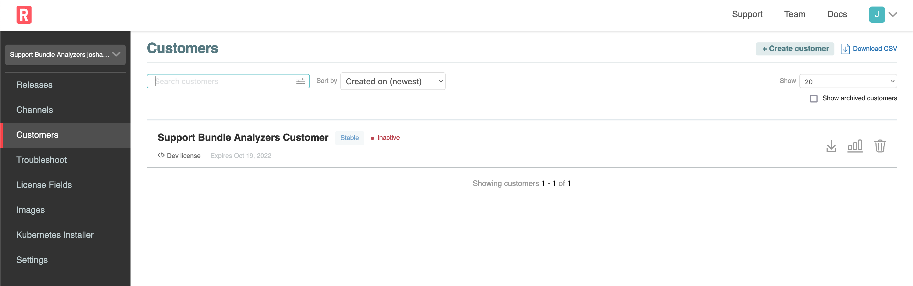
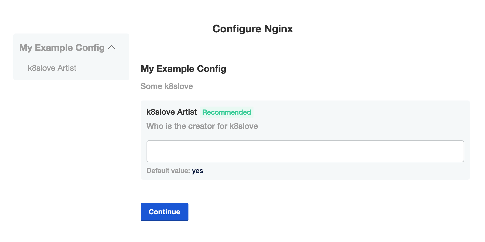
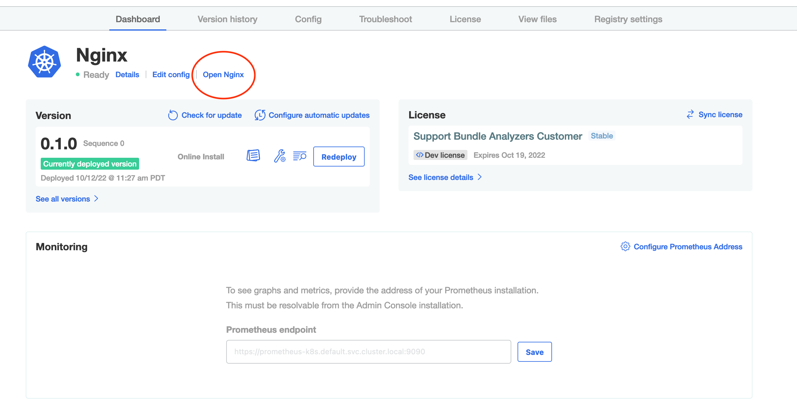

🚀 Let's start
==============

### Vendor Portal login

To access the Vendor Portal, you will need your participant id. If you go to the Shell tab, it will show you the username and password to be used for the Vendor tab. It will be of the following format:

```
username: [PARTICIPANT_ID]@replicated-labs.com
password: [PARTICIPANT_ID]
```

Once you have the credentials, you can login into the Vendor tab and you should land on the Channels. Channels allow you to manage who has access to which releases of your application.

👋 Install Nginx
===============

In this case, the Applicatin Installer is already deployed. So you can download the license from the Vendor Portal (`Support Bundle Analyzers Customer`), upload the license in the Application Installer and go through the initial installation.

### 1. Download the license

   

### 2. Install the application

The password for the application installer is your `PARTICIPANT_ID`, which can be obtained running the following in the Shell tab:

```
echo $INSTRUQT_PARTICIPANT_ID
```

Go to the `Application Installer` tab (external window), login and upload the license that was downloaded from the Vendor Portal. You can accept the defaults for the Last mile Configuration.

   

🐛 The Issue
===============

Once the app is deployed, you can browse to the application, using the `Open App` link.



You'll notice that in this case the application is running, but the content it is showing is not what you would expect. You'll see that it is a bit of a contrived use case, but a great way to learn more about support bundles.

Let's move to the next challenge and see if Support Bundles can help!