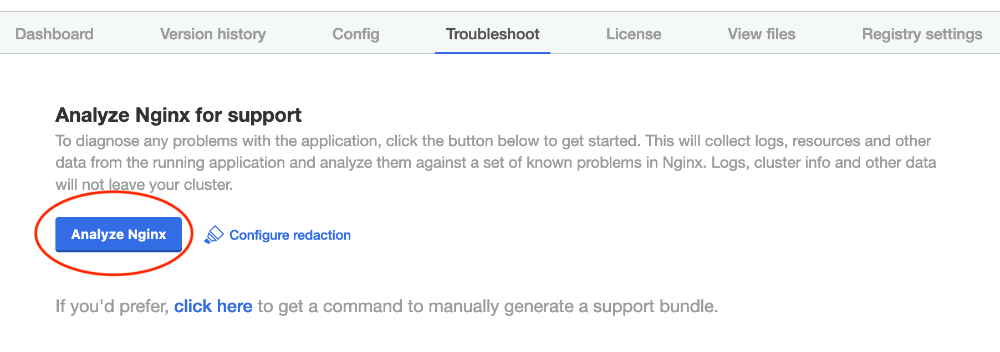
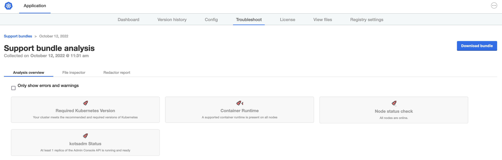
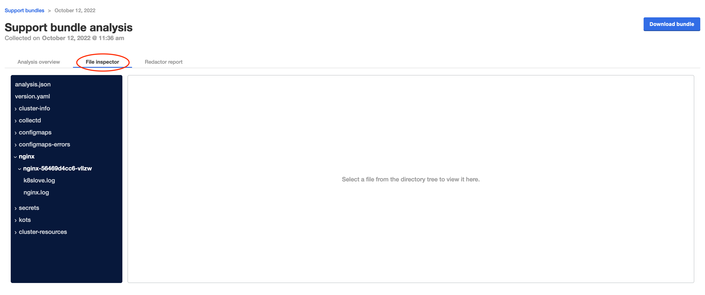
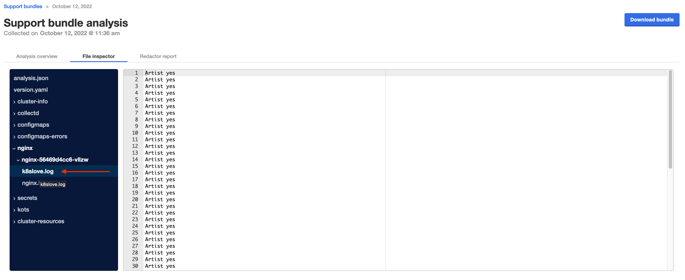
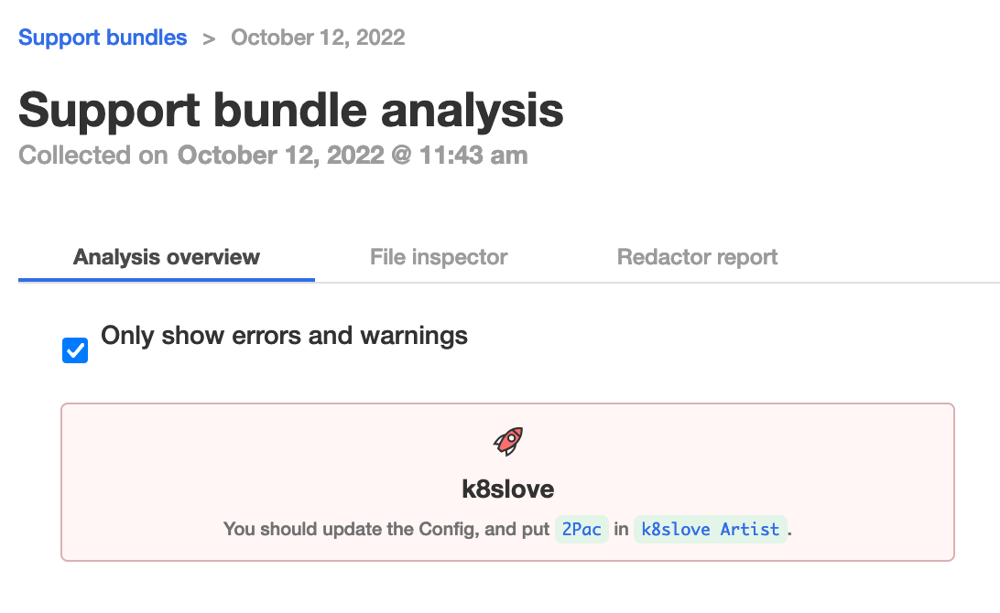
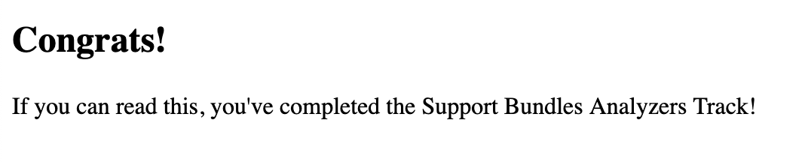
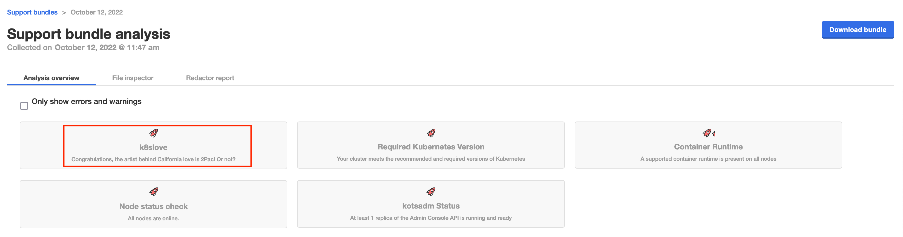

🔎 Create a Support Bundle
==========================

As you know, the first step when the application isn't starting or behaving correctly will be to collect a support bundle. Doing so will run a series of diagnostic checks to help diagnose problems with the application. In the case that a problem cannot be diagnosed automatically, a bundle will be ready for download so you can share with your broader team to help diagnose the issue. Start by navigating to the `Application Installer > Troubleshoot` and click the "Analyze" button.

<div align="center"><blockquote><h3>If an application isn't behaving correctly, always collect a support bundle</h3></blockquote></div>




Once the bundle is collected, you will not learn a lot more. All analyzers will be running just fine.



And if you want, you can even click on the `File inspector` tab, which shows all the information that was collected. Problem here, is that in this case the application logs are not even collected. 🤔

🪵  Add Application Logs
========================

The application consists of an nginx deployment. So let's add a [logs collector](https://troubleshoot.sh/docs/collect/logs/) to the `kots-support-bundle.yaml`. Go to the Vendor Portal tab, create a new release and change the `kots-support-bundle.yaml` so it contains:

```yaml
apiVersion: troubleshoot.sh/v1beta2
kind: SupportBundle
metadata:
  name: support
spec:
  collectors:
    - clusterInfo: {}
    - clusterResources: {}
    - logs:
        name: nginx
        selector:
          - app=nginx
        containerNames:
          - nginx
          - k8slove
```

Once the release is saved, you can promote it to the `Stable` channel.

In the Application installer tab, click `Check for update` and deploy the new version. Once deployed, go to the "Troubleshoot" tab and generate another support bundle.

Of course nothing changed in the analyzers view (as we only added a collector), but let's go to the file inspector to see if our logs collector can tell us something.



The `nginx.log` is not so special. But the `k8slove.log` is a bit more special and contains `Artist yes`.



That doesn't sound correct, as the Artist for the song "California love" should be `2Pac`. (Told you it is a bit of a contrived example).


❤️  Add Analyzer
================

When a customer is having an issue with your application, asking them to scan through the collectors output isn't the greatest end-user experience. We can make it a lot easier for the customer by adding analyzers that analyze the output from the collectors.

Let's add an Analyzer to the support bundle that shows an error if the `k8slove.log` does not contain `Artist 2Pac`, and helps the end user to understand what they should do to fix the application!

In the Vendor Portal, create a new release and update the `kots-support-bundle.yaml` to contain the following:

```yaml
apiVersion: troubleshoot.sh/v1beta2
kind: SupportBundle
metadata:
  name: support
spec:
  collectors:
    - clusterInfo: {}
    - clusterResources: {}
    - logs:
        name: nginx
        selector:
          - app=nginx
        containerNames:
          - nginx
          - k8slove
  analyzers:
    - textAnalyze:
        checkName: k8slove
        fileName: nginx/**/k8slove.log
        regex: 'Artist 2Pac'
        outcomes:
          - pass:
              when: "true"
              message: "Congratulations, the artist behind California love is 2Pac! Or not?"
          - fail:
              when: "false"
              message: "You should update the Config, and put `2Pac` in `k8slove Artist`."
```

The above analyzer, will search for any text `Artist 2Pac` and fail if not found.

Save and promote the release to the `Stable` channel. Update the application in the Application Installer, and generate a new Support Bundle.



Great! So now the end-user will also know they have to update the config option. Go ahead, update the config, and deploy the new version. Once deployed, you can refresh the deployed app and should see the following output:



If you go back to the application installer, and generate another support bundle, the Analyzer view should now show an additional test that passses.



Great! Let's move to the next challenge and see if we could get all that information also in the Vendor Portal.