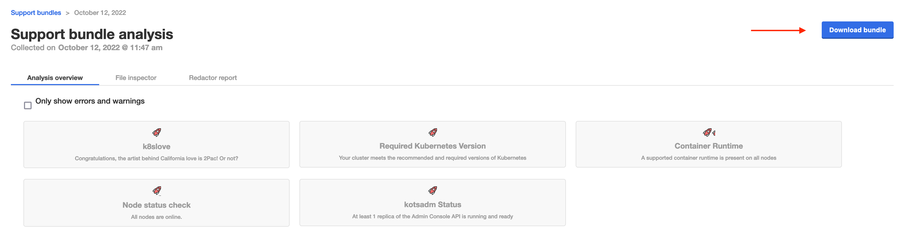
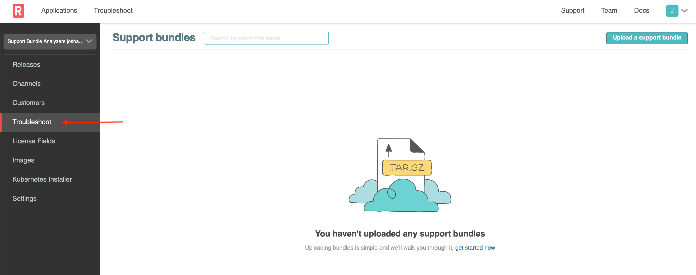
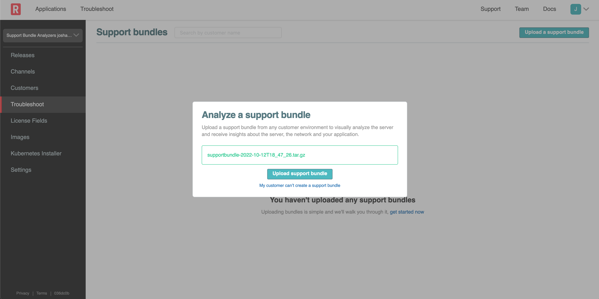
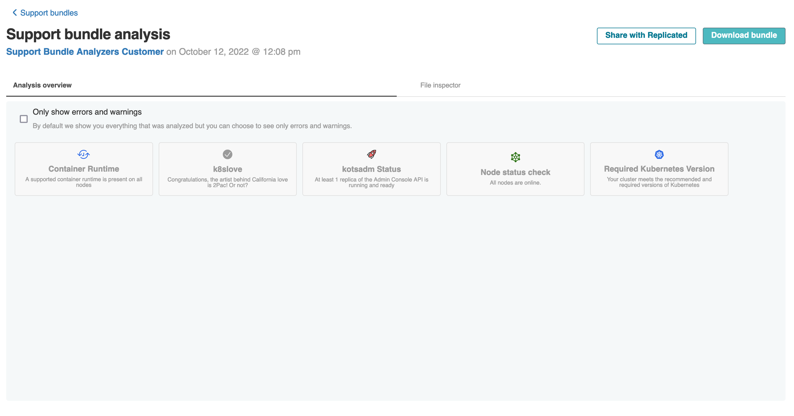
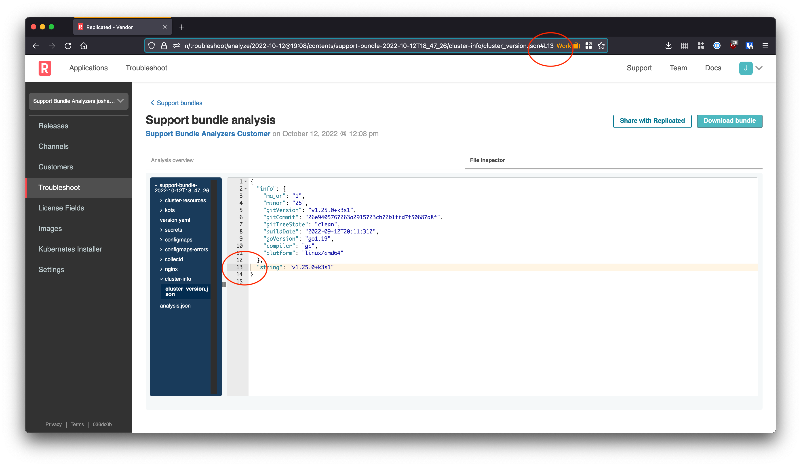
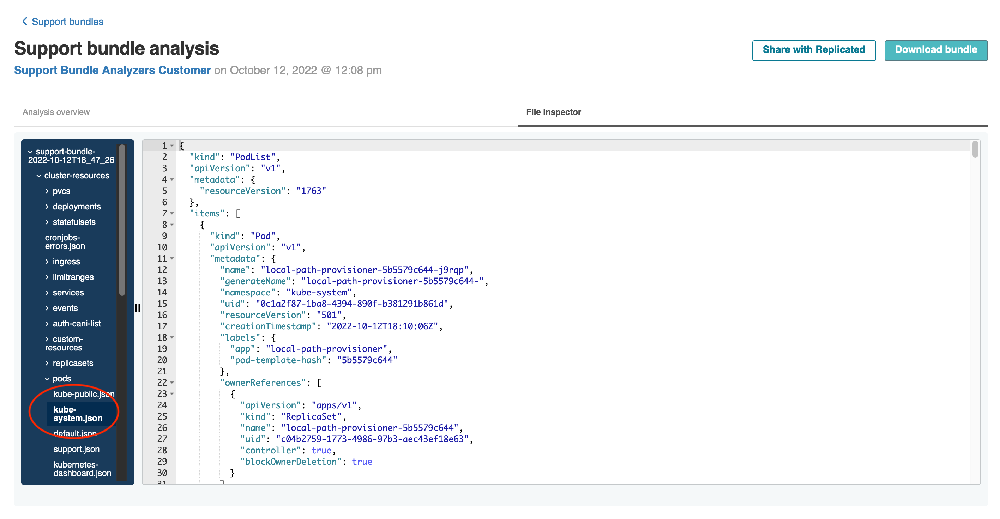

⬇️ Download the support bundle
===========================

The key lesson of this track is around what to do if analyzers don't provide any useful information. So far we've been mainly assuming we always have access to the Application Installer. But that will not be the case for many customers. So let's walk through downloading the bundle, collaborating with your team to diagnose the error, and preventing it in the future.

<div align="center"><blockquote><h3>If support analyzers don't surface any issues, the bundle should be downloaded and sent to the vendor team</h3></blockquote></div>

In this case, even though we're wearing a "customer" hat for parts of these exercises, the "vendor" is also you in this case 🙂

Let's grab the bundle using the "download bundle" option so we can upload it to https://vendor.replicated.com to collaborate with the team:




⬆️ Upload in Vendor Portal
=======================

Next, we'll navigate to the Vendor Portal tab and go to Troubleshoot.



Click on "Upload a support bundle" and then drag and drop the bundle you downloaded from the instance.
Having access to the instance to download the bundle simplifies things for us in this case.
In the real world, you can receive the bundle from a customer by whatever means is most secure/convenient for them.



Once it's uploaded, you should see a similar view of the analyzers.



This view is identical to what your customer will see!

Next we'll dig into the logs by navigating to the file inspector tab.
We can use the line-level deep linking in the UI to highlight and share specific errors and log lines.

**Exercise** navigate to the `File Inspector` in the Vendor Portal tab and open `cluster-info/cluster_version.json`. Determine the version of Kubernetes that is running on the server side.
Test the line-level linking by copying the URL into a new tab.



Note that as you click line numbers in the gutter, the URL changes.

<div align="center"><blockquote><h3>Once a bundle has been uploaded to the vendor console, use deep-linking to collaborate on the diagnosis with your team.</h3></blockquote></div>

These links can be attached to a support ticket, shared in Slack, etc.

If you choose the "Share with Replicated" option in the https://vendor.replicated.com, the same links will become accessible to Replicated's support team.


🐚 Support Bundle ctl
==================

As you might have noticed, besides the application logs, the support bundle also contains a lot more information. Each support bundle does contain some "default" collectors that always are included. One of them is the [cluster-resources](https://troubleshoot.sh/docs/collect/cluster-resources/) which will capture all kubernetes resources from the cluster.

In the `Vendor Portal` tab, you can easily browse all the collected output if you go to `File Inspector` and open one of the files under `cluster-resources`



Although the collected information is all `json`, there is a lot of information in it that can be very helpfull! And there is even an easy way to interact with it using [sbctl](https://github.com/replicatedhq/sbctl): a command line tool for examining K8s resources in Troubleshoot's support bundles.

The `Shell` tab already has the `sbctl` cli installed. So all we have to do is download the support bundle into it. Go to the `Shell` tab and run the following:

```bash
download_support_bundle
export SHELL=/bin/bash
```

Next, you can go to the `Shell` tab and run:

```bash
sbctl shell -s ./supportbundle.tar.gz
```

This will allow you to interact with the support bundle, using `kubectl`. Try some of the following commands, and see what info you get back:

```bash
kubectl get ns
```

```bash
kubectl get pods -n kube-system
```

```bash
kubectl describe deployment nginx -n support
```

Congratulations! You have completed this track!