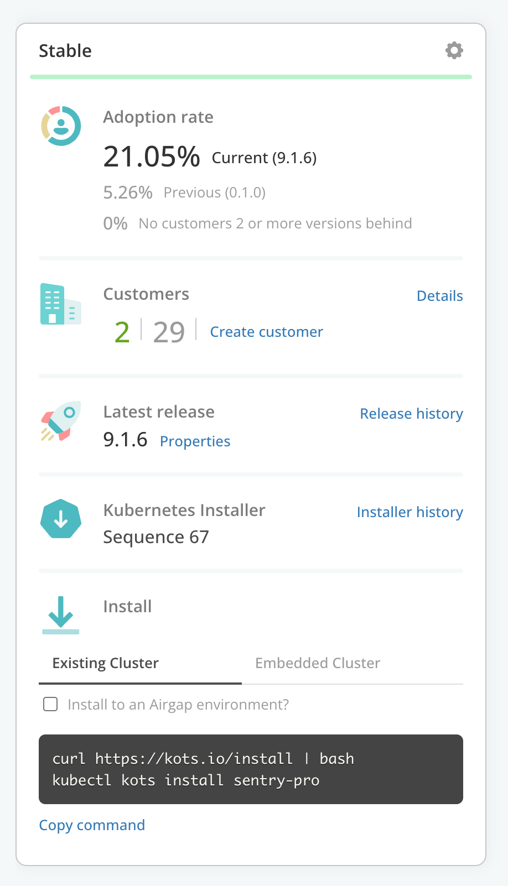
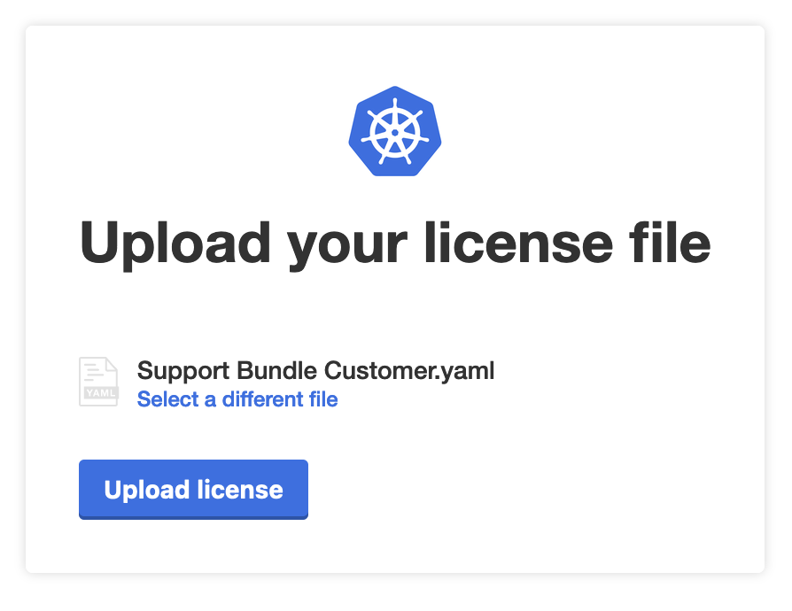

🚀 Let's begin!
=================

# Vendor Portal login

Log into the Vendor Portal with your existing account, and note your application *app slug*, *release channel*, and the "existing cluster install command".  It should look something like `kubectl kots install <app-slug/channel>`.  You don't need to install it yet! We have a little bit of setup to complete, first.

  

# Download the license

Navigate to the Vendor Portal tab and download the license that you've provisioned for your development work.

  

# Install the Replicated embedded cluster

In the Cluster Node 1 tab, begin your embedded cluster installation

```shell
curl -sSL https://kurl.sh/<installer-name> | bash -s ha
```

*When prompeted for the loadbalancer IP address, leave it blank to use the internal LB*

When the install script completes, copy the join command and run it in the *Cluster Node 2* tab

Repeat for *Cluster Node 3*

# Expose the admin console

To reach the admin console through the VM's firewall, expose the Kubernetes Service for `kotsadm`.  Paste this whole snippet:

```shell
kubectl expose deployment kotsadm \
  -n $(kubectl get pods -A -l app=kotsadm --no-headers | awk '{ print $1 }' ) \
  --type=LoadBalancer \
  --name=kotsadm2 \
  --port=8800 \
  --target-port=3000
```

# Upload your license and install the app

After installation succeeds, navigate to the [Application Installer admin console](http://[[ Instruqt-Var key="HOSTNAME" hostname="kubernetes-vm" ]].[[ Instruqt-Var key="SANDBOX_ID" hostname="kubernetes-vm" ]].instruqt.io:8800), login and upload your license.

  

In the admin console, continue to configure your application, run preflight checks, and deploy your application.

Once your application is deployed and the admin console reports it is ready to use, we can move on to the interactive troubleshooting exercises.

Click "Check" to continue.
