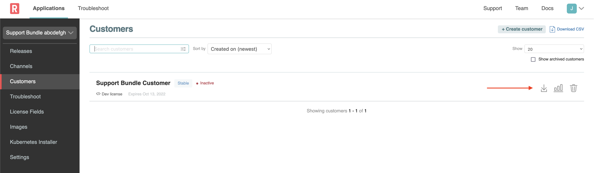

🚀 Let's start
=================

## Vendor Portal login

Log into the Vendor Portal with your existing account, and note your application install command from your typical release channel.  It should look something like:

```shell
kubectl kots install <app-slug>
```

## Download the license

Navigate to the Vendor Portal tab and download the license that you've provisioned for your development work.

  

👋 Install Your Application
================

### 1. Install the application

Install your application by executing `kots install` with your app slug:

```shell
kubectl kots install your-app-slug/stable
```

### 2. Upload your license

After installation succeeds, navigate to the `Application Installer` admin console, login and upload your license.

  

### 3. Expose the Application Installer admin console

To reach the admin console through the VM's firewall, expose the Kubernetes Service for `kotsadm`:

```shell
kubectl expose deployment kotsadm -n $(kubectl get pods -A -l app=kotsadm --no-headers | awk '{ print $1 }' ) --type=LoadBalancer --name=kotsadm2 --port=8800 --target-port=3000
```

🏁 Next
=======

Great! Now that your application is installed, we can move on to the interactive troubleshooting exercises.

Click "Next" to continue.
