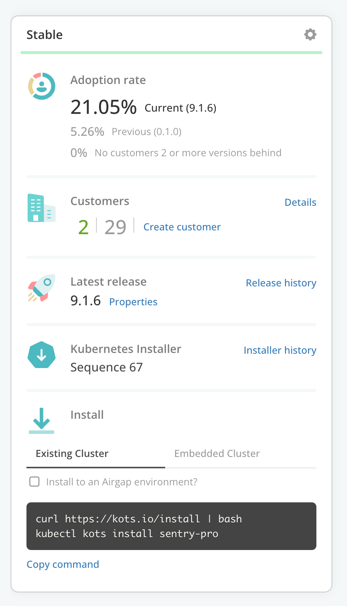

🚀 Let's start
=================

# Vendor Portal login

Log into the Vendor Portal with your existing account, and note your application *app slug*, *release channel*, and the "existing cluster install command".  It should look something like `kubectl kots install <app-slug/channel>`:

  

# Download the license

Navigate to the Vendor Portal tab and download the license that you've provisioned for your development work.

  

Then click into the next section and install your application.

Install your application
==================

### 1. Run the Application Installer

Configure the environment for automation by exporting the name of your app slug and the release channel.  Type the following into your shell, replacing `your-app` and `stable` with your app slug and release channel, and hit Enter.

```shell
export APP_SLUG=your-app
export CHANNEL=stable

```

Then run the following snippet to add these variables to your shell environment - they'll be useful later for automating the challenges.  You can paste the following snippet entirely:

```shell
echo "export APP_SLUG=${APP_SLUG}" >> ~/.bashrc
echo "export CHANNEL=${CHANNEL}" >> ~/.bashrc
```


Then, install your application by executing `kots install` with your app slug.  You can copy/paste this snippet:

```shell
kubectl kots install ${APP_SLUG}/${CHANNEL} \
  --no-port-forward=true
```

### 2. Upload your license

After installation succeeds, navigate to the `Application Installer` admin console, login and upload your license.

  

### 3. Expose the Application Installer admin console

To reach the admin console through the VM's firewall, expose the Kubernetes Service for `kotsadm`.  Paste this whole snippet:

```shell
kubectl expose deployment kotsadm \
  -n $(kubectl get pods -A -l app=kotsadm --no-headers | awk '{ print $1 }' ) \
  --type=LoadBalancer \
  --name=kotsadm2 \
  --port=8800 \
  --target-port=3000
```

Now that your application is installed, we can move on to the interactive troubleshooting exercises.

Click "Check" to continue.
