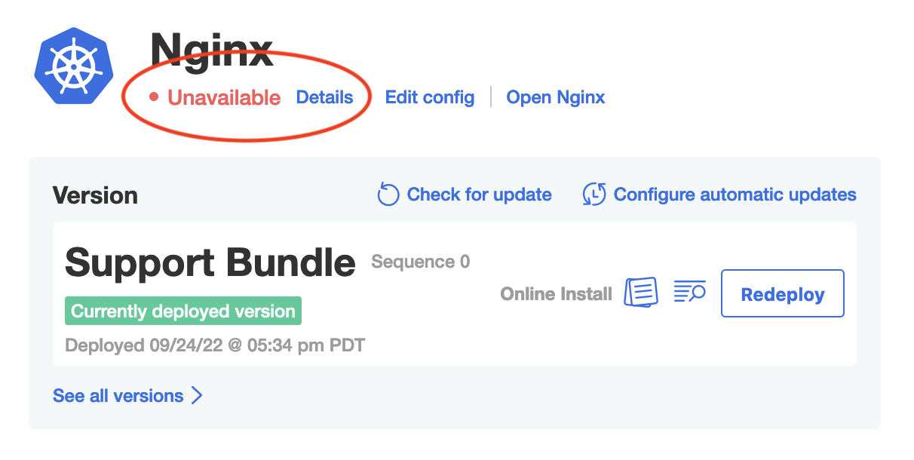
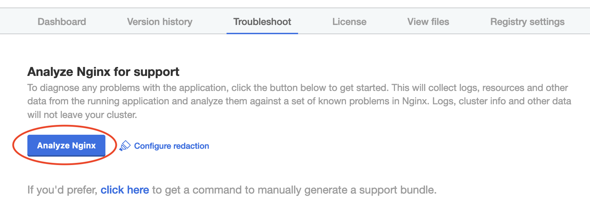
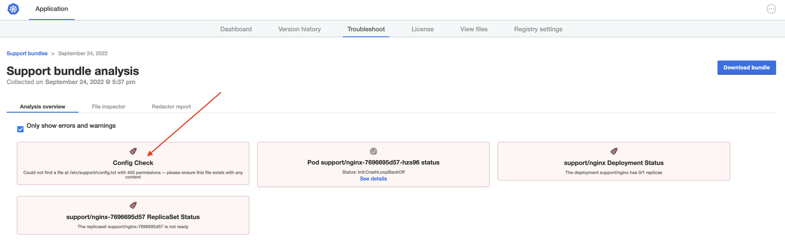

🚀 Let's start
==============

### Vendor Portal login

To access the Vendor Portal, you will need your participant id. If you go to the Shell tab, it will show you the username and password to be used for the Vendor tab. It will be of the following format:
```
username: [PARTICIPANT_ID]@replicated-labs.com
password: [PASSWORD]
```

Once you have the credentials, you can login into the Vendor tab and you should land on the Channels. Channels allow you to manage who has access to which releases of your application.

👋 Install Nginx
================

In this case, the Application Installer is already deployed. So you can download the license from the Vendor Portal (`Support Bundle Customer`), upload the license in the Application Installer and go through the initial installation.

### 1. Download the license

   

### 2. Install the application

The password for the application installer is your `PARTICIPANT_ID`, which can be obtained running the following in the Shell tab:

```
echo $INSTRUQT_PARTICIPANT_ID
```

Go to the `Application Installer` tab (external window), login and upload the license that was downloaded from the Vendor Portal.

   

🐛 The Issue
============

Once the app is deployed, you'll notice something is not quite right. The Status Informers show "Unavailable".




🔎 Investigating
================

As you know, the first step when the application isn't starting will be to collect a support bundle. Doing so will run a series of diagnostic checks to help diagnose problems with the application. In the case that a problem cannot be diagnosed automatically, a bundle will be ready for download so you can share with your broader team to help diagnose the issue. Start by navigating to the "Troubleshoot" tab and clicking the "Analyze" button.

<div align="center"><blockquote><h3>If an application isn't starting, always collect a support bundle</h3></blockquote></div>




Once the bundle is collected, you should see an informative error message in the analyzers:




> Could not find a file at /etc/support/config.txt with 400 permissions -- please ensure this file exists with any content


♠️ Under the hood
================

To understand why the application won't work, we have to look a little more into how the application works. The `Deployment` resource, is making use of an `initContainer` which checks for the following:

```yaml
  initContainers:
    - name: check-file
      image: busybox
      command:
        - /bin/sh
        - -ec
        - |
          perms=$(stat -c "%a" /etc/support/config.txt)
          if [ "$perms" -ne "400" ]; then echo missing config; exit 1; fi
      volumeMounts:
        - mountPath: /etc/support
          name: config
```

So this means that this file needs to present with the right permissions for the application pod to even start.

In the support bundle specification, this is also what is being checked for:

The collector:
```yaml
  - exec:
      name: check-config
      collectorName: check-config
      selector:
        - app=file-check-pod
      namespace: '{{repl Namespace}}'
      args:
      - stat
      - -c
      - "%a"
      - /etc/support/config.txt
```

The analyzer:
```yaml
  - textAnalyze:
      checkName: Config Check
      fileName: check-config/{{repl Namespace}}/*/check-config-*.txt
      regex: '400'
      outcomes:
        - pass:
            message: Found properly-restricted file at /etc/support/config.txt
        - fail:
            message: Could not find a file at /etc/support/config.txt with 400 permissions -- please ensure this file exists with any content
```

If you want to learn more about the power of Support Bundles, check out [https://troubleshoot.sh](https://troubleshoot.sh).

🏁 Next
=======

Great! Now that we're able to generate a support bundle and analyze a broken application, let's move to the next challenge and correct the problem.
