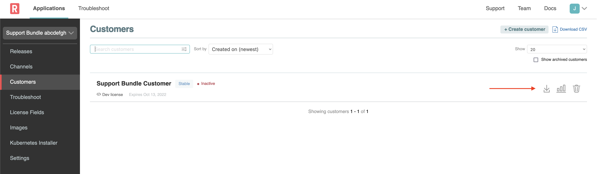
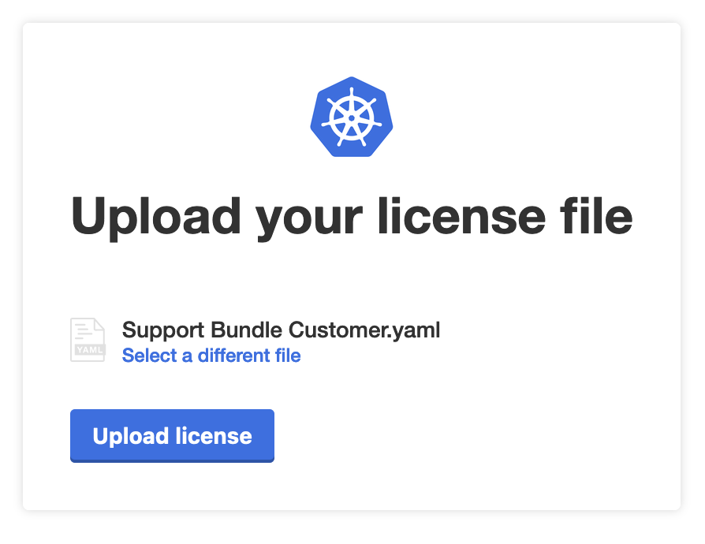
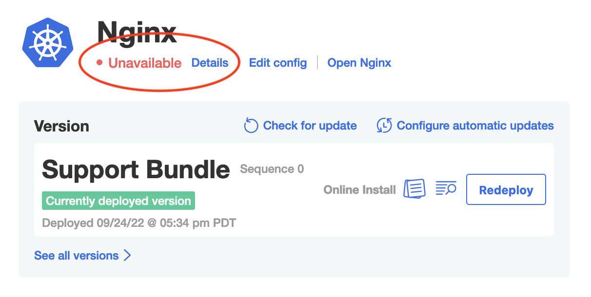
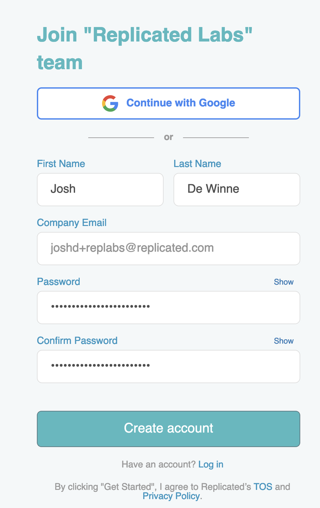
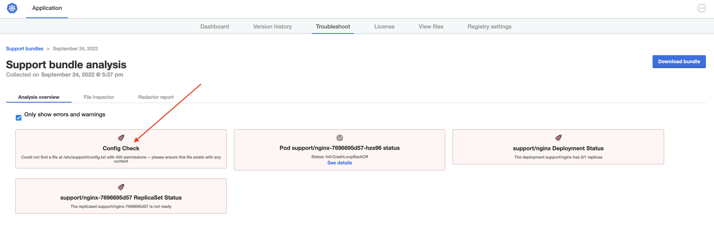

👋 Install Nginx
===============

In this case, the Applicatin Installer is already deployed. So you can download the license from the Vendor Portal (`Support Bundle Customer`), upload the license in the Application Installer and go through the initial installation.

1. Download the license

   

2. Install the app

   

🐛 The Issue
===============

Once the app is deployed, you'll notice something is not quite right. The Status Informers show "Unavailable".

🔎 Investigating
===============

As you know, the first step when the application isn't starting will be to collect a support bundle. Doing so will run a series of diagnostic checks to help diagnose problems with the application. In the case that a problem cannot be diagnosed automatically, a bundle will be ready for download so you can share with your broader team to help diagnose the issue. Start by navigating to the "Troubleshoot" tab and clicking the "Analyze" button.

<blockquote><h3>If an application isn't starting, always collect a support bundle</h3></blockquote>

Once the bundle is collected, you should see an informative error message in the analyzers:

> Could not find a file at /etc/lab1/config.txt with 400 permissions -- please ensure this file exists with any content

🏁 Next
=========

Great! Now that we're able to generate a support bundle and analyze a broken application, let's move to the next challenge and correct the problem.