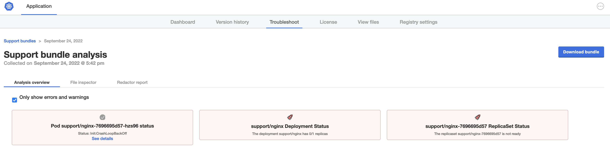
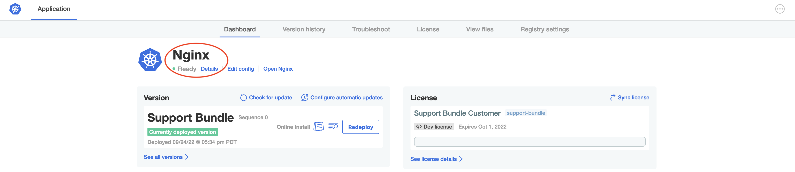

🐚 Correcting
===============

In order to correct this issue you'll need to add the missing file.

<details>
  <summary>Expand for shell commands</summary>

```
sudo touch /etc/support/config.txt
sudo chmod 400 /etc/support/config.txt
```
</details>

🏆  Validating
===============

If we run another support bundle, we should now see this check passes:



Once the fix is done, we can wait for the nginx pod to recover from CrashLoopBackoff, or we can give the pod a nudge to get it to retry immediately:

```text
kubectl delete pod -l app=nginx
```

Furthermore, we should now see that the application shows ready in the admin console, and we can open it via the link:




Congrats! You've completed the Support Bundle Track!
