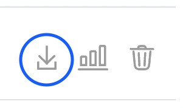

👋 Initial Application Check
============================

**In this exercise you will:**

 * Check the kubernetes cluster
 * Complete the deployment of the application by proving a license file
 * Access the Replicated Vendor portal to download customer license

***
## Ground Rules

In this lab and most of those that follow it, some of the failure scenarios are quite contrived.
It is very possible to reverse-engineer the solution by reading the Kubernetes YAML instead of following the lab steps.
If you want to get the most of out these labs, use the presented debugging steps to get experience with the toolset.

***

### 1. Check Kubernetes environment

A kubernetes environment has been pre-provisioned for this exercise.  Use the *Shell* tab to check and see that currently no application is running there.

```
kubectl get all
```

### 2. Access Vendor portal to download license

Click on the Vendor tab to launch the Vendor Portal login in new browser tab.

To access the Vendor Portal, you will need your participant id. If you go to the *Shell* tab, it will show you the username and password to be used for the Vendor tab. It will be of the following format:
```
username: [PARTICIPANT_ID]@replicated-labs.com
password: [PARTICIPANT_ID]
```

Once you have the credentials, you can login into the Vendor tab and you should land on the Channels tab.


### 3. Download Application License

A sample end customer has been pre-created and associated with the Stable release channel where the test application release has been promoted to.  View this customer by navigating to the *Customers* tab on the left hand side of the UI, the customer name is *Hola SupportCLI Customer*.

Click on the download license icon on the right of the customer entry as you'll use that in the next challenge.




***
To complete this challenge, press **Check**.
