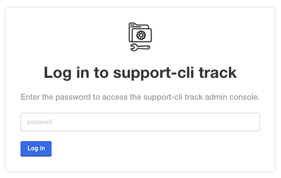
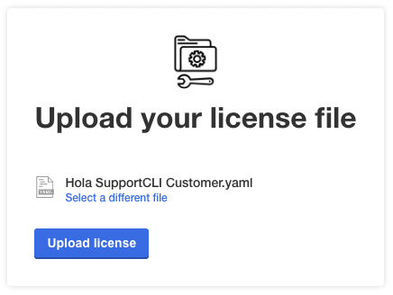
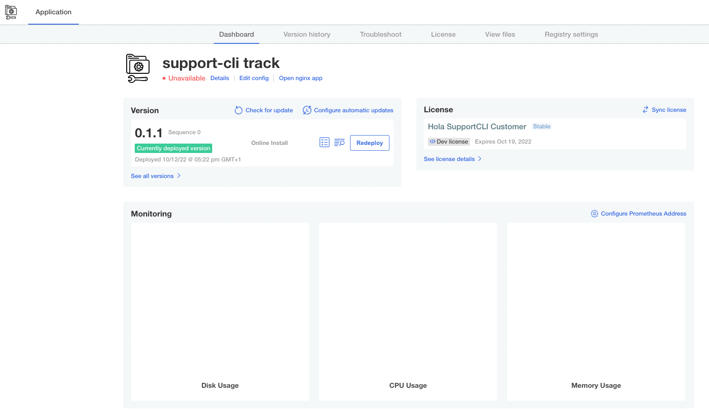
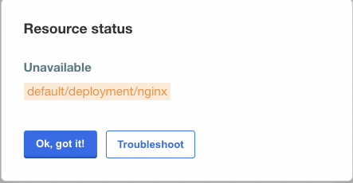

👋 Load the application license in kotadm UI
============================================

**In this exercise you will:**

 * Login to the kotsadm portal
 * Load the application license download from the vendor portal

### 1. Kotsadm UI Login

Launch the kotsadm and authenticate using PARTICIPANT_ID value from the Shell tab output as the password.

### 2. Upload application license

Once authenticated to kotsadm, you will be promoted to upload a license, select or drag and drop a file and click Upload.

The application will then fully deploy, running the pre-flight checks for the first time.  Click *Continue* on the Preflight checks screen and you will land on the dashboard and can see the application is not healthy.

Progress to the next challenge to investigate further.

To complete this challenge, press **Check**.

