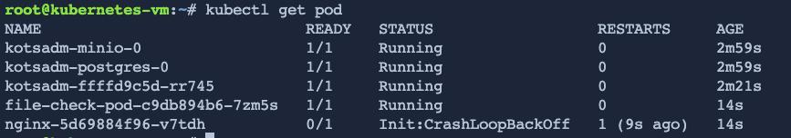
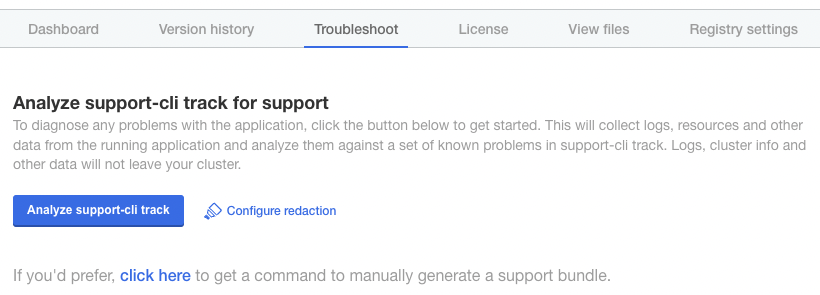
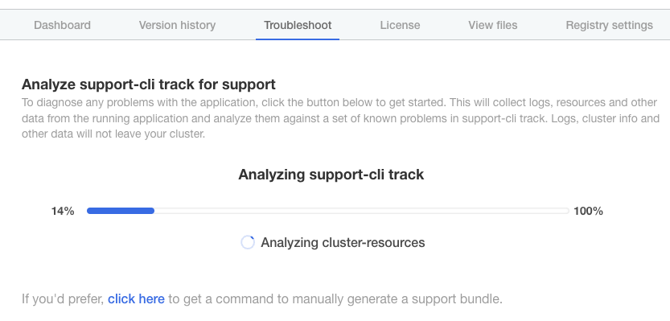
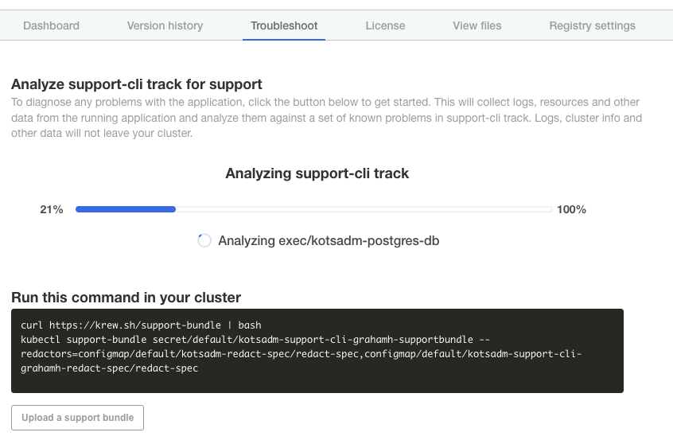
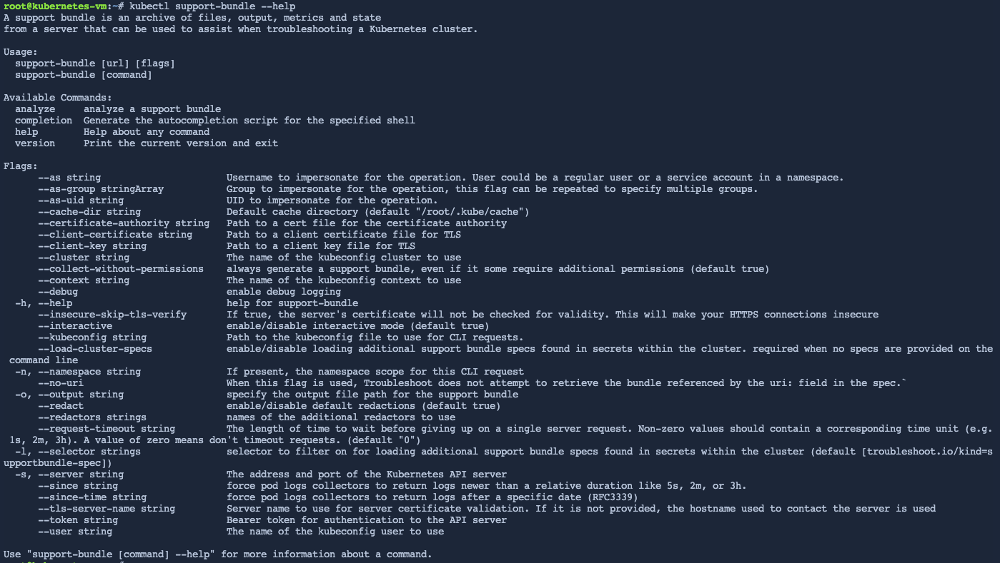
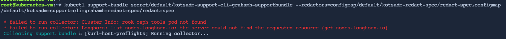
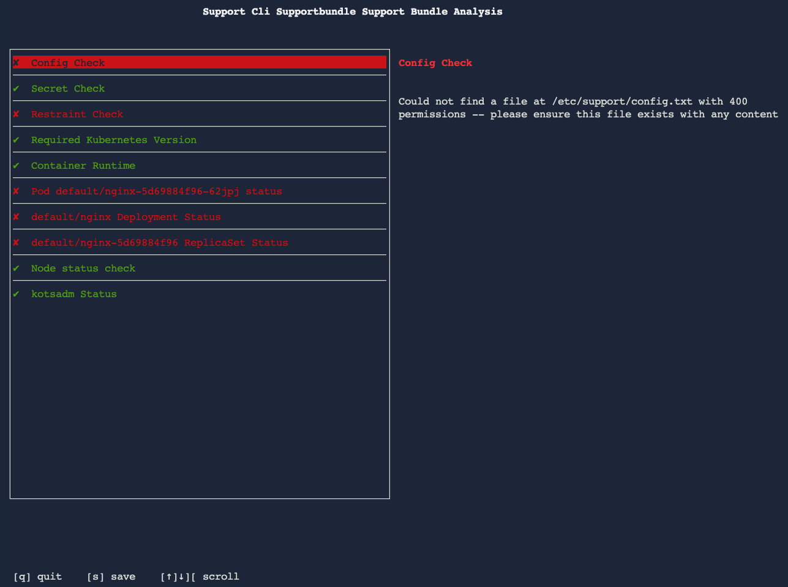
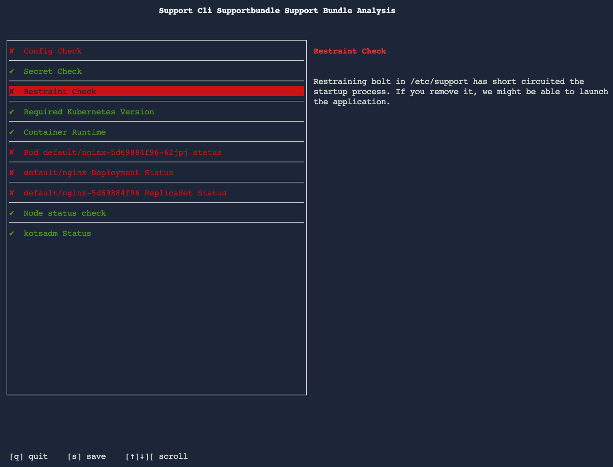
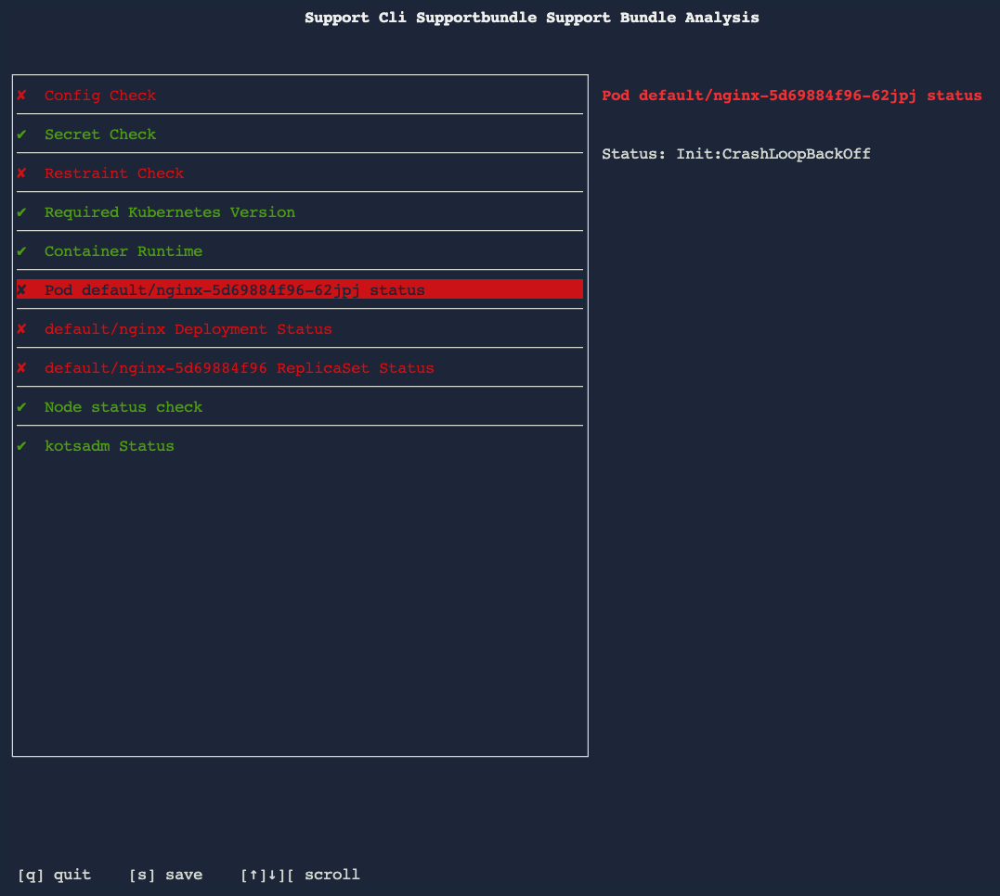
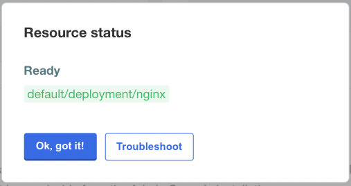

👋 Load the application license in kotadm UI
============================================

**In this exercise you will:**

 * Collect a support bundle
 * Investigate application health issues using the cli

***

### 1. Application Status CLI

While the goal of this lab is to show you how to get rich diagnostic information without using granular kubectl CLI commands, we'll pause for a second here to do some very basic inspection of what's happening using kubectl get pod.

```
kubectl get pod
```

Notice the status of the nginx pod is in Init:CrashLoopBackoff status



Rather than diagnosing using kubectl, follow the steps to analysing using the troubleshoot.io tools..


### 2. Support Bundle Collection

In the KotsAdm UI, navigate to the Troubleshoot tab and select *Analyze support-cli track*



This will trigger a support bundle collection via the kotsadm UI



Note the text at the bottom of the screen:

*If you'd prefer, click here to get a command to manually generate a support bundle.*

click on the *click here* link to show the commands to collect a support bundle via the CLI.



This is useful as sometimes the kotsadm UI may be unavailable and diagnosis needs to be performed from the CLI only.

Note that the commands are in two parts.  Firstly install the support-bundle kubernetes cli plugin using krew:
```
curl https://krew.sh/support-bundle | bash
```

Then the bundle generation itself:
```
kubectl support-bundle secret/default/kotsadm-support-cli-${INSTRUQT_PARTICIPANT_ID}-supportbundle --redactors=configmap/default/kotsadm-redact-spec/redact-spec,configmap/default/kotsadm-support-cli-${INSTRUQT_PARTICIPANT_ID}-redact-spec/redact-spec
```

Note the above support-bundle command launches a console ui on the bundle contents


### 3. CLI Support Bundle Analysis

Note the help output from the support-bundle:

```
kubectl support-bundle --help
```



In the support bundle console UI, step through the issues and address them one by one.

Here is some sample output similar to what you should see in your environment:





Based on the advice presented in the support bundle content, perform corrective action on the cluster..

### 4. Status Check - CLI

Check the status of the application services via the cli

```
kubectl get all
```

The nginx pod should be in *Running* state, it can take some time for it to loop after it has backed off so it can be deleted and the replica set will replace with a new one.
```
kubectl get pod/$(kubectl get pod | grep nginx | awk '{print $1}')
kubectl delete pod/$(kubectl get pod | grep nginx | awk '{print $1}')
watch "kubectl get pod/$(kubectl get pod | grep nginx | awk '{print $1}')"
```


### 3. Status Check - UI

Once the application is confirmed to be running on the CLI, check in the UI

The Application StatusInformers should be Green now:



The application launcher should also now be functional, from the Dashboard click on *Open nginx app* link


***

🏁 Finish
=========
Once the nginx application is running and you have reviewed the application, you can Complete the track.

To Finish this track, press **Check**.
