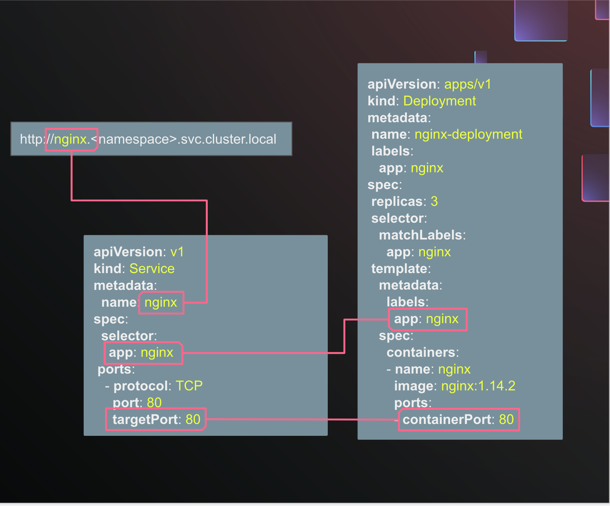

You get another report from a customer saying that their application isn't working, as if **a Pod is not responding and connections time out**.  How would you begin to solve the problem?

Here are some prompts to get you thinking in the right direction:

- What cluster component handles communication between Pods?
- What cluster component handles load balancing for Pods and exposes Pods to connections from outside the cluster?

To pass this challenge, save the broken resource to `~/solution.yaml`, edit it to be correct, then click "Next" to check your work.

💡 Using `sbctl`
=================

- Remember that you can use the interactive shell prompt with `sbctl shell -s <path-to-support-bundle>`

💡 Using `kubectl`
=================

- Remember that you can get a resource in YAML format by doing `kubectl get <resource> -o yaml`
- Also remember that you can save the output of a command to a file with the `>` operator: `kubectl get <resource> -o yaml > ~/resource.yaml`

- Remember that you can ask for more than one kind of resource at a time by listing them with commas: `kubectl get pods,services,deployments`

- Remember that you can ask for resources from all namespaces with the `--all-namespaces, -A` flag: `kubectl get pods -A`

- Remember that you can show extra information, like IP addresses and which node a resource is scheduled on, with the `-o wide` flag: `kubectl get pods -A -o wide`


💡 Hints
=================

- The Kubernetes documentation has a [great manual on debugging Services](https://kubernetes.io/docs/tasks/debug/debug-application/debug-service/)

- Think about the traffic flow to a typical application:
  - There are multiple **hops** in the network path, and any of them _could_ be a potential break in the path.
  - Which hops can you identify?

- How does traffic get to workloads inside kubernetes
- How does Kubernetes handle DNS resolution and load balancing for Pods?

💡 More Hints
=================

- A typical app usually has at least a frontend and a backend, and maybe some middle services.  The frontend is usually expected to handle incoming requests.  The backend is usually expected to handle requests *only* from the frontend or other services.

- Some apps do not always crash if they can't connect to an API they depend on.  It may not be obvious just by looking at the Pod states that there is a problem.  Make sure to examine Pod logs in the app for any errors or warnings.


💡 More Hints about Services
=================

- Kubernetes Services act as load balancers to Pods
  - Pods advertise a `containerPort` that they are listening on, but we don't want to keep track of their IP addresses since they change all the time.  Services are a way to abstract away the IP addresses of the Pods, and instead use a DNS name to connect to the Pods.  A Service's name is recorded as a DNS record in the cluster.
  - Services advertise a listening `port` and forward connections to a `targetPort`.

  

Troubleshooting Procedure
=================

First, let's consider what's deployed in the cluster and outline some assumptions.  Use `kubectl get pods,deployments,services,ingresses -A -o wide` to list the resources involved in our problem.  We want to include all namespaces because there could be components like an Ingress Controller in a different namespace than our application.  We can see that Deployments are running, Services exist, and we can match Service names to Deployment names and make some assumptions about the network paths.  Notice, also, that there is a single Ingress route that matches all hostnames, and an Ingress class called `contour` and an associated `projectcontour` Namespace with Pods.  We need to consider that the Contour Ingress Controller is a potential hop in the network path.  This is a common pattern for a Replicated Embedded Cluster installation.


#### Understand the limits of the problem
Let's consider all the hops in our system.  We know there is a Pod, and a Service, and potentially an IngressController pod; troubleshooting any networking problem begins by figuring out the network path from the client to the server,.  At each step, we can check our connection with something like `netcat` or `curl` depending on what kind of protocol we are using.  Perhaps the web frontend is not working, or perhaps a backend API is not working; start to understand the limits of the problem, and work backwards from Pods that are no longer responding to the client.

List all the pods and check for any that are not `Running` with `kubectl get pods -n <namespace> -o wide`.  If there are any Pods that are not `Running`, check the logs with `kubectl logs -n <namespace> <pod-name>`.  If all the Pods are healthy, we'll check logs anyway because not every application will crash on a broken connection - many will continue to run, but emit errors.

As you explore the app's logs, you should notice some error messages with patterns like "connection error" and "transport: Error while dialing:".  These should stand out as red flags.  Note the IP address and port number involved in the failed connection.

Return to the list of resources involved in networking by doing `kubectl get pods,deployments,services,ingresses -A -o wide`.  Cross-reference the failed connection IP address and port with the resources in the cluster.  What do you find that matches?

You can make this a little bit easier by using `grep`: `kubectl get pods,deployments,services,ingresses -A -o wide | grep <ip-address>`.  This will show you only the resources that match the IP address you are looking for.

Since this application has some clearly defined roles and names for each microservice, it should be easy to identify the Deployment and Pods that are not responding.  Not all applications may be so clear, so let's also learn to use the Service's `selector` since, that's [how the Kubernetes model works](https://kubernetes.io/docs/tutorials/services/connect-applications-service/#the-kubernetes-model-for-connecting-containers).

Use `kubectl describe svc` and `kubectl describe deployment` and note the `selector` and `labels` of the Service and Deployment.  The `selector` of the Service should match the `labels` of the Pod spec inside the Deployment.  If the `selector` does not match the `labels`, the Service will not forward connections to the Pod correctly.  Example with only the relevant fields shown:

```plaintext
root@cloud-client:~# kubectl describe deployment kotsadm
Name:                   kotsadm
Namespace:              default
Pod Template:
  Labels:           app=kotsadm

root@cloud-client:~# kubectl describe service kotsadm
Name:              kotsadm
Namespace:         default
Selector:          app=kotsadm
```

You should be able to identify the faulty Service now.  If you can't, remember that in a typical application, the frontend or "web tier" is usually expected to route connections between microservices.  Review the logs of the frontend to see if it is handling connections correctly.

Now that you can identify the faulty Service, we need to understand what went wrong and how to fix it.

We can see the Service's **Type**, which tells us how the service is exposed; a `ClusterIP` service is only accessible within the cluster by other Pods.

Describe the Service with `kubectl describe svc`, and note the its listening `port` and the `targetPort` it forwards connections to.  The `targetPort` should match the `containerPort` of associated Pods.  If the Service's `targetPort` does not match a Pod's `containerPort`, the Service will not forward connections to the Pod correctly.

✔️ Solution
=================

The problem in this challenge is that a Service is not correctly forwarding connections to a Pod in a Deployment.  The Service is forwarding connections to a port where the Pod is not listening.  We can see from Pod logs that other microservices expect to use port 7070 to communicate with the `cartservice`, and `cartservice` should forward connections to port 7070 on the Pod.  The Service's `targetPort` should match the Pod's `containerPort`.

Remember that you can think of a Service like a traditional "load balancer" or "reverse proxy" that forwards connections to the correct Pod.  The Service listens on a `port` and forwards connections to a `targetPort` on the Pod with a matching selector.  The `targetPort` in a Service should be set to the `containerPort` in the Pod spec:


```plaintext
# kubectl describe service cartservice
Name:              cartservice
Namespace:         default
Selector:          app=cartservice
...
Port:              grpc  7070/TCP
TargetPort:        30000/TCP

# kubectl describe deployment cartservice
Name:                   cartservice
Namespace:              default
Pod Template:
  Labels:           app=cartservice
  Containers:
   server:
    Image:      gcr.io/google-samples/microservices-demo/cartservice:v0.9.0
    Port:       7070/TCP
```

Remediation
=================

Patch or edit the affected service to correct the port number. You may have to refer to the other resources in the cluster to identify the correct port number.
