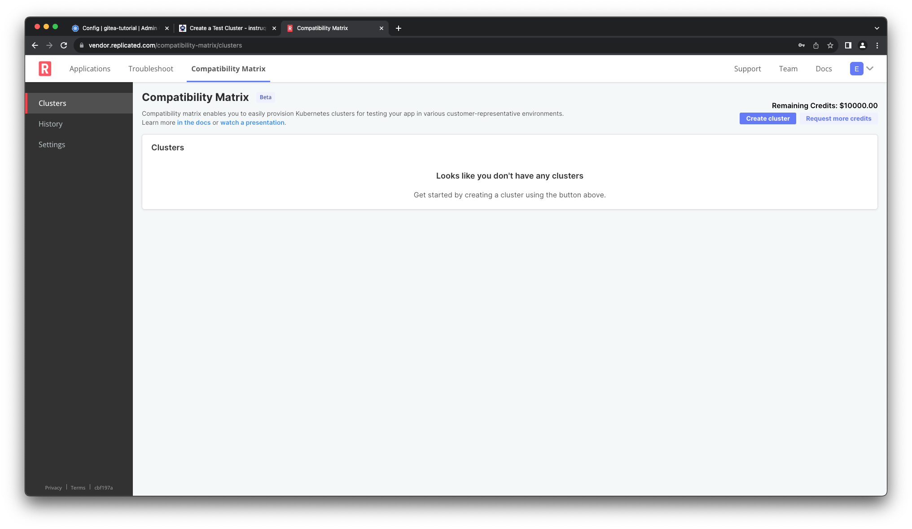
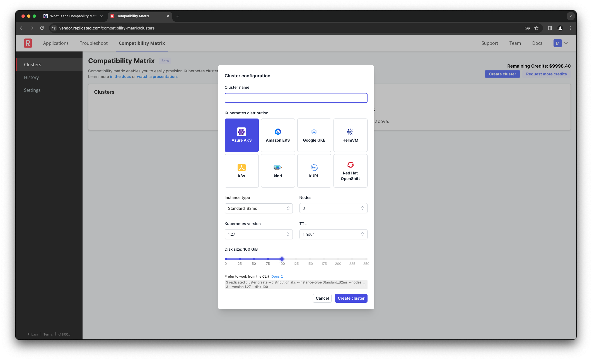
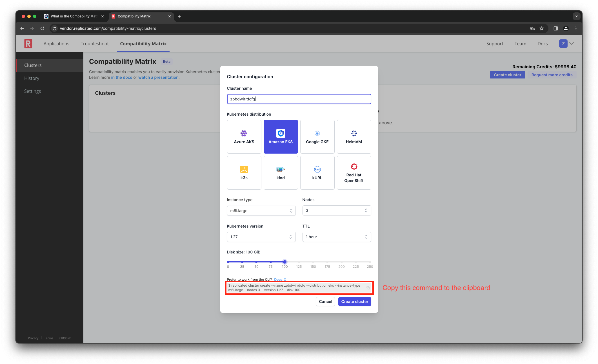

👋 Introducing the Comptibility Matrix
======================================

The Replicated Compatibility Matrix is a service for quickly and easily
spinning up ephemeral clusters for testing your application. You can manage
your clusters using the Replicated Vendor Portal. We also provide a command-line
interface and a series of GitHub actions to facilitate Continuous Delivery.

Compatibility Matrix in the Vendor Portal
=========================================

Let's use the Replicated Vendor Portal to understand the types of clusters
you can create for you testing. Click the "Vendor Portal" tab and log in with
the following credentials

Username: `[[ Instruqt-Var key="USERNAME" hostname="shell" ]]` 
Password: `[[ Instruqt-Var key="PASSWORD" hostname="shell" ]]`

Once you log in, you'll see the the Compatability Matrix landing page. It
should look something like the image below, but since this is shared lab
environment you may see one or more clusters listed. If there are any clusters
there, make sure you leave them alone so others who are learning about
Replicated can have a good experience. I'm sure you'd want them to do the same
for you.

Defining a Cluster
==================

Click on the "Create Cluster" button in the top right on the page to see the
options you have for creating a cluster. We're going to select a few options for
the cluster in the portal, but we're not going to create it. Instead we're going
to use the Replicated CLI to create it in the next step of the lab.

Choose the type of cluster you want to create and update the other options if
you'd like. If you're not sure what to choose, pick the following:

<table>
<tbody>
<tr><td>Cluster Name</td><td>c[[ Instruqt-Var key="USERNAME" hostname="shell" ]]</td></tr>
<tr><td>Kubernetes Distribution</td><td>Amazon EKS</td></tr>
<tr><td>Instance Type</td><td>m6i.large</td></tr>
<tr><td>Nodes</td><td>3</td> </tr>
<tr><td>Kubernetes Version</td><td>1.27</td></tr>
<tr><td>TTL</td><td>1 hour</td></tr>
<tr><td>Disk Size</td><td>100 GiB</td></tr>
</tbody>
</table>

You could just click the "Create cluster" button and create a cluster form
here, but let's copy the command from the bottom of the dialog box and use it
to create a cluster from the command line.

Click the "Check" button below to move to access a terminal and run the cluster
creation command.
