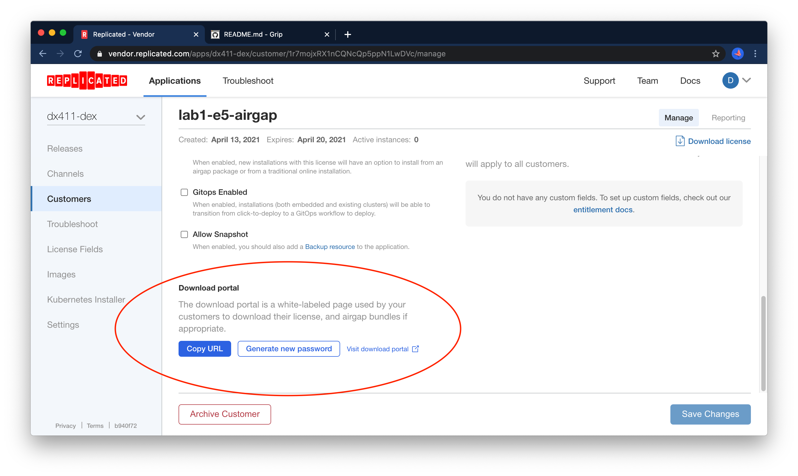

Lab 1.5: Airgap
=========================================

In this lab, we'll review how to perform installations in airgapped environments, and
how to collect support bundles in airgapped environments.

In this case we'll start with a bare airgapped server with no kots installation, so you can
get practice performing an airgap install from scratch.

Once that's done, we'll explore how some of the support techniques differ between online and airgapped environments. 

### Airgap Workflow Overview

### Instance Overview

You will have received the IP of a jump box and the name of an airgapped server.
For example, you may have received:

```text
jump-dx411-dex-lab1-e5-airgap = 104.155.131.205
dx411-dex-lab1-e5-airgap
```

In general, the name of the private server will be the same as the Jump box, with the characters `jump-` removed from the prefix. 
Put another way, you could construct both instance names programatically as

```shell
jump-${REPLICATED_APP}-lab1-e5-airgap
```

and

```shell
${REPLICATED_APP}-lab1-e5-airgap
```

### Connecting

First set your application slug, and the public IP of your jump box:

```shell
export JUMP_BOX_IP=...
export REPLICATED_APP=... # your app slug
```

Next, you can ssh the airgapped server with

```shell
ssh -J dex@${JUMP_BOX_IP} dex@${REPLICATED_APP}-lab1-e5-airgap
```

Once you're on, you can verify that the server indeed does not have internet access. Once you're convinced, you 
can ctrl+C the command and proceed to the next section

```shell
curl -v https://kubernetes.io
```

### Moving Assets into place

If you haven't already, you can log out of the airgapped instance with `exit` or ctrl+D. 
Our next step is to collect the assets we need for an airgapped installation:

1. A license with the airgap entitlement enabled
2. An airgap bundle containing the kURL cluster components
3. An airgap bundle containing the application components

(2) and (3) are separate artifacts to cut down on bundle size during upgrade scenarios where only the application version 
is changing and no changes are needed to the underlying cluster.

#### Building an Airgap Release

By default, only the Stable and Beta channels will automatically build airgap bundles

- manually build
- set channel to auto build

For a production application, airgap releases will be built automatically on the Stable channel, so this won't
be necessary.

#### Enabling Airgap for a customer

The first step will be to enable airgap for the `lab1-e5` customer:


#### Download Airgap Assets 


After saving the customer, scroll to the bottom of the page to the `Download Portal` section.



Generate a new password and save it somewhere in your notes.
Next, click the link to open the download portal. 
This is a link you would usually send to your customer, so from here on our we'll be wearing our "end user" hat.


Navigate to the "embedded cluster" option and review the three downloadable assets.


Download the license file, but **don't download the kURL bundle**.
While you can download the kurl bundles directly to your workstation and copy it to the remote server, you'll
likely be able to go much faster if you copy the URL and download the assets directly onto the jump box.
You can copy each URL as shown below:


You'll want to download the other bundle `Latest Lab 1.5: Airgap Bundle` to your workstation.

Now, let's SSH our Jump box (the one with the public IP) and download the kurl bundle.
We'll use the `-A` flag to the `ssh` command to forward our agent so we can interact with the airgapped node as well.
Replace the URL with the one you copied above

```text
dex@jump-dx411-dex-lab1-e5-airgap ~$ curl -okurlbundle.tar.gz https://kurl.sh/bundle/dx411-dex-lab1-e5-airgap.tar.gz
```

When it's finished, copy it to the airgapped server. 
You can use the DNS name in this case, as described in [Instance Overview](#instance-overview).
In this example we've ssh'd the jump box with the -A flag so the SSH agent will be forwarded.

```text
dex@jump-dx411-dex-lab1-e5-airgap ~$ scp kurlbundle.tar.gz dx411-dex-lab1-e5-airgap:
```

**Note** -- we use SCP via an ssh tunnel in this case, but the airgap methods int his lab also extend to 
more locked down environments where e.g. physical media is required to move assets into the datacenter.

Now we'll SSH all the way to airgap node. If you still have a shell on your jump box, you can use the instance name.

```text
dex@jump-dx411-dex-lab1-e5-airgap ~$ ssh dx411-dex-lab1-e5-airgap
```

Otherwise, you can use the above 

```shell
ssh -J ${JUMP_BOX_IP} ${REPLICATED_APP}-lab1-e5-airgap
```

Once you're on the "airgapped" node, untar the bundle and run the install script with the `airgap` flag.
kURL install flags are documented [in the kurl.sh docs](https://kurl.sh/docs/install-with-kurl/advanced-options).

```shell
tar xvf kurlbundle.tar.gz
sudo bash install.sh airgap
```

At the end, you should see the familiar `Installation Complete` message. 
Since the instance is airgapped, we'll need to create a port-forward to access the UI from our workstation in the next step.

### Accessing the UI via SSH tunnel, Configuring the instance

You'll want to create a port forward from your workstation in order to access to UI locally.
Again we'll use `REPLICATED_APP` to construct the DNS name but you can input it manually as well.

```shell
export JUMP_BOX_IP=...
export REPLICATED_APP=... # your app slug
ssh -vNL 8800:${REPLICATED_APP}-lab1-e5-airgap:8800 dex@${JUMP_BOX_IP}
```

This will run in the foreground, and you wont see any output, but you can test by navigating to http://localhost:8800

From here, you can proceed with the standard setup steps, until we get to the post-license install step.
Remember that this is a fresh install so you'll need to grab the password from the install script output:


After you upload your license, you'll be greeted with an Airgap Upload screen. Use the "application bundle" that you
downloaded to your workstation using the customer portal here.


You'll see the bundle uploaded and images being pushed to kURL's internal registry:


We'll find that the application is unavailable. 


While we'll expore [support techniques for airgapped environments](#collecting-a-cli-support-bundle) 
below, in this case you should observe that our deployment is simply not valid, specifically, the
standard nginx entrypoint has been overriden:

```yaml
      containers:
        - name: nginx
          image: nginx
          command:
            - exit
            - "1"
```

So we'll need to create a new release in order to 

### Airgapped Upgrades

- make release
- download new bundle
- upload new bundle


### Collecting a CLI support bundle

- move file into place
- run w/ path to file
Of course, since our app is installed, we could also have used the command from [lab 3](../lab1-e3-support-cli):
  
```shell
export REPLICATED_APP=... # your app slug
kubectl support-bundle \
  secret/default/kotsadm-${REPLICATED_APP}-supportbundle \
  --redactors=configmap/default/kotsadm-redact-spec/redact-spec,configmap/default/kotsadm-${REPLICATED_APP}-redact-spec/redact-spec
```

- do an airgap install
- collect kots.io support bundle by transferring spec onto instance
- scp bundle off instance via jumpbox  
- fix instance