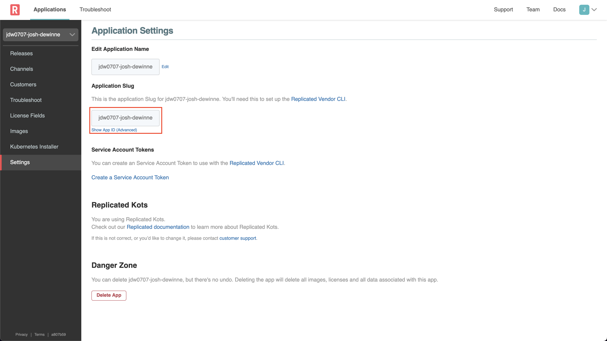
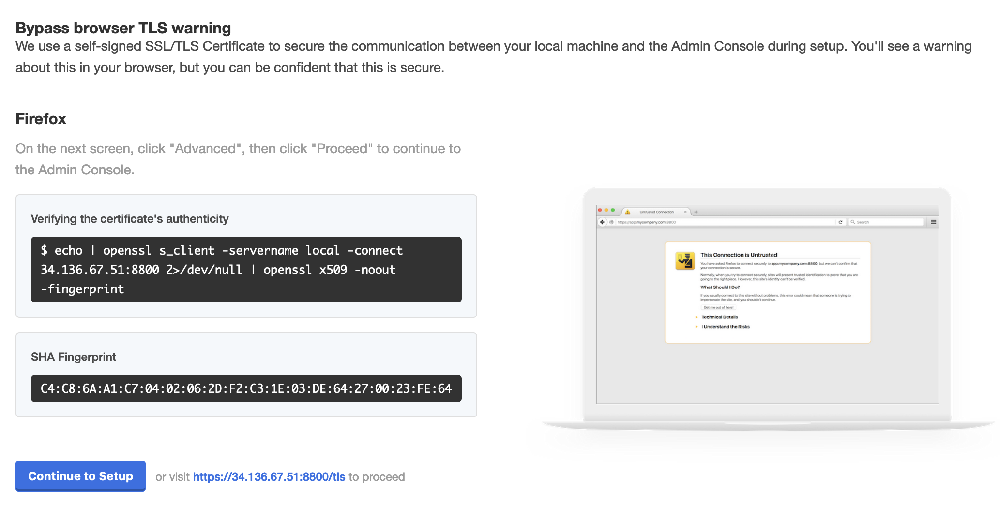
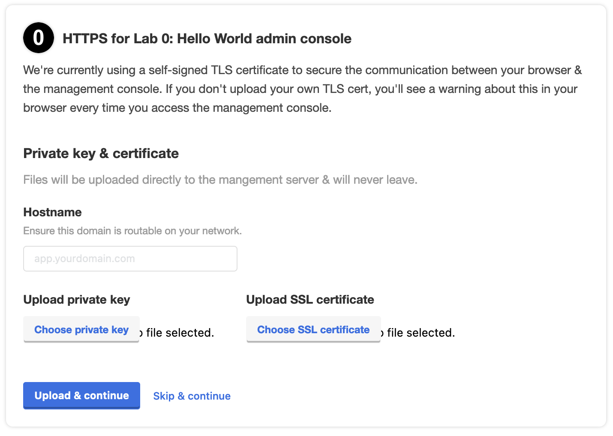
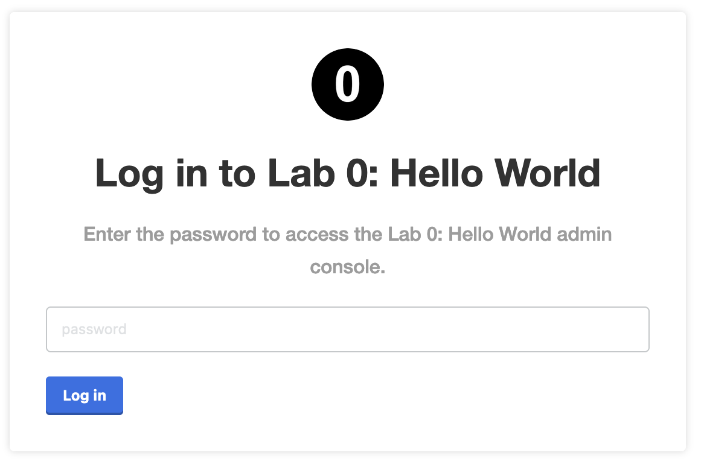
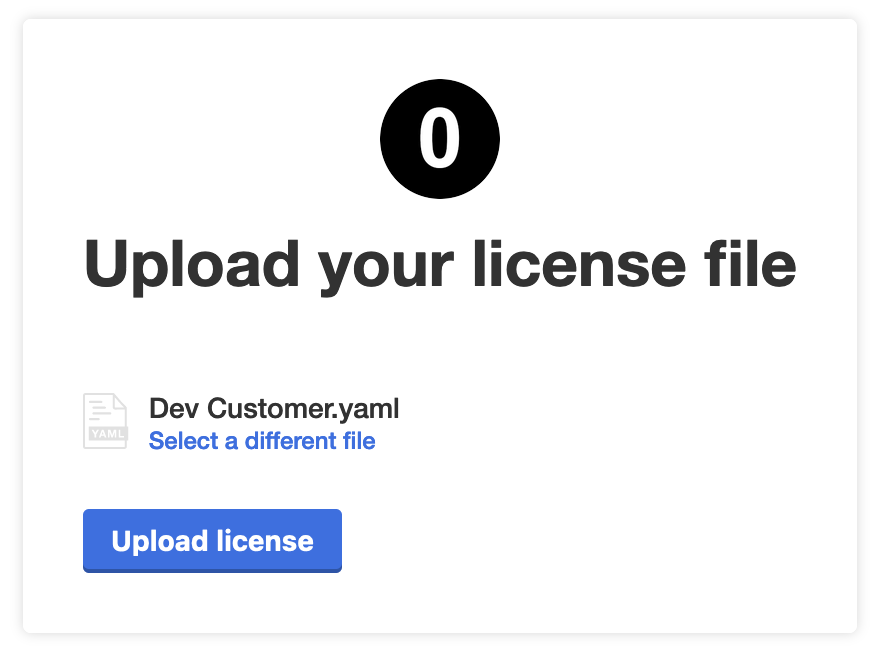
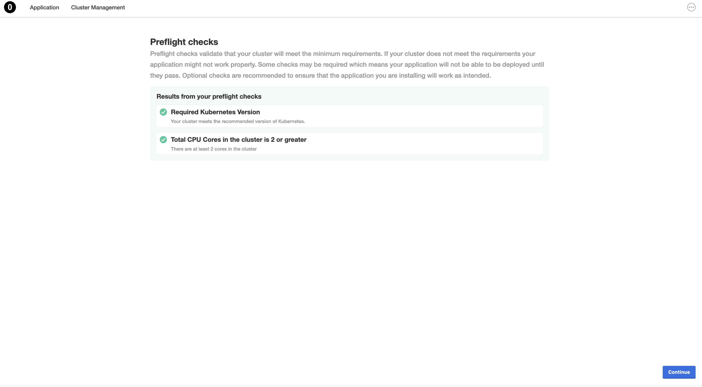
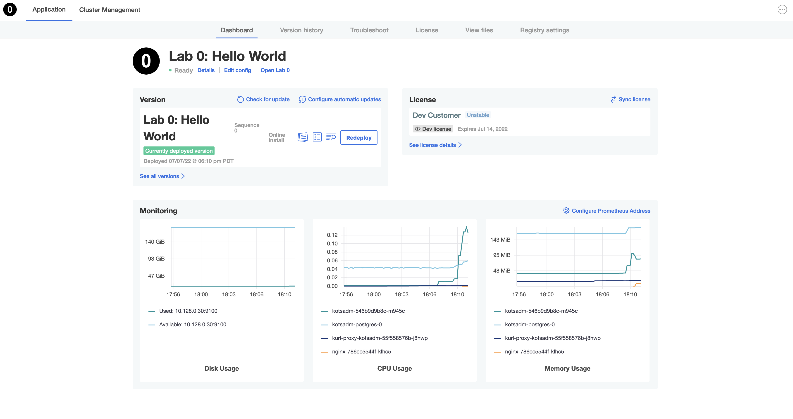
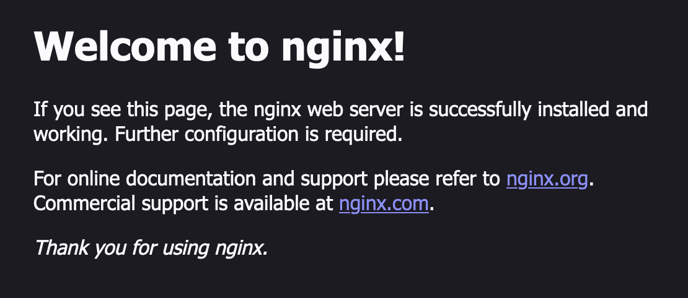
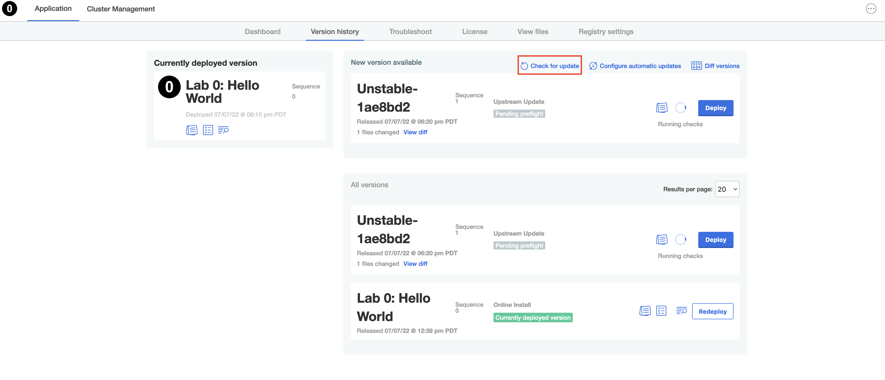

Lab 0: Hello World
=========================================

This exercise is designed to give you a sandbox to ensure you have the basic CLI tools set up and are prepared to proceed
with the exercises in Lab 1.

The README and the YAML sources draw from https://github.com/replicatedhq/replicated-starter-kots

* **What you will do**: 
  * Complete the simplest possible "Hello World" setup with a minimal KOTS application designed for demos
  * Set up Replicated CLI Tools for fast iteration
  * Ship an update to a development instance
* **Who this is for**: This lab is for anyone who works with app code, docker images, k8s yamls, or does field support for multi-prem applications
  * Full Stack / DevOps / Product Engineers 
  * Support Engineers
  * Implementation / Field Engineers
* **Prerequisites**: 
  * Basic working knowledge of Kubernetes
  * A Linux or Mac machine on which to set up the development environment (see [this issue](https://github.com/replicatedhq/kots-field-labs/issues/7) for windows)
* **Outcomes**:
  * You will build a working understanding of the Replicated CLI tools and a fast development workflow
  * You will be prepared to integrate the Replicated Vendor platform into your existing CI/CD workflow via GitHub actions or your platform of choice
  * You will have completed the prerequisites for labs 2, 5 and 6


* * *

## Get started

To start, you'll want to clone this repo somewhere. Optionally, you can fork it first (or you can do this later).

```shell script
git clone https://github.com/replicatedhq/kots-field-labs 
cd kots-field-labs/labs/lab00-hello-world
```

### 1. Install CLI

To start, you'll want to install the `replicated` CLI.
You can install with [homebrew](https://brew.sh) or grab the latest Linux or macOS version from [the replicatedhq/replicated releases page](https://github.com/replicatedhq/replicated/releases).

##### Brew

```shell script
brew install replicatedhq/replicated/cli
```

##### Manual

```shell script
curl -s https://api.github.com/repos/replicatedhq/replicated/releases/latest \
           | grep "browser_download_url.*$(uname | tr '[:upper:]' '[:lower:]')_all.tar.gz" \
           | cut -d : -f 2,3 \
           | tr -d \" \
           | cat <( echo -n "url") - \
           | curl -fsSL -K- \
           | tar xvz replicated
```
Then move `./replicated` to somewhere in your `PATH`:


```shell script
mv replicated /usr/local/bin/
```

##### Verifying

You can verify it's installed with `replicated version`:

```text
$ replicated version
```
```json
{
  "version": "0.31.0",
  "git": "c67210a",
  "buildTime": "2020-09-03T18:31:11Z",
  "go": {
      "version": "go1.14.7",
      "compiler": "gc",
      "os": "darwin",
      "arch": "amd64"
  }
}
```

***
### 2. Configure environment

You should have received an invite to log into https://vendor.replicated.com -- you'll want to accept this invite and set your password.

**Important Note:** It is important to logout of any existing session in the Replicated vendor portal so that when clicking on the Labs Account invitation email link it takes you to a specific new registration page where you enter your name and password details.  If you get a login screen then this is probably the issue.

Once registered, you will be in a shared account with all other lab participants -- once you log in, your application will be automatically selected:


Now, you'll need to set up environment variables to interact with vendor.replicated.com and instance.


`REPLICATED_APP` should be set to the app slug from the Settings page.

<p align="center"></img></p>

Next, create a `read/write` User API token from your [Account Settings](https://vendor.replicated.com/account-settings) page:
> Note: Ensure the token has "Write" access or you'll be unable create new releases.

<p align="center"></img></p>

Once you have the values,
set them in your environment.

```
export REPLICATED_APP=...
export REPLICATED_API_TOKEN=...
export FIRST_NAME=... # your first name
```

You can ensure this is working with

```
replicated release ls
```
***
### 3. Verifying manifests

From `labs/lab00-hello-world`, You should have a few YAML files in `manifests`:


```text
$ ls -la manifests
total 28
drwxr-xr-x. 2 root root  161 Apr 12 18:27 .
drwxr-xr-x. 4 root root   94 Apr 12 18:27 ..
-rw-r--r--. 1 root root  179 Apr 12 18:27 k8s-app.yaml
-rw-r--r--. 1 root root 4186 Apr 12 18:27 kots-app.yaml
-rw-r--r--. 1 root root  990 Apr 12 18:27 kots-preflight.yaml
-rw-r--r--. 1 root root  347 Apr 12 18:27 kots-support-bundle.yaml
-rw-r--r--. 1 root root  447 Apr 12 18:27 nginx-deployment.yaml
-rw-r--r--. 1 root root  438 Apr 12 18:27 nginx-service.yaml
```

You can verify this yaml with `replicated release lint`:

```shell script
replicated release lint --yaml-dir=manifests
```

You should get a list that returns no errors, and exits with a 0 exit code. Output should look something like this, although if your info/warnings are slightly different that's okay.

```text
RULE                   TYPE    FILENAME                     LINE    MESSAGE
config-spec            warn                                                                        Missing config spec
```

* * *

### 4. Creating our first release


Now that we have some YAML, let's create a release and promote it to the `Unstable` channel so we can test it internally.
You can inspect the `Makefile` to get a sense of what is happening under the hood, but for now, for simplicity we'll use the Makefile command,
for this and all future labs in this program.


```shell script
make release
```

You can verify the release was created with `replicated release ls`:

```text
$ replicated release ls
SEQUENCE    CREATED                      EDITED                  ACTIVE_CHANNELS
1           2020-09-03T11:48:45-07:00    0001-01-01T00:00:00Z    Unstable
```

* * *

### 5. Download a Customer License

A customer license (downloadable as a `.yaml` file) is required to install any KOTS application.
To create a customer license, log in to the [Vendor Portal](https://vendor.replicated.com) and select the "Customers" link on the left. Customers for each lab have already been created for you.


You can view the customer details by clicking the row. 
For this Hello World exercise we'll use `Dev Customer`. 
You'll notice that the customer is assigned to the the "Unstable" channel on the right hand side, and the Customer Type is set to "Development".
When you've reviewed these, you can click the "Download License" link in the top right corner.


This will download the file with your customer name and a `.yaml` extension.
This is the license file a customer would need to install your application.


Alternatively, you can also use the CLI to review customers and download license files:

```text
replicated customer ls
```


```shell script
replicated customer download-license --customer "Dev Customer" > dev-customer.yaml
```
Whether you used the UI or CLI, you can verify the license file you downloaded with `cat` or at the very least `head`:

```text
$ head dev-customer.yaml

apiVersion: kots.io/v1beta1
kind: License
metadata:
  name: dev-customer
spec:
  appSlug: rp415-dex
  channelName: Unstable
  customerName: Dev Customer
  endpoint: https://replicated.app
```
 * * *

### 6. Getting an install command

Next, let's get the install commands for the Unstable channel with `channel inspect`:

```shell script
replicated channel inspect Unstable
```

Output should look something like this:

```
ID:             VEr0nhJBBUdaWpPaOIK-SOryKZEwa3Mg
NAME:           Unstable
DESCRIPTION:
RELEASE:        1
VERSION:        Unstable-ba710e5
EXISTING:

    curl -fsSL https://kots.io/install | bash
    kubectl kots install rp415-dex/unstable

EMBEDDED:

    curl -fsSL https://k8s.kurl.sh/rp415-dex-unstable | sudo bash

AIRGAP:

    curl -fSL -o rp415-dex-unstable.tar.gz https://k8s.kurl.sh/bundle/rp415-dex-unstable.tar.gz
    # ... scp or sneakernet rp415-dex-unstable.tar.gz to airgapped machine, then
    tar xvf rp415-dex-unstable.tar.gz
    sudo bash ./install.sh airgap
```

* * *

### 7. Installing KOTS

A server has already been provisioned for this exercise by your instructor, and details should have been shared with you. You'll want to find the one with the name matching `lab00-hello-world`.
KOTS has not yet been installed on this server to give you an opportunity to experiment with the install process.

#### **On the Server**


```bash
ssh ${FIRST_NAME}@<server ip address>
```
 
Next run the install script from `replicated channel inspect Unstable` above,
using the `EMBEDDED` version:

```shell
curl -sSL ... | bash
```

This script will install Kubernetes, and the KOTS admin console containers (kotsadm).

Installation should take about 5-10 minutes.

You should expect output like this:

```text


		Installation
		  Complete ✔


Kotsadm: http://[ip-address]:30880
Login with password (will not be shown again): [password]
This password has been set for you by default. It is recommended that you change this password; this can be done with the following command: kubectl kots reset-password default


```

> **NOTE**: The Kotsadm URL and Password in the above output. We will use this later to complete the install of the application.


Test `kubectl` with the following command:
```shell script
kubectl get pods
```

Expect output like this:

```text
NAME                                  READY   STATUS    RESTARTS   AGE
kurl-proxy-kotsadm-6755fb9cdf-fjb7b   1/1     Running   0          3m1s
kotsadm-0                             1/1     Running   0          3m3s
kotsadm-postgres-0                    1/1     Running   0          3m3s
user@kots-guide:~$
```

* * *

### 8. Install the Application

At this point, Kubernetes and the Admin Console are running, but the application isn't deployed yet.
To complete the installation, visit the URL noted previously in your browser.  The URL is shown in the output from the installation script.

Click "Continue to Setup" in the browser to continue to the secure Admin Console.

<p align="center"></img></p>

Accept the insecure certificate.


<!-- TODO: Insert screenshot of certificate warning -->

Click the "Skip & continue" link in the admin console.

> Note, For production installations we recommend uploading a trusted cert and key, but for this tutorial we will proceed with the self-signed cert.

<p align="center"></img></p>

Paste in the password noted previously on the password screen. The password is shown in the output from the installation script.

<p align="center"></img></p>

Until this point, this server is just running Kubernetes, and the kotsadm containers.
The next step is to upload a license file so KOTS can pull containers and run your application. Use the license file we downloaded in step 5.
Click the Upload button and select your `.yaml` file to continue, or drag and drop the license file from a file browser. 

<p align="center"></img></p>

Preflight checks are designed to ensure this server has the minimum system and software requirements to run the application.
Depending on your YAML in `preflight.yaml`, you may see some of the example preflight checks fail.
If you have failing checks, you can click continue -- the UI will show a warning that will need to be dismissed before you can continue.

<p align="center"></img></p>


You will be presented with the application dashboard where you can see various information and metrics. Click the Continue button to proceed to the dashboard.

<p align="center"></img></p>

Run the following in the console to show the nginx application we just deployed:
```shell script
kubectl get pods
```

### View the application

Click the "Open Lab 0" link in the dashboard to open the NGINX server. 

Since this example uses the default nginx application, you should see a basic (perhaps familiar) nginx server running:

<p align="center"></img></p>

Next, we'll walk through creating and delivering an update to the application we just installed.

* * *

### 9. Iterating

From our local repo, we can update the nginx deployment to test a simple update to the application.
We'll add a line to `nginx-deployment.yaml`, right after `spec:`. The line to add is

```yaml
  replicas: 2
```

Using `head` to view the first 10 lines of the file should give the output below

```shell script
head manifests/nginx-deployment.yaml
```

```yaml
apiVersion: apps/v1
kind: Deployment
metadata:
  name: nginx
  labels:
    app: nginx
spec:
  replicas: 2
  selector:
    matchLabels:
```

Once you've added the `replicas` line, you can create a new release:

```shell script
make release
```

### Update the Test Server

To install and test this new release, we need to connect to the Admin Console dashboard on port :30880 using a web browser.
At this point, it will likely show that our test application is "Up To Date" and that "No Updates Are Available".
The Admin Console can be configured to check for new updates at regular intervals but for now we'll trigger a check manually by clicking "Check for Updates".
You should see a new release in the history now.
You can click the "View diff" link to open a modal comparing the releases. For now let's click "Deploy" to roll out this new version.

<p align="center"></img></p>

Clicking the Deploy button will apply the new YAML which will change the number of nginx replicas, this should only take a few seconds.
You can verify this on the server by running

```shell script
kubectl get pod -l app=nginx
```

You should see two pods running.

* * *

### Next Steps

From here, you can continue iterating on your application to explore KOTS features.
Continue making changes and using `make release` to publish them.
