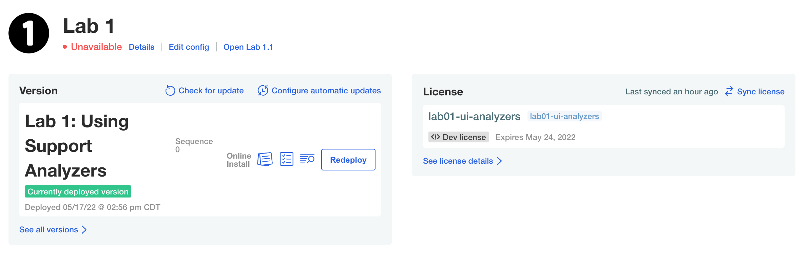
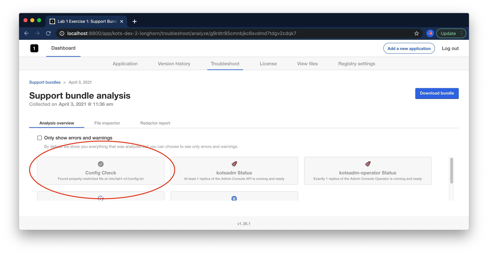

Lab 1.1: Using Support Analyzers
=========================================

In this lab, we'll use the Support Bundle analyzers feature to debug an application, modifying the host in order to create the correct conditions for the application to start. In this case, the app is already deployed, but something is not quite right. The Status Informers show "Unavailable".




You can open the KOTS admin console on your node by navigating to https://$IP_ADDRESS:8800 in a browser. The password to your instance will be provided as part of the lab, or you can reset by SSHing the node and running

```shell
kubectl kots reset-password -n default
```

### Ground Rules

In this lab and most of those that follow it, some of the failure scenarios are quite contrived.
It is very possible to reverse-engineer the solution by reading the Kubernetes YAML instead of following the lab steps.
If you want to get the most of out these labs, use the presented debugging steps to get experience with the toolset.

### Investigating

As you know, the first step when the application isn't starting will be to collect a support bundle. Doing so will run a series of diagnostic checks to help diagnose problems with the application. In the case that a problem cannot be diagnosed automatically, a bundle will be ready for download so you can share with your broader team to help diagnose the issue. Start by navigating to the "Troubleshoot" tab and clicking the "Analzye" button.

<div align="center"><blockquote><h3>If an application isn't starting, always collect a support bundle</h3></blockquote></div>


Once the bundle is collected, you should see an informative error message in the analyzers:


> Could not find a file at /etc/lab1/config.txt with 400 permissions -- please ensure this file exists with any content

### Correcting

In order to correct this issue, you'll need to SSH into your `lab1-ui-analyzers` node and add this file. 

<details>
  <summary>Expand for shell commands</summary>

```
sudo touch /etc/lab1/config.txt
sudo chmod 400 /etc/lab1/config.txt
```
</details>

### Validating

Running another support bundle, we should now see this check passes:




Once the fix is done, we can wait for the nginx pod to recover from CrashLoopBackoff, or we can give the pod a nudge to get it to retry immediately:

```text
kubectl delete pod -l app=nginx
```

Furthermore, we should now see that the application shows ready in the admin console, and we can open it via the link:


Congrats! You've completed Exercise 1! [Back To Exercise List](https://github.com/replicatedhq/kots-field-labs/tree/main/labs)

