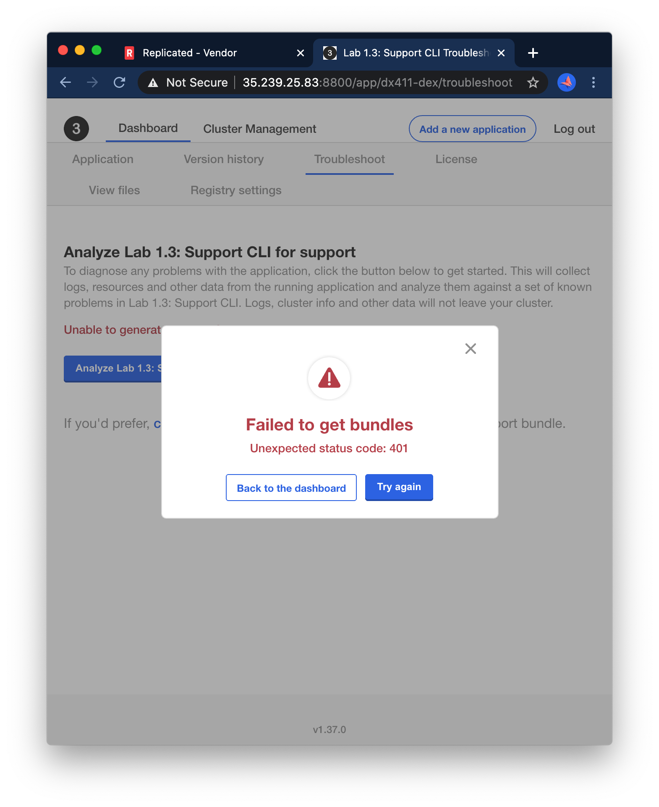

Lab 1.3: Support CLI
=========================================

In this lab, we'll learn how to debug and diagnose support problems when the KOTS admin console is unavailable.

* **What you will do**:
    * Learn to use the `kubectl support-bundle` CLI tools
* **Who this is for**: This lab is for anyone who will be involved in diagnosing end-user issues in the field
    * Support Engineers
    * Implementation / Field Engineers
    * Full Stack / DevOps / Product Engineers
* **Prerequisites**:
    * Basic working knowledge of Kubernetes
* **Outcomes**:
    * You will be ready to use the support-bundle CLI to collect a bundle & analysis
      in the rare case that an instance is struggling to the point that the KOTS 
      admin console is unavailable
    
### Before you start

> **NOTE**: If you have configured your <span style="color:#1E90FF;">**/etc/hosts**</span> file with the instance(s) names and IP address(es) you can use the lab name, i.e. lab03-support-cli in place of the node IP address. 

You can open the KOTS admin console for your node by navigating to https://lab03-support-cli:30880 in a browser. Otherwise use `https://<Instance IP Address>:30880`. The password to your instance will be provided as part of the lab, or you can reset by SSHing into the node and running the below `kubectl kots` command. 


```bash
export FIRST_NAME=... # your first name
ssh ${FIRST_NAME}@<Instance IP Address>
kubectl kots reset-password -n default
```

***
## Ground Rules

In this lab and most of those that follow it, some of the failure scenarios are quite contrived.
It is very possible to reverse-engineer the solution by reading the Kubernetes YAML instead of following the lab steps.
If you want to get the most of out these labs, use the presented debugging steps to get experience with the toolset.

### Investigating

At first glance, you may notice that something is entirely wrong with this instance. You may even get a 502 error 
when trying to open kotsadm.


In this exercise, we'll review how to collect a support bundle when the admin console itself is having issues. However, to start, you should be able
to access the KOTS UI for about 30 seconds at a time in between errors. So you'll want to *start by refreshing a few 
times* until the UI itself loads.

Logging into the instance, we see, as you might expect, that the application is unavailable:


Our first instinct by now should be to try to collect a bundle. However, you may notice something entirely new is going on:
there are issues with the kotsadm console itself. You will likely see 502 or 401 errors, and be unable to view the bundle:




While the goal of this lab is to show you how to get rich diagnostic information without using granular `kubectl` CLI 
commands, we'll pause for a second here to do some very basic inspection of what's happening using `kubectl get pod`. 


```text
$ kubectl get pod 
NAME                                  READY   STATUS        RESTARTS   AGE
kurl-proxy-kotsadm-6755fb9cdf-hhw7v   1/1     Running       0          149m
kotsadm-postgres-0                    1/1     Running       0          149m
file-check-pod-854566f588-8q9lc       1/1     Running       0          146m
nginx-54794fffb5-8jkgz                0/1     Init:2/3      0          3m59s
kotsadm-0                             1/1     Terminating   0          83s
```

It appears that our app pod is stuck initializing, and the KOTS admin console is in the middle of terminating/re-initializing.

***
## Getting a Support Bundle when KOTS is crashing

This brings us to our next key takeaway:

<div align="center"><blockquote><h3>When the KOTS admin console is unavailable, the <code>kubectl support-bundle</code> command should be used to collect a support bundle.</h3></blockquote></div>

The CLI bundle command can be grabbed from the UI on the "Troubleshoot" page.
Note that the `kubectl support-bundle` plugin will always be pre-installed on kURL instances, so the `curl https://krew.sh/support-bundle | bash` command can 
and should be omitted in this case. 


In the case that the UI is totally unreachable, the command will follow the pattern below. 
Note that this pattern is subject to change in future KOTS versions and you should prefer to copying the command from the UI.
The below was built from a KOTS instance running version 1.37.0.

```shell
export REPLICATED_APP=... # your app slug
kubectl support-bundle \
  secret/default/kotsadm-${REPLICATED_APP}-supportbundle \
  --redactors=configmap/default/kotsadm-redact-spec/redact-spec,configmap/default/kotsadm-${REPLICATED_APP}-redact-spec/redact-spec
```


When running the support bundle command, you will likely see some warnings and deprecation errors. You might also have to confirm the generation of the support-bundle if the connection is insecure. These can be ignored:

```text
$ kubectl support-bundle secret/default/kotsadm-jdw0711-josh-dewinne-supportbundle --redactors=configmap/default/kotsadm-redact-spec/redact-spec,configmap/default/kotsadm-jdw0711-josh-dewinne-redact-spec/redact-spec

 * failed to run collector "logs/app=nginx": failed to get log stream: container "nginx" in pod "nginx-54794fffb5-8jkgz" is waiting to start: PodInitializing
 * failed to run collector "ceph": rook ceph tools pod not found
 * failed to run collector "longhorn": list nodes.longhorn.io: the server could not find the requested resource (get nodes.longhorn.io)
 Collecting support bundle ⠙ sysctl2022/07/15 00:53:01 An analyzer failed to run: failed to read collected ceph status: open /tmp/supportbundle1684135001/support-bundle-2022-07-15T00_51_46/ceph/status.json: no such file or directory
Connection appears to be insecure. Would you like to attempt to create a support bundle anyway?: y
A support bundle has been created and uploaded to your cluster for analysis. Please visit the Troubleshoot page to continue.
A copy of this support bundle was written to the current directory, named "support-bundle-2022-07-15T00_51_46.tar.gz"

```

Eventually you'll be presented with the same analyzer results you'd have seen in the kotsadm UI:


<div align="center"><blockquote><code>`kubectl support-bundle` can be used to review the same application analysis that is usually available in the KOTS admin console</code></blockquote></div>

Upon exiting with `q`, you may also notice this error. 

```
* Failed to upload support bundle: execute request: Put "http://kotsadm.default.svc.cluster.local:3000/api/v1/troubleshoot/1r7ImhqI0fmI89HcKCbGrIpsLq9/57j6mjj92v8v5274jgtr2rn55g5kt6h2": dial tcp: lookup kotsadm.default.svc.cluster.local on 127.0.0.53:53: server misbehaving
```

As a last step, the support CLI will try to upload the generated bundle to the KOTS admin console so it can be reviewed there as well,
but as we well know, the kotsadm console is in a restart loop so it's expected that this step might fail.
Of course if you time things right, your bundle may complete while the KOTS admin console *is* available :slightly_smiling_face:

In any case, the `Failed to upload support bundle` error is expected and can be ignored.


### Diagnosis

Review the failing checks to understand what is wrong with the server and correct the problem.

<details>
  <summary>Open for a hint</summary>

Scrolling to the failing check, we can review the error message:


Specifically, you'll see the error message:

```shell
Restraining bolt in /etc/lab3 has short circuited the startup process. If you remove it, we might be able to launch the application.
```

We can remove this file with

```shell
sudo rm /etc/lab3/restraining-bolt.txt
```

</details>

* * *

When you're done making changes, you should see the pods recover and stabilize

```text
$ kubectl get pod
NAME                                    READY   STATUS    RESTARTS   AGE
kurl-proxy-kotsadm-6755fb9cdf-hhw7v     1/1     Running   0          160m
kotsadm-postgres-0                      1/1     Running   0          160m
file-check-pod-854566f588-8q9lc         1/1     Running   0          157m
troubleshoot-copyfromhost-rqr5l-qq8qm   1/1     Running   0          11m
kotsadm-0                               1/1     Running   0          111s
nginx-54794fffb5-8jkgz                  1/1     Running   0          15m
```


After a few minutes, we should see that the app becomes available


***
## Additional exercise: Sharing the Bundle

As part of the CLI collection, a support bundle will be dropped in your current working directory.


```text
$ ls -l
total 1388
-rw-rw-r-- 1 dex dex   3944 Apr 13 13:23 license.yaml
-rw-rw-r-- 1 dex dex 461852 Apr 13 15:44 support-bundle-2021-04-13T15_43_47.tar.gz
```

Use `scp` or some other means to copy the bundle off the server to your workstation, upload it to vendor.replicated.com, and review the analyzers there as well. 
An example of using `scp` is provided below. 
This command should be run from your local workstation.

```bash
scp ${FIRST_NAME}@<Instance IP Address>:~/support-bundle-2021-04-13T15_43_47.tar.gz .
```


You'll see at least one analyzer populated in the UI, about KOTSadm being unreachable.


### What if KOTS is failing before an app is installed?

You may notice that the support bundle CLI command we used above relies on an application-specific secret:

```shell
export REPLICATED_APP=... # your app slug
kubectl support-bundle \
  secret/default/kotsadm-${REPLICATED_APP}-supportbundle \
  --redactors=configmap/default/kotsadm-redact-spec/redact-spec,configmap/default/kotsadm-${REPLICATED_APP}-redact-spec/redact-spec
```

What can we do if KOTS is misbehaving before a license is installed and the application-specific support secrets are configured?
In general this means "escalate the problem to Replicated", but you want to make sure to provide as much detail as possible.
There is another more generic support bundle that can *always* be collected, and the command to collect it is always the same:

```text
kubectl support-bundle https://kots.io
```

This is another important takeaway:

<div align="center"><blockquote><h3><code>kubectl support-bundle https://kots.io</code> can be used to collect generic information about the KOTS admin console</h3></blockquote></div>


Again, as before, you will see some warnings and failures that can be ignored:

```text
$ kubectl support-bundle https://kots.io

 * failed to run collector "ceph": rook ceph tools pod not found
 * failed to run collector "longhorn": list nodes.longhorn.io: the server could not find the requested resource (get nodes.longhorn.io)
 Collecting support bundle ⠙ collectd2022/07/15 01:00:41 An analyzer failed to run: failed to read collected ceph status: open /tmp/supportbundle2523728313/support-bundle-2022-07-15T00_59_38/ceph/status.json: no such file or directory
support-bundle-2022-07-15T00_59_38.tar.gz
```


> **Note**: -- using this technique requires outbound internet access to pull the spec from kots.io.
The SupportBundle spec that is used in this case is located [here](https://github.com/replicatedhq/kots/blob/master/support-bundle.yaml).
In [Lab 5 - airgap](../lab05-airgap) we'll learn to run this generic bundle when there is no outbound internet access.

Congrats! You've completed Exercise 3! [Back To Exercise List](https://github.com/replicatedhq/kots-field-labs/tree/main/labs)
