Lab 1.8: Airgap
=========================================

In this lab, we'll review how to perform installations in Air Gap environments, and
how to collect support bundles in Air Gap environments.

* **What you will do**:
    * Access and verify a single-node Air Gap setup via a bastion server
    * Learn to use KOTS to install in an Air Gap environment
    * Create an SSH tunnel to configure an Air Gap instance
    * Perform an upgrade of an application in an Air Gap environment
    * Use the `kubectl support-bundle` CLI in an Air Gap environment
* **Who this is for**: This lab is for anyone who builds/maintains KOTS applications (see note below)
    * Full Stack / DevOps / Product Engineers
* **Prerequisites**:
    * Basic working knowledge of Kubernetes
* **Outcomes**:
    * You will be ready to deliver a KOTS application into an Air Gap environment
    * You will build confidence in performing upgrades and troubleshooting in Air Gap environments

## Overview

In this case we'll start with a bare Air Gap server with no KOTS installation, so you can
get practice performing an Air Gap install from scratch.

Once that's done, we'll explore how some of the support techniques differ between online and Air Gap environments. 

***
## Airgap Workflow Overview

First, we'll push a release -- in the background, Replicated's Air Gap builder will prepare an Air Gap bundle.


Next, we'll collect a license file, a download link, and a public kURL bundle.

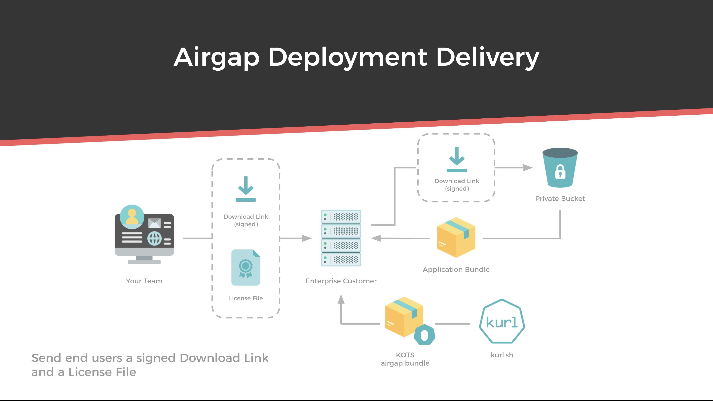

From there, we'll move all three artifacts into the datacenter via a jump box.


The above diagram shows a three node cluster, but we'll use only a single node.
While the KOTS bundle will be moved onto the server via SCP as in the diagram,
the app bundle and license file will be uploaded via a browser UI through an SSH tunnel.

***
## Getting Started


You should have received an invite to log into https://vendor.replicated.com -- you'll want to accept this invite and set your password.

From the Settings page, copy the Application Slug. You'll need that later to set the `REPLICATED_APP`.

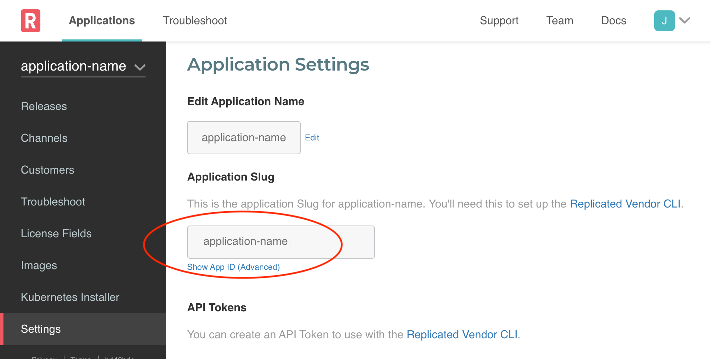

***
## Instance Overview

You will have received the IP of a jump box and the name of an Air Gap server.
For example, you may have received:

```text
dx411-dex-lab08-airgap-lite-jump = 104.155.131.205
dx411-dex-lab08-airgap-lite
```

In general, the name of the private server will be the same as the jump box, with the characters `-jump` removed from the suffix.
Put another way, you could construct both instance names programatically as

```shell
${REPLICATED_APP}-lab08-airgap-lite-jump
```

and

```shell
${REPLICATED_APP}-lab08-airgap-lite
```

### Connecting

First set your application slug, the public IP of your jump box and your first name:

```shell
export JUMP_BOX_IP=...
export REPLICATED_APP=... # your app slug
export FIRST_NAME=... # your first name (lower case)
```

Next, you can SSH into the Air Gap server using the following command:

```shell
ssh -J ${FIRST_NAME}@${JUMP_BOX_IP} ${FIRST_NAME}@${REPLICATED_APP}-lab08-airgap-lite
```

The `-J` option, allows to connect to the target host by first making a ssh connection to the jump host (`${JUMP_BOX_IP}`) described by destination and then establishing a TCP forwarding to the ultimate destination (`${REPLICATED_APP}-lab08-airgap-lite`) from there.

You can also do it in multiple steps and achieve the same:

```shell
local> ssh ${FIRST_NAME}@${JUMP_BOX_IP}
jump> export REPLICATED_APP=...
jump> ssh ${REPLICATED_APP}-lab08-airgap-lite
```

Once you're on the Air Gap server, you can verify that the server indeed does not have internet access. Once you're convinced, you 
can ctrl+C the command and proceed to the next section

```shell
curl -v https://kubernetes.io
```


***
## Moving Assets into place

If you haven't already, you can log out of the Air Gap instance with `exit` or ctrl+D. 
Our next step is to collect the assets we need for an Air Gap installation:

1. A license with the Air Gap entitlement enabled
2. An Air Gap bundle containing the kURL cluster components
3. An Air Gap bundle containing the application components

(2) and (3) are separate artifacts to cut down on bundle size during upgrade scenarios where only the application version 
is changing and no changes are needed to the underlying cluster.


#### Starting the kURL Bundle Download

Now, let's SSH to our jump box (the one with the public IP) `ssh kots@<jump box IP address>` and download the kurl bundle.

##### Enabling Airgap for a customer

The first step will be to enable Air Gap for the `lab8` customer:

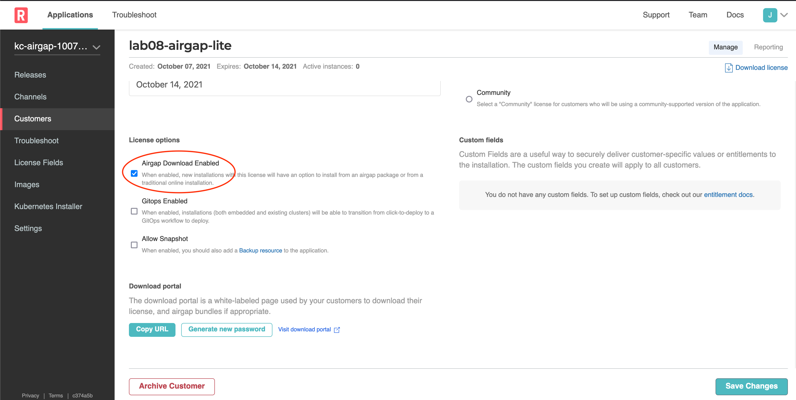


##### Download Airgap Assets 
After saving the customer, scroll to the bottom of the page to the `Download Portal` section.

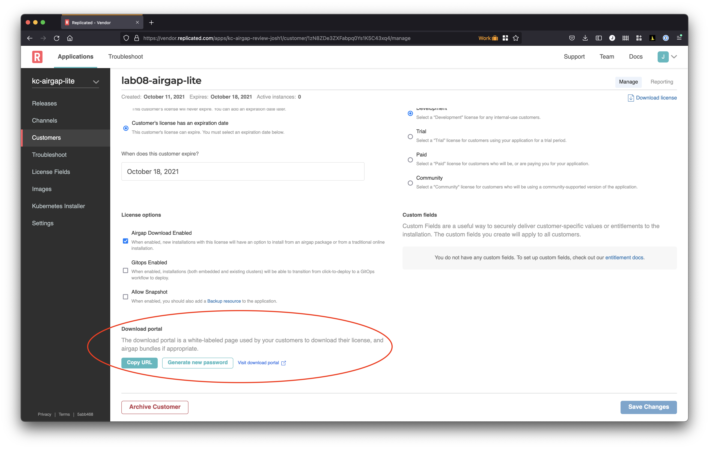

Generate a new password and save it somewhere in your notes.
Next, click the link to open the download portal. 
This is a link you would usually send to your customer, so from here on we'll be wearing our "end user" hat.
Replace the URL below with the one you can get from the downlaod portal


```text
kots@dx411-dex-lab08-airgap-lite-jump ~$ curl -o kurlbundle.tar.gz <URL>
```

This will take several minutes, leave this running and proceed to the next step, we'll come back in a few minutes.

#### Building an Airgap Release

By default, only the Stable and Beta channels will automatically build Air Gap bundles. For other channels, you have two options to create an airgap release:

- Manually build from the "Release History" view for a channel
- Set a channel to auto build all promoted releases

For a production application, Air Gap releases will be built automatically on the Stable channel, so this won't
be necessary.

In this case, since we're working off the `lab08-airgap-lite` channel, you'll want to enable Air Gap builds on that channel.

You can check the build status by navigating to the "Release History" for the channel.

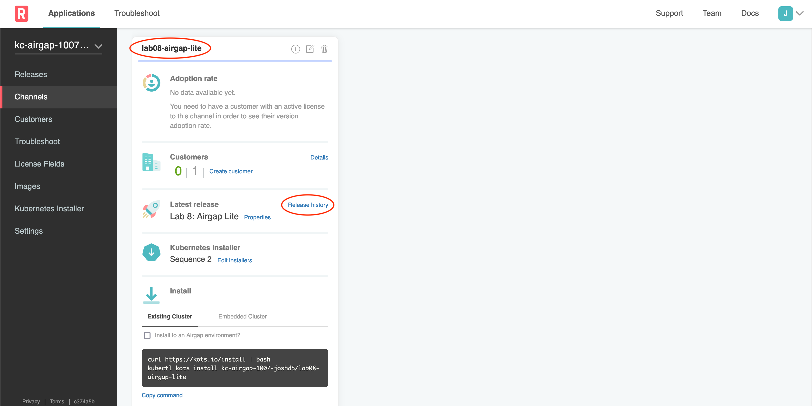

You can build invividual bundles on the Release History page, but you'll likely want to edit the channel and enable "build all releases for this channel".

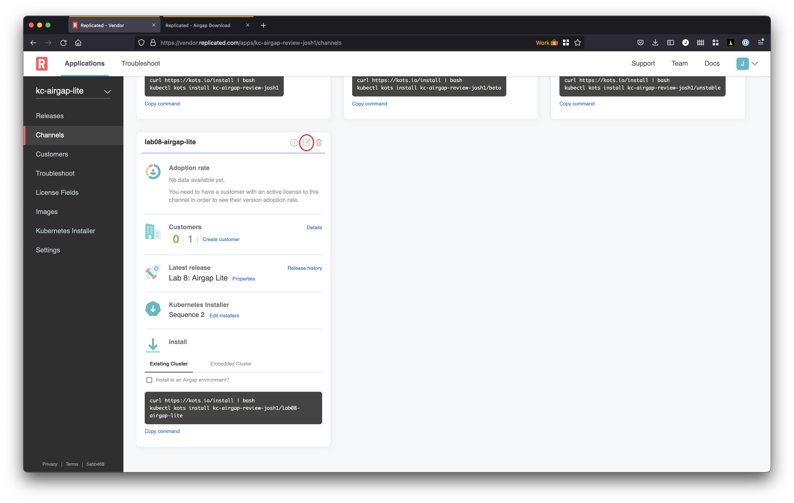

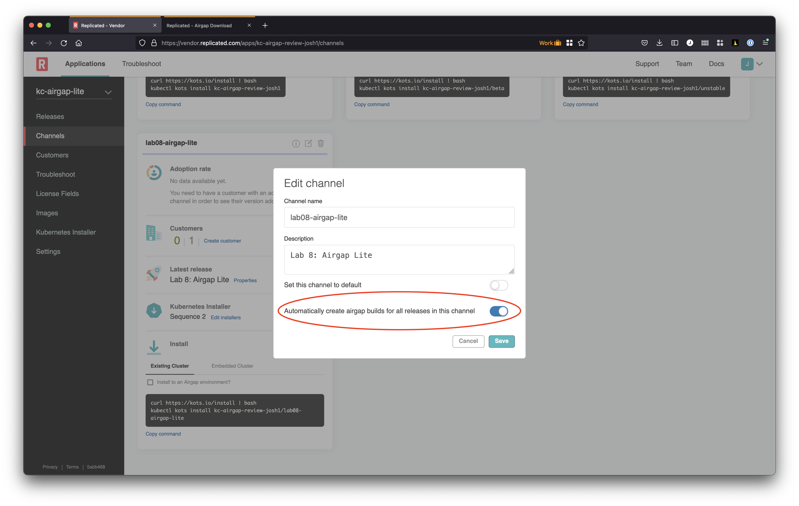

Now you should see all the bundles building or built on the release history page:

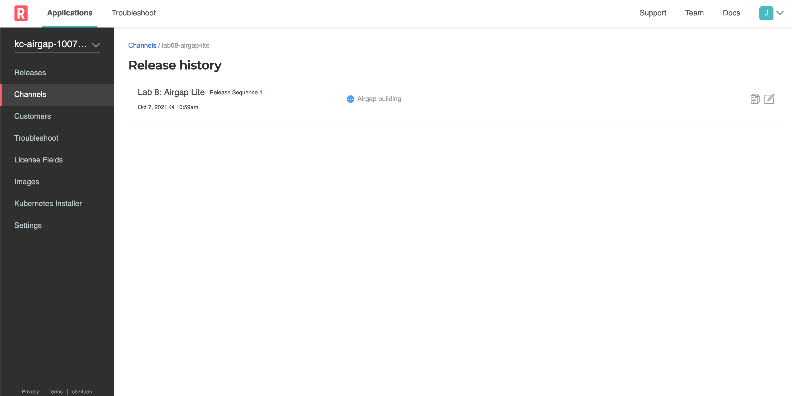

#### Download Airgap Assets 
Let's go back to the download portal where we previously got the kURL bundle URL, so we can download the airgap assets.


Navigate to the "embedded cluster" option and review the three downloadable assets.

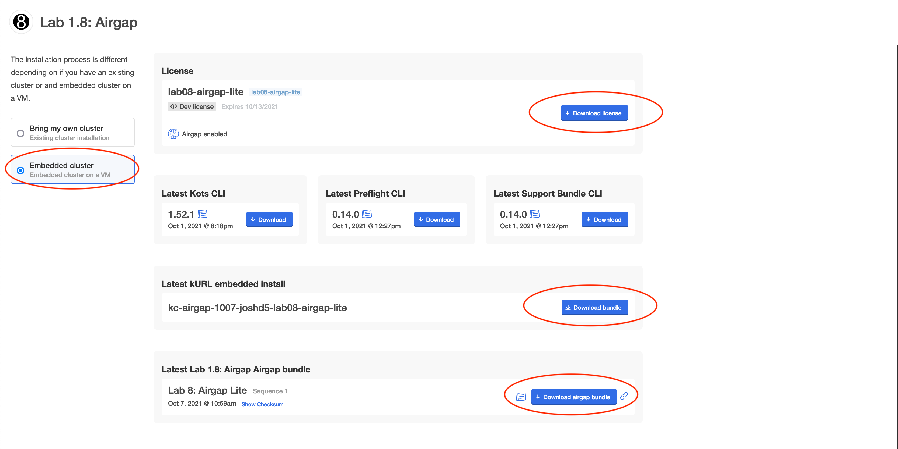

Download the license file, but **don't download the kURL bundle** -- this is the download we already started on the server.

You'll also want to download the other bundle `Latest Lab 1.8: Airgap Bundle` to your workstation.

Now, let's SSH to our jump box (the one with the public IP) `ssh kots@<jump box IP address>` and check the download of the kurl bundle.
Replace the URL with the one you copied above.

At the beginning of the lab, we downloaded the bundle with this command from the Jump box.

```text
kots@dx411-dex-lab08-airgap-lite-jump ~$ curl -o kurlbundle.tar.gz <URL>
```

It should be finished now, so you can copy it to the Air Gap server. 
You can use the DNS name in this case, as described in [Instance Overview](#instance-overview).

```text
kots@dx411-dex-lab08-airgap-lite-jump ~$ scp kurlbundle.tar.gz ${REPLICATED_APP}-lab08-airgap-lite:~

```

> **Note**: -- we use SCP via an SSH tunnel in this case, but the Air Gap methods in this lab also extend to
more locked down environments where e.g. physical media is required to move assets into the datacenter.

Now we'll SSH all the way to Air Gap node. If you still have a shell on your jump box, you can use the instance name.

```text
kots@dx411-dex-lab08-airgap-lite-jump ~$ ssh ${REPLICATED_APP}-lab08-airgap-lite
```

Otherwise, you can use the one below 

```shell
ssh -J ${FIRST_NAME}@${JUMP_BOX_IP} ${FIRST_NAME}@${REPLICATED_APP}-lab08-airgap-lite
```

Once you're on the Air Gap node, untar the bundle and run the install script with the `airgap` flag.
kURL install flags are documented [in the kurl.sh docs](https://kurl.sh/docs/install-with-kurl/advanced-options).

```shell
tar xvf kurlbundle.tar.gz
sudo bash install.sh airgap
```

At the end, you should see a `Installation Complete` message as shown below. Since the instance is Air Gap, we'll need to create a port forward to access the UI from your workstation in the next step.


***
## Accessing the UI via SSH tunnel, Configuring the instance

You'll want to create a port forward from your workstation in order to access to UI locally.
Again we'll use `REPLICATED_APP` to construct the DNS name but you can input it manually as well.

```shell
export FIRST_NAME=... # your firstname (lowercase)
export JUMP_BOX_IP=... # your jumpbox IP
export REPLICATED_APP=... # your app slug
ssh -NL 8800:${REPLICATED_APP}-lab08-airgap-lite:8800 -L 8888:${REPLICATED_APP}-lab08-airgap-lite:8888 ${FIRST_NAME}@${JUMP_BOX_IP}
```

This will run in the foreground, and you wont see any output. At this point, Kubernetes and the Admin Console are running inside the air gapped server, but the application isn't deployed yet.
To complete the installation, visit http://localhost:8800 in your browser.

Click "**Continue and Setup**" in the browser to continue to the secure Admin Console.

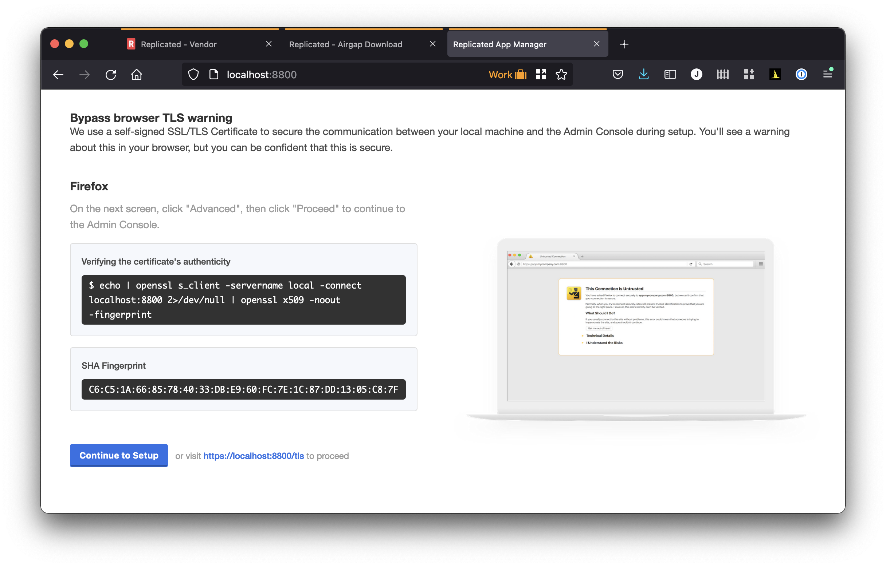

Click the "**Skip and continue**" to Accept the insecure certificate in the admin console.
> **Note**: For production installations we recommend uploading a trusted cert and key, but for this tutorial we will proceed with the self-signed cert.

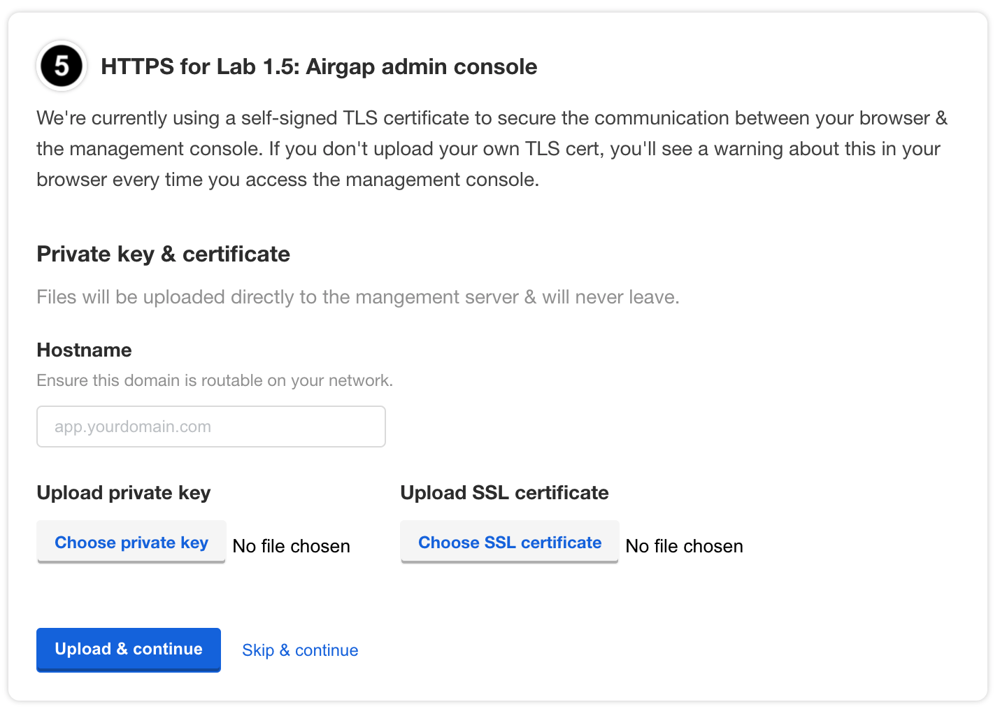

At the login screen paste in the password noted previously on the `Installation Complete` screen. The password is shown in the output from the installation script.

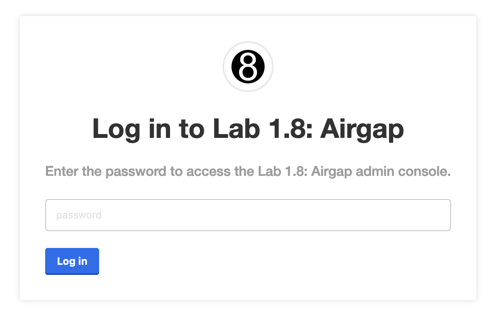

Until this point, this server is just running Kubernetes and the kotsadm containers.
The next step is to upload a license file so KOTS can validate which application is authorized to be deployed. Use the license file we downloaded earlier.

Click the Upload button and select your `.yaml` file to continue, or drag and drop the license file from a file browser. 

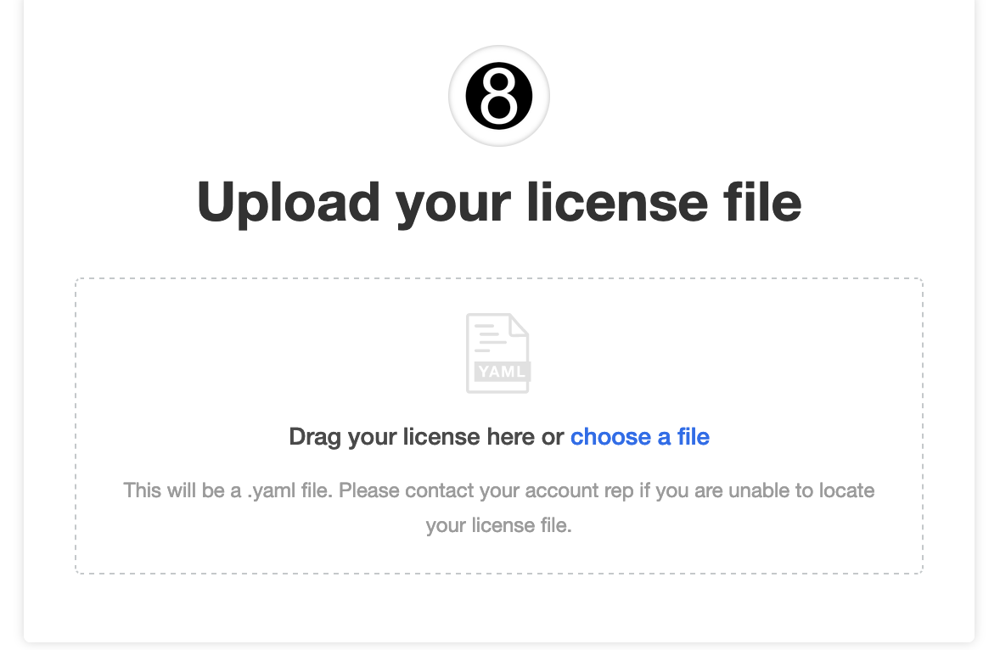

After you upload your license, you'll be greeted with an Airgap Upload screen. Select **choose a bundle to upload** and use the "application bundle" that you
downloaded to your workstation using the customer portal here. Click **Upload Air Gap bundle** to continue the upload process.

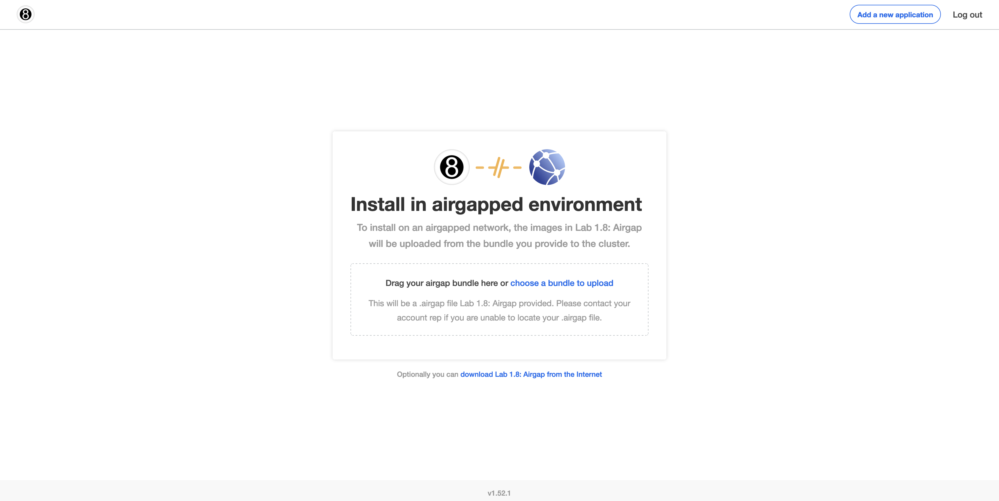

You'll see the bundle uploaded and images being pushed to kURL's internal registry. This will take a few minutes to complete.

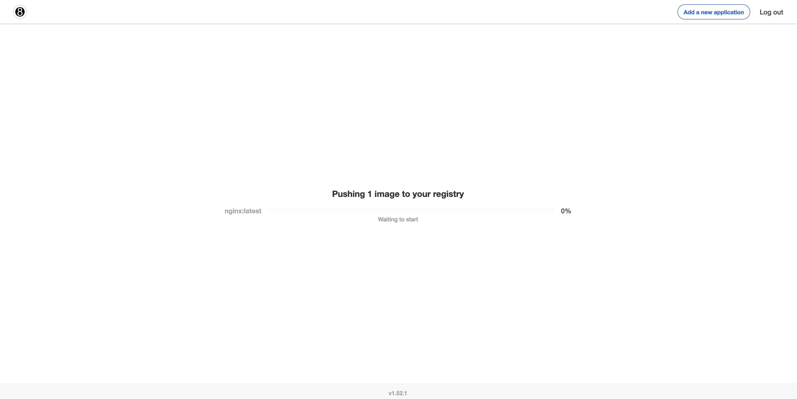

Once uploaded `Preflight Checks` will run. These are designed to ensure this server has the minimum system and software requirements to run the application.
Depending on your YAML in `preflight.yaml`, you may see some of the example preflight checks fail.
If you have failing checks, you can click continue -- the UI will show a warning that will need to be dismissed before you can continue.


We'll find that the application is unavailable. 

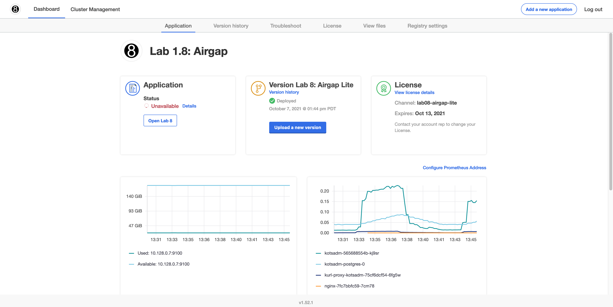

While we'll explore [support techniques for airgapped environments](#collecting-a-cli-support-bundle) 
below, in this case you should observe that our deployment is simply not valid, specifically, the
standard nginx entrypoint has been overriden:

```yaml
      containers:
        - name: nginx
          image: nginx
          command:
            - exit
            - "1"
```

So we'll need to deploy a new release in order to fix this.

***
## Deploying a new version

As part of the lab setup, a new release has been created in Vendor Portal with the fix. In order to make the release available, go to `Releases > Sequence 2` and click `Promote`. Select the `lab08-airgap-lite` channel to promote it to.

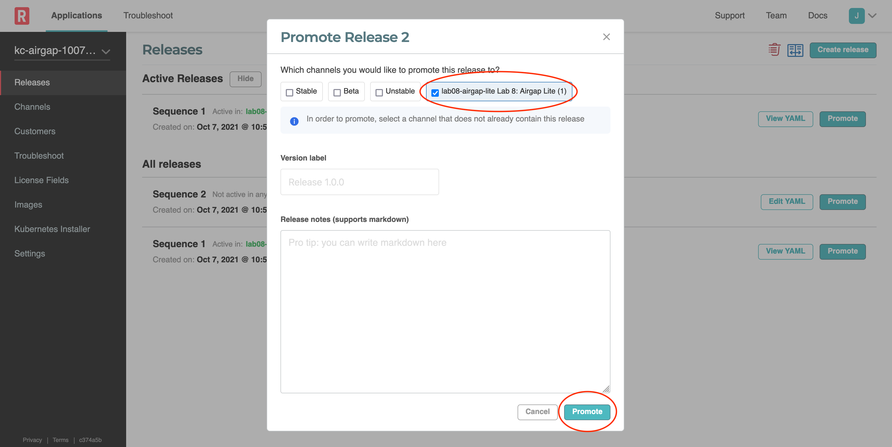

If you are interested, you can review the difference between the two releases in the Vendor Portal. It is also shown below:

```diff
diff --git a/labs/lab05-airgap/manifests/nginx-deployment.yaml b/labs/lab05-airgap/manifests/nginx-deployment.yaml
index fa29e8d..3a66405 100644
--- a/labs/lab05-airgap/manifests/nginx-deployment.yaml
+++ b/labs/lab05-airgap/manifests/nginx-deployment.yaml
@@ -16,9 +16,6 @@ spec:
       containers:
         - name: nginx
           image: nginx:latest
-          command:
-            - exit
-            - "1"
           volumeMounts:
             - mountPath: /usr/share/nginx/html
               name: html
```

Once the promotion is done, you should be able to navigate back to the customer download portal we accessed from the customer page.
Scrolling to the bottom, you can click "show older bundles" to see the history of releases on the lab08-airgap channel.
The new release may take a minute or two to build, so you're want to refresh the make until you see one
with a timestamp that matches when you promoted the release.

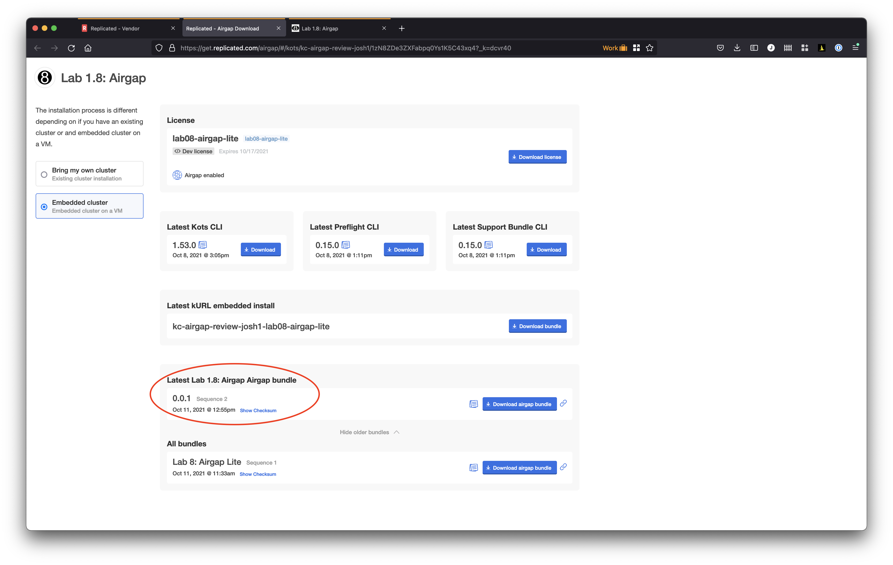

Once you've downloaded the new version, in the KOTS Admin Console select **Version History** and click "**Upload a new version**" and select your bundle.

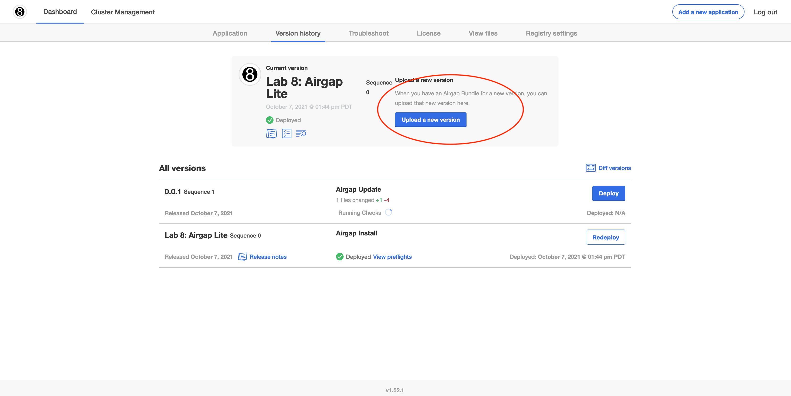

You'll see the bundle upload as before and you'll have the option to deploy it once the
preflight checks complete. Click **Deploy** to perform the upgrade.

Click the **Application** button to navigate back to the main landing page. The app should now show as **Ready** status on the main dashboard.

In order to access the application select **Open Lab 8**. 
> **Note**: For this work successfully you'll need to ensure the SSH tunnel for the app's port (8888) was initialized.

Congrats! You've installed and then upgraded an Air Gap instance!

***
## Collecting a CLI support bundle

As a final step, we'll review how to collect support bundles. However, what would we do in the case that the app installation itself was failing?
We can try our `kots.io` support bundle from the Air Gap server.

```shell
kubectl support-bundle https://kots.io
```

As you might expect this will fail because we can't fetch the spec from the internet.

```text
Error: failed to load collector spec: failed to get spec from URL: execute request: Get "https://kots.io": dial tcp 104.21.18.220:443: i/o timeout
```

In this case, we'll want to pull in the spec from https://github.com/replicatedhq/kots/blob/master/support-bundle.yaml.
How you get this file onto the server is up to you -- expand below for an option that uses `cat` with a heredoc.


<details> 

```shell
cat <<EOF > support-bundle.yaml
apiVersion: troubleshoot.sh/v1beta2
kind: SupportBundle
metadata:
  name: collector-sample
spec:
  collectors:
    - clusterInfo: {}
    - clusterResources: {}
    - ceph: {}
    - exec:
        args:
          - "-U"
          - kotsadm
        collectorName: kotsadm-postgres-db
        command:
          - pg_dump
        containerName: kotsadm-postgres
        name: kots/admin_console
        selector:
          - app=kotsadm-postgres
        timeout: 10s
    - exec:
        args:
          - "http://localhost:3030/goroutines"
        collectorName: kotsadm-goroutines
        command:
          - curl
        containerName: kotsadm
        name: kots/admin_console
        selector:
          - app=kotsadm
        timeout: 10s
    - exec:
        args:
          - "http://localhost:3030/goroutines"
        collectorName: kotsadm-operator-goroutines
        command:
          - curl
        containerName: kotsadm-operator
        name: kots/admin_console
        selector:
          - app=kotsadm-operator
        timeout: 10s
    - logs:
        collectorName: kotsadm-postgres-db
        name: kots/admin_console
        selector:
          - app=kotsadm-postgres
    - logs:
        collectorName: kotsadm-api
        name: kots/admin_console
        selector:
          - app=kotsadm-api
    - logs:
        collectorName: kotsadm-operator
        name: kots/admin_console
        selector:
          - app=kotsadm-operator
    - logs:
        collectorName: kotsadm
        name: kots/admin_console
        selector:
          - app=kotsadm
    - logs:
        collectorName: kurl-proxy-kotsadm
        name: kots/admin_console
        selector:
          - app=kurl-proxy-kotsadm
    - logs:
        collectorName: kotsadm-dex
        name: kots/admin_console
        selector:
          - app=kotsadm-dex
    - logs:
        collectorName: kotsadm-fs-minio
        name: kots/admin_console
        selector:
          - app=kotsadm-fs-minio
    - logs:
        collectorName: kotsadm-s3-ops
        name: kots/admin_console
        selector:
          - app=kotsadm-s3-ops
    - secret:
        collectorName: kotsadm-replicated-registry
        includeValue: false
        key: .dockerconfigjson
        name: kotsadm-replicated-registry
    - logs:
        collectorName: rook-ceph-agent
        selector:
          - app=rook-ceph-agent
        namespace: rook-ceph
        name: kots/rook
    - logs:
        collectorName: rook-ceph-mgr
        selector:
          - app=rook-ceph-mgr
        namespace: rook-ceph
        name: kots/rook
    - logs:
        collectorName: rook-ceph-mon
        selector:
          - app=rook-ceph-mon
        namespace: rook-ceph
        name: kots/rook
    - logs:
        collectorName: rook-ceph-operator
        selector:
          - app=rook-ceph-operator
        namespace: rook-ceph
        name: kots/rook
    - logs:
        collectorName: rook-ceph-osd
        selector:
          - app=rook-ceph-osd
        namespace: rook-ceph
        name: kots/rook
    - logs:
        collectorName: rook-ceph-osd-prepare
        selector:
          - app=rook-ceph-osd-prepare
        namespace: rook-ceph
        name: kots/rook
    - logs:
        collectorName: rook-ceph-rgw
        selector:
          - app=rook-ceph-rgw
        namespace: rook-ceph
        name: kots/rook
    - logs:
        collectorName: rook-discover
        selector:
          - app=rook-discover
        namespace: rook-ceph
        name: kots/rook
    - exec:
        collectorName: weave-status
        command:
        - /home/weave/weave
        args:
        - --local
        - status
        containerName: weave
        exclude: ""
        name: kots/kurl/weave
        namespace: kube-system
        selector:
        - name=weave-net
        timeout: 10s
    - exec:
        collectorName: weave-report
        command:
        - /home/weave/weave
        args:
        - --local
        - report
        containerName: weave
        exclude: ""
        name: kots/kurl/weave
        namespace: kube-system
        selector:
        - name=weave-net
        timeout: 10s

  analyzers:
    - textAnalyze:
        checkName: Weave Status
        exclude: ""
        fileName: kots/kurl/weave/kube-system/weave-net-*/weave-status-stdout.txt
        outcomes:
        - fail:
            message: Weave is not ready
        - pass:
            message: Weave is ready
        regex: 'Status: ready'
    - textAnalyze:
        checkName: Weave Report
        exclude: ""
        fileName: kots/kurl/weave/kube-system/weave-net-*/weave-report-stdout.txt
        outcomes:
        - fail:
            message: Weave is not ready
        - pass:
            message: Weave is ready
        regex: '"Ready": true'
EOF
```
</details>

Once this is present, you can use the following to collect a bundle as usual.

```shell
kubectl support-bundle ./support-bundle.yaml
```

There's an in depth post with some other options at [How can i generate a support bundle if i cannot access the admin console?](https://help.replicated.com/community/t/kots-how-can-i-generate-a-support-bundle-if-i-cannot-access-the-admin-console/455).

Congrats! You've completed Exercise 8! [Back To Exercise List](https://github.com/replicatedhq/kots-field-labs/tree/main/labs)


***
## Extra exercises

If you finish the lab early you can:

1. Experiment with copying the CLI-generated bundle off the server and uploading it to https://vendor.replicated.com
1. Experiment with expanding or building your own `support-bundle.yaml` and using it to collect other information about the host
