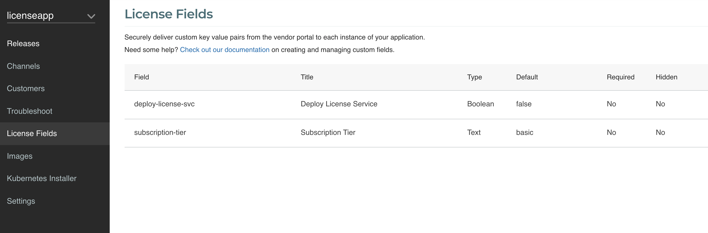
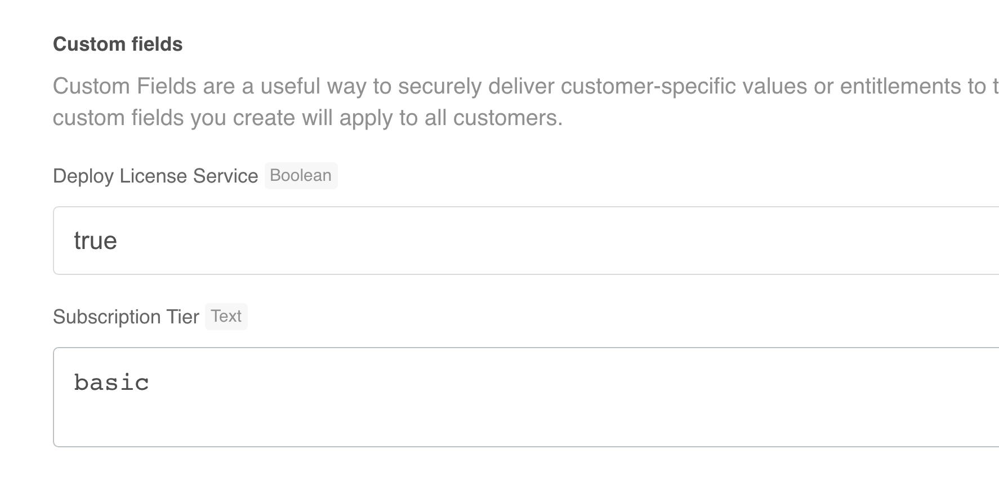
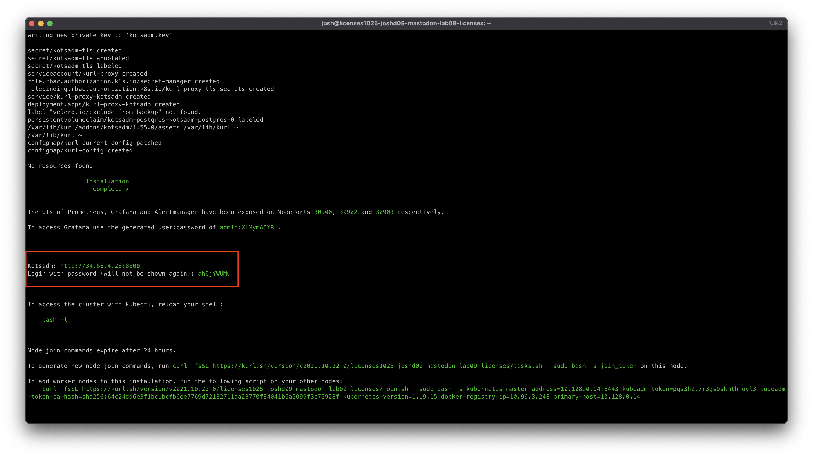
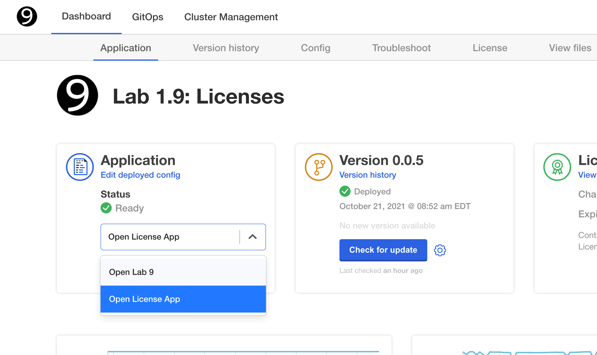

Lab 1.9: Licenses
=========================================

In this lab, you will learn how to use licenses and add custom entitlements to customer licenses.

* **What you will do**:
    * Learn about Licenses 
* **Who this is for**:
    * Anyone who builds or maintains app manager applications (Full Stack / Devops/ Product Engineers)
* **Prerequisites**:
    * Basic working knowledge of Kubernetes
    * Have completed [Lab00-hello-world]((../lab00-hello-world))
* **Outcomes**:
    * You can define License Custom Fields.
    * You can use License Context to control deployment of a service.
    * You can use License Context to control the display of Config Options.
    * You can build confidence in performing upgrades and troubleshooting in air gap environments.

## Overview

This lab covers an advanced topic and is meant to be hands-on. The documentation for the topics covered in this lab can be found [here](https://kots.io/vendor/entitlements/creating-entitlements/) and it is recommended you review them prior to getting started. In this lab, we are going to deploy a license service that will check the installed license file and display details to the end user. Our License Service is a simple [flask](https://flask.palletsprojects.com/en/2.0.x/) application that sends a REST call to the running `kotsadm` service.

The License Service will be an optional component that will be enabled in the License, and specific Configuration Options will be displayed to allow the user to use a different port.


## License Lab Overview

1. Define Custom License Fields

1. Add Deployment Manifest for License Service

1. Add a service to connect to the License Service.

1. Add a Config Options that will only show when the license has the License Service enabled.

1. Create a new release

1. Download the license

1. Install the application

1. Test the License Service UI

1. Update License and test changes


## About the License Service

As mentioned above, our License Service is a simple flask application that calls the /license/v1/license endpoint which is exposed by the App Manager. When you run a query against this endpoint, you will get output similar to this:

``` json

{
   "assignee":"Internal-test",
   "fields":[
      {
         "field":"Segment",
         "title":"Customer Segment",
         "type":"Text",
         "value":"Enterprise"
      },
      {
         "field":"license_service",
         "title":"License Service",
         "type":"Boolean",
         "value":false
      }
   ],
   "installation_id":"1zgTuYHaBzxlkkiRrQzQ9764NvJ",
   "license_id":"1fjKPAuEKN780MML2pGzm64D7GU",
   "license_type":"dev",
   "release_channel":"Unstable"
}

```

The image for this app is located [here](./LicenseApp/Dockerfile) and the code is available [here](./LicenseApp/app/app.py). The version of the application contains the following code:

```python

@app.route('/')
def license_check():
    message_to_display = ''
    response = requests.get(
    "http://kotsadm:3000/license/v1/license",
    headers={
        "content-type":"application/json"
    },
    )
    response_json = response.json()
    message_to_display += '<b>License Details:</b><br/><br> License assigned to <b>' + response_json["assignee"] + '</b>'
    custom_fields = response_json['fields']
    for custom_field in custom_fields:
        print (message_to_display)
        if custom_field['field']=='subscription-tier' :
           message_to_display += '<br><br><br> The Current Subscription Tier is <b>' + custom_field["value"] + '</b>'
        
    return message_to_display

```

The code above gets the values of the **assignee** and **Subscription Tier** fields and constructs a message to return to the user.  

## Getting Started


> **Note:** Completion of [Lab 0](../lab00-hello-world) is required, and assumed that you already know how to create new releases, deploy it to a provided VM and be able to iterate on updates to the application.

You should have received an invite to log into https://vendor.replicated.com -- you'll want to accept this invite and set your password.

Make sure to update your environment variables to interact with this application. See [Get Started -> Steps 1 and 2](https://github.com/replicatedhq/kots-field-labs/blob/main/labs/lab00-hello-world/README.md)


`REPLICATED_APP` should be set to the app slug from the Settings page. You should have received your App Name
ahead of time.


`REPLICATED_API_TOKEN` should be set to the previously created user api token. See [Get Started -> Steps 1 and 2](https://github.com/replicatedhq/kots-field-labs/blob/main/labs/lab00-hello-world/README.md)

Once you have the values, set them in your environment.

```
export REPLICATED_APP=...
export REPLICATED_API_TOKEN=...
```

Lastly before continuing make sure to clone this repo locally as we will be modifying `lab09` later during the workshop.
```bash
git clone https://github.com/replicatedhq/kots-field-labs
cd kots-field-labs/labs/lab09-licenses
```

In this folder you will find the `manifests` directory which contains the sample `nginx` app we have been using in previous labs and will be our starting point. 

Create your first release using these manifests to ensure your CLI is set up correctly. If needed, promote the release to the proper channel.

***
## Instance Overview

You will have received the IP of a Virtual Machine (VM) for this lab. 

```text
dx411-dex-lab09-licenses = 104.155.131.205
```

### Connecting

First set your application slug, the public IP of your jump box and your first name:

```shell
export VM_IP=...
export FIRST_NAME=... # your first name
```

Next, you can SSH into the Air Gap server using the following command:

```shell
ssh ${FIRST_NAME}@${VM_IP}
```

To save time, start the installation of the first release created. To install the application, browse to **Channels** and check the command for Installing for Embedded Clusters. Should be something similar to:

```shell

curl -sSL https://k8s.kurl.sh/dx411-dex/lab09-licenses | sudo bash

```

While the installation runs, we can proceed to make changes to the application.


## Define License Fields

* Log in to https://vendor.replicated.com using the account created above.

* Navigate to **License Fields** and define two new fields to look like the ones shown below:



* Create or update an existing license and set the values of the newly created fields.



## Create a New Release

Our starting point is the same `nginx` app we have been using in the previous labs. The contents of your first release are in the `/lab09-licenses/manifests` directory. 

It is assumed that you have already followed `lab00 - Hello World` and have already set up your local dev environment. 

## Add the Deployment Manifest

Our next release will include the ability to deploy our License Service. Create a new deployment manifest with the contents below:

``` yaml

apiVersion: apps/v1
kind: Deployment
metadata:
  name: license-app-deployment
  labels:
    app: license-app
  annotations:
    kots.io/when: '{{repl eq (LicenseFieldValue "deploy-license-svc") "true" }}'  
spec:
  replicas: 1
  selector:
    matchLabels:
      app: license-app
  template:
    metadata:
      labels:
        app: license-app
    spec:
      containers:
        - name: license-app
          image: cremerfc/repl-license-app:latest
          ports:
            - containerPort: 5000

```

A few things to note in the above manifest:

1. On line 8 we have an `annotation` that tells the `App Manager` to only deploy this manifest when the License Field `deploy-license-svc` is set to `true`. To do this we are using a couple of [Template Function Contexts](https://kots.io/reference/template-functions/contexts/), specifically the License Context [LicenseFieldValue](https://kots.io/reference/template-functions/license-context/#licensefieldvalue). 

1. On line 21 we are pulling the `repl-license-app` image, which is the flask app.

1. On line 23 we are exposing port 5000, which is the port that `flask` uses.

## Add the Config Manifest

We are going to provide the end user the option to specify the port to run our License Service. However, we only want to display this option if the License Service is enabled in the license. [Configs](https://kots.io/reference/v1beta1/config/) will be covered in more detail in a separate lab.

Create a new manifest with the following contents:

```yaml

kind: Config
metadata:
  name: license-app-config
spec:
  groups:
    - name: license-app-opts
      title: License Service Options
      description: Set License Service Options Below
      when: repl{{ eq (LicenseFieldValue "deploy-license-svc") "true" }}
      items:
      - name: service-port
        title: Port to expose the License Service UI
        type: text
        default: '5000'

```

## Add the Service Manifest

In order to connect to our License Service, we need a service. We are going to define two services, one to be used in a [kURL](https://kurl.sh) cluster and one on all other clusters. The reason is that the `kURL` cluster is usually a 1 node cluster so its easier to access applications via *IP address*:*port*, so a `NodePort` makes more sense in this scenario.

Keep in mind that if the License Service is not deployed, we won't need this service either. We are also going to use the Config option to set the port in the manifest.

Create a new service manifest with the following contents:

``` yaml

apiVersion: v1
kind: Service
metadata:
  name: license-app-service
  labels:
    app: license-app
  annotations:
    kots.io/when: '{{repl eq (not IsKurl) (eq (LicenseFieldValue "deploy-license-svc") "true" ) }}'
spec:
  type: ClusterIP
  ports:
  - port: repl{{ ConfigOption "service-port"}}
  selector:
    app: license-app
---
apiVersion: v1
kind: Service
metadata:
  name: license-app-service
  labels:
    app: license-app
  annotations:
    kots.io/when: '{{repl eq (IsKurl) (eq (LicenseFieldValue "deploy-license-svc") "true" ) }}'
spec:
  type: NodePort
  ports:
    - port: 5000
      nodePort: repl{{ ConfigOption "service-port"}}
  selector:
    app: license-app


```

## Make the License Service UI Available in App Manager

The last change we need to make to the application is to make it accessible via the App Manager. To do this, we will edit two files.

First, we will add another `ports` entry to the `kots-app.yaml` file so App Manager will port forward the License Service as well. Here is what the completed file may look like:

``` diff
  apiVersion: kots.io/v1beta1
  kind: Application
  metadata:
    name: app-slug
  spec:
    title: "Lab 1.9: Licenses"
    statusInformers:
      - deployment/nginx
    ports:
      - serviceName: "nginx"
        servicePort: 80
        localPort: 8888
        applicationUrl: "http://nginx"
+     - serviceName: "license-app-service"
+       servicePort: 5000
+       localPort: 5000
+       applicationUrl: "http://license-app-service"  
    icon: data:image/png;base64,...

```
Plese note that the above is not a complete manifest as the icon base64 is not included for brevity.

We also want to add the ability to open the UI from the App Manager. To do this, we will add a new `link` element to the `k8s-app.yaml` :

```diff

  apiVersion: app.k8s.io/v1beta1
  kind: Application
  metadata:
    name: "lab09-Licenses"
  spec:
    descriptor:
      links:
        - description: Open Lab 9
          url: "http://nginx"
+       - description: Open License App
+         url: "http://license-app-service"

```

Note that a copy of the completed manifests can be found in the `LicenseApp\manifests\` folder.

***

## Create Release and Deploy

Create a new release that includes the above changes 


## Finish Deploying the Application

While we were creating our new release, the installation on the VM should have completed by now. In the output of the install, locate the `kotsadm` address and password as shown below:



Enter the password to login to the App Manager and upload the customer license `yaml` file. The next window should display the License Service options:


Since we have a default value, we don't need to enter a value.

Once the App Manager has deployed the application we should see two options in the **Application** tile:



Click on **Open License App** to see the License values:


***

## Further Reading

For further reading on the topics covered in this lab, please check out the following:

* [AppManager Config](https://kots.io/reference/v1beta1/config/)
* [Template Functions](https://kots.io/reference/template-functions/contexts/)
* [Licenses & Entitlements](https://kots.io/vendor/entitlements/creating-entitlements/)

