Lab 1.10: Demo
=========================================

In this lab, we'll use the application installer to deploy a demo application onto the kURL kubernetes cluster. Once installed, we'll use the Support Bundle analyzers feature to debug the application and modify the host in order to create the correct conditions for the application to start. 

* **What you will do**:
    * Learn to deploy a k8s application
    * Learn to query, read, and understand support bundle analyzers
    * Use the analyzers to fix a problem on the server and get the application up and running
* **Who this is for**: This lab is for anyone who will deploy KOTS applications **plus** anyone who will be user-facing
    * Full Stack / DevOps / Product Engineers
    * Support Engineers
    * Implementation / Field Engineers
    * Success / Sales Engineers
* **Prerequisites**:
    * Basic working knowledge of Linux (SSH, Bash)
* **Outcomes**:
    * You will be able to deploy k8s applications onto a kURL cluster using KOTS
    * You will be ready to use KOTS's support bundle feature to diagnose first-line issues in end-user environments
    * You will reduce escalations and expedite time to remediate for such issues

### Ground Rules

In this lab and most of those that follow it, some of the failure scenarios are quite contrived.
It is very possible to reverse-engineer the solution by reading the Kubernetes YAML instead of following the lab steps.
If you want to get the most of out these labs, use the presented debugging steps to get experience with the toolset.

### Installing the application

#### 1. Vendor Portal

You should have received an invite to log into https://vendor.replicated.com -- you'll want to accept this invite and set your password.

You will be in a shared account with all other lab participants -- once you log in, your application will be automatically selected:


In the vendor portal, the main concepts are [Channels](https://kots.io/vendor/packaging/channels-and-releases/), [Releases](https://kots.io/vendor/packaging/kots-custom-resources/), [Customers](https://kots.io/vendor/packaging/customers-and-licenses/) and [Kubernetes Installers](https://www.replicated.com/blog/kurl-with-replicated-kots/)

We'll be using the lab10-demo channel.

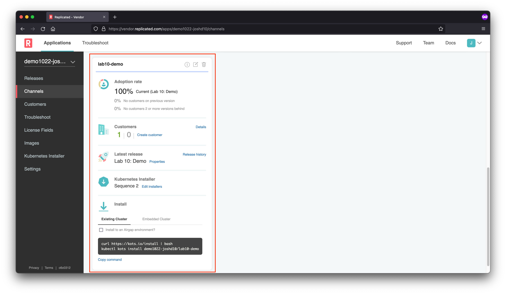

The channel already has a release promoted to it.

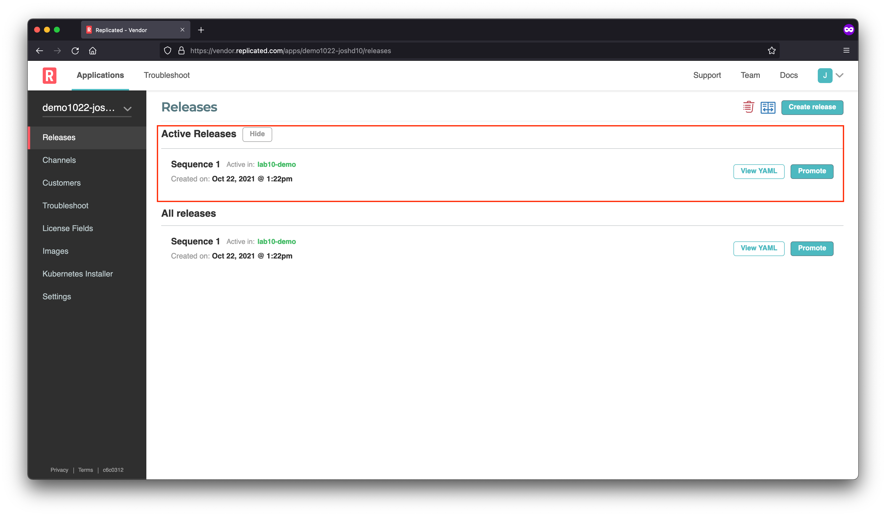

And we'll be using the already defined kURL kubernetes installer

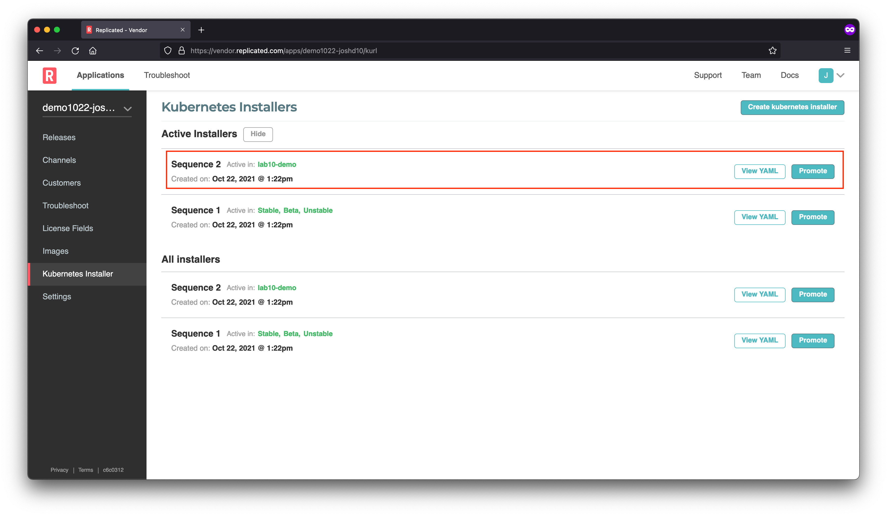

In order to install a k8s application using the Replicated application installer (KOTS), we have 2 options

1. Existing cluster

   

1. Embedded cluster

   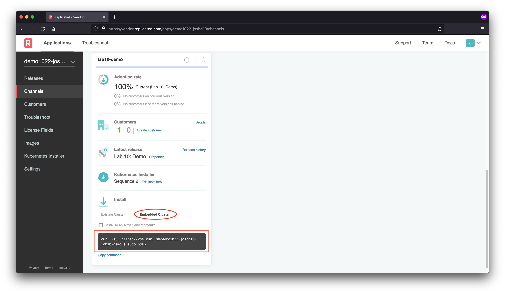

We'll be using the embedded cluster throught the rest of the lab. The VM for this lab has the Embedded cluster already pre-installed, so all we will need is a Customer license to kick-of the installation process.

Go to Customers and click the download button:

   

#### 2. Accessing the Application Installer

1. You can open the KOTS admin console on your node by navigating to

    ```
    https://$IP_ADDRESS:8800
    ```

    in a browser. If you have [configured /etc/hosts](../../doc/01-architecture.md#terraform), you can access it at [https://lab10-demo:8800](https://lab10-demo:8800).

1. Click **Continue to Setup** in the browser to navigate to the secure admin console.

   

1. Click **Skip & continue** to accept the unsecure certificate in the admin console.
    > **Note**: For production installations we recommend uploading a trusted certificate and key, but for this tutorial we will proceed with the self-signed certificate.

   

1. On the login screen use the password provided as part of the lab. or you can reset by SSHing the node and running

    ```bash
    export FIRST_NAME=... # your first name

    ssh ${FIRST_NAME}@<server ip address>

    kubectl kots reset-password -n default
    ```

1. Upload the license (previously downloaded from the vendor portal)

    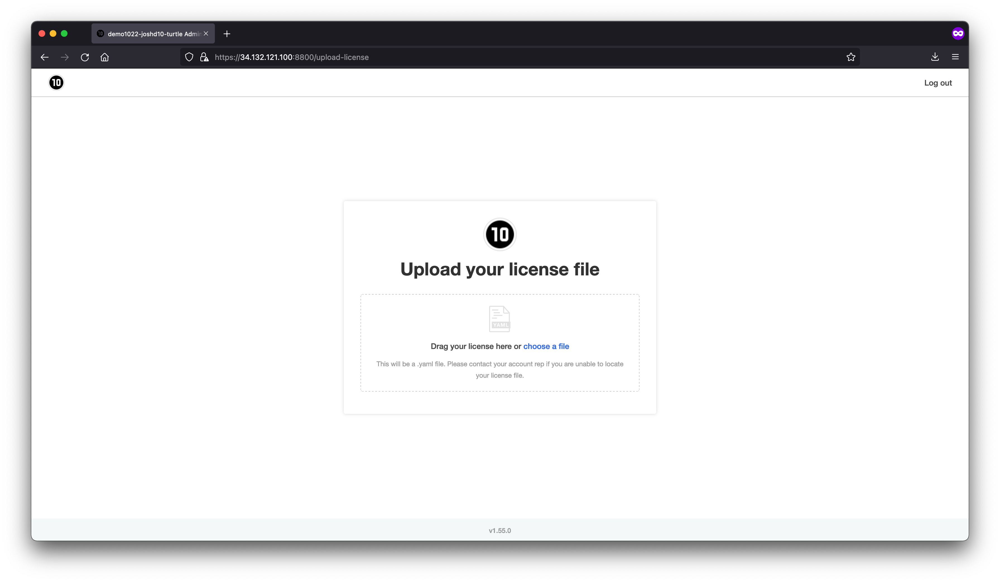

1. Check the Preflights and click Continue

    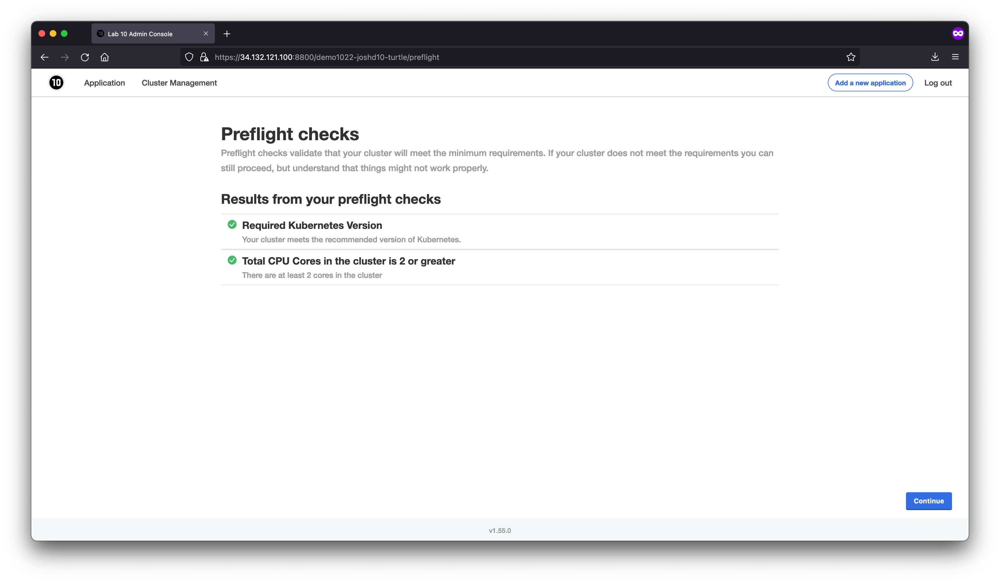

1. You'll notice the application stays in Status "Unavailable". Proceed to the next section to experience Day 2 of operations.

    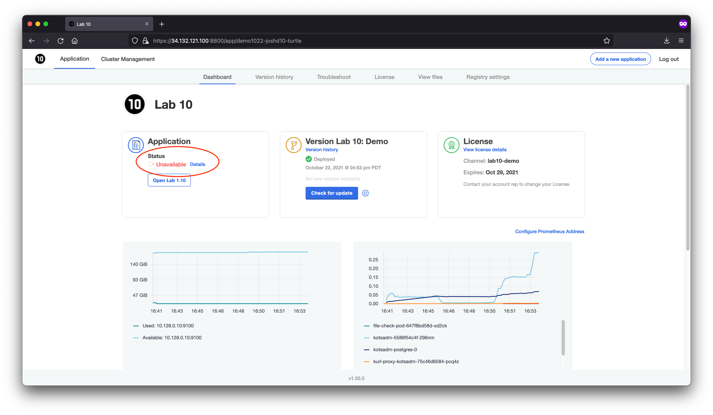


### Support Bundle

#### The Issue

In this case, the app is already deployed, but something is not quite right.
The Status Informers show "Unavailable".


#### Investigating

As you know, the first step when the application isn't starting will be to collect a support bundle. Doing so will run a series of diagnostic checks to help diagnose problems with the application. In the case that a problem cannot be diagnosed automatically, a bundle will be ready for download so you can share with your broader team to help diagnose the issue. Start by navigating to the "Troubleshoot" tab and clicking the "Analyze" button.

<div align="center"><blockquote><h3>If an application isn't starting, always collect a support bundle</h3></blockquote></div>

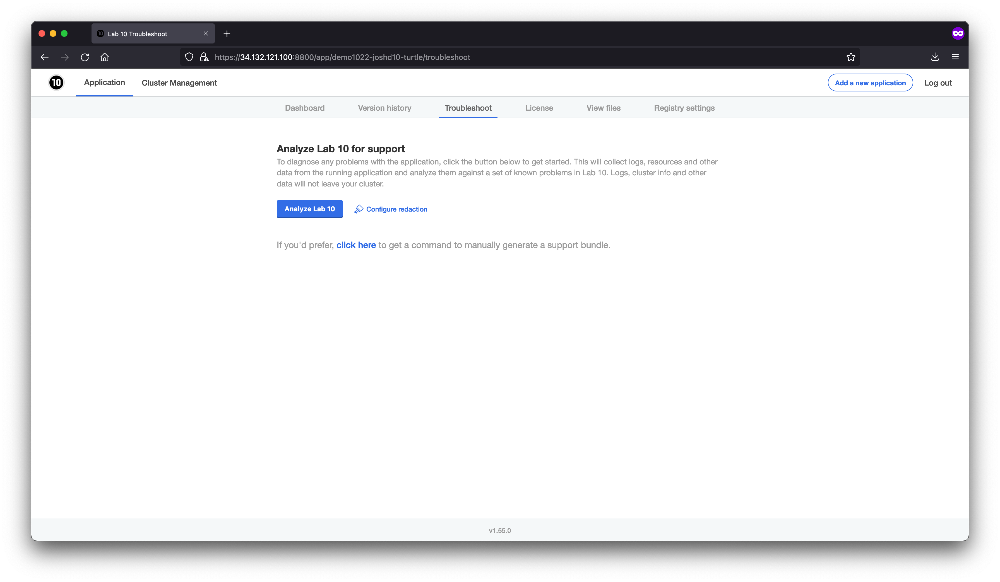


Once the bundle is collected, you should see an informative error message in the analyzers:

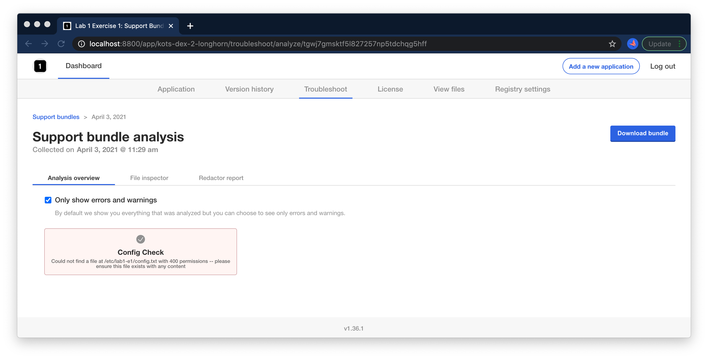


> Could not find a file at /etc/lab10/config.txt with 400 permissions -- please ensure this file exists with any content

#### Correcting

In order to correct this issue, you'll need to SSH into your `lab10-demo` node and add this file. 

```bash
export FIRST_NAME=... # your first name

ssh ${FIRST_NAME}@<server ip address>
```

<details>
  <summary>Expand for shell commands</summary>

```
sudo touch /etc/lab10/config.txt
sudo chmod 400 /etc/lab10/config.txt
```
</details>

#### Validating

Running another support bundle, we should now see this check passes:


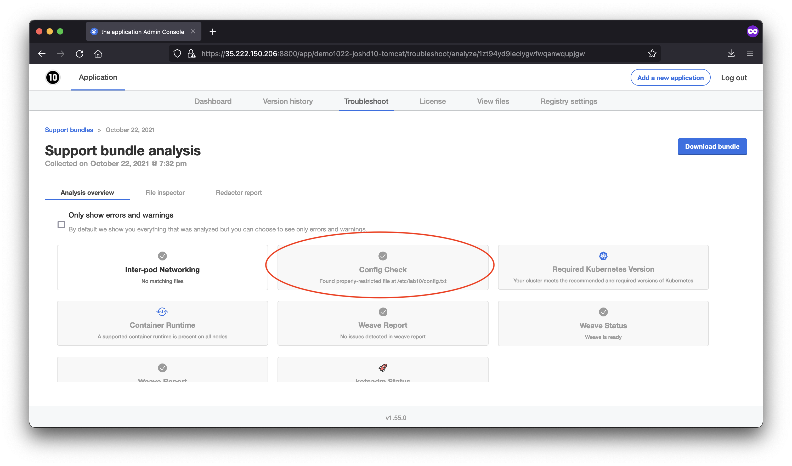

Once the fix is done, we can wait for the nginx pod to recover from CrashLoopBackoff, or we can give the pod a nudge to get it to retry immediately:

```text
kubectl delete pod -l app=nginx
```

Furthermore, we should now see that the application shows ready in the admin console, and we can open it via the link:


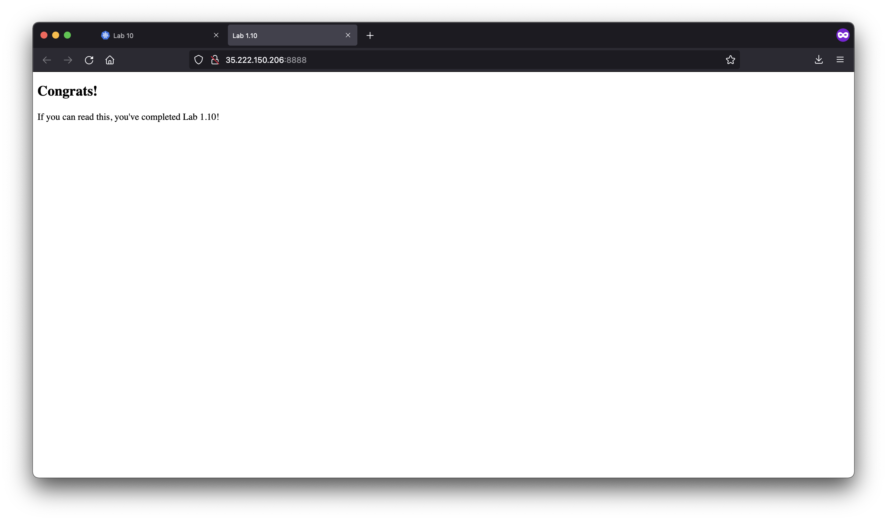

Congrats! You've completed Exercise 10! [Back To Exercise List](https://github.com/replicatedhq/kots-field-labs/tree/main/labs)
