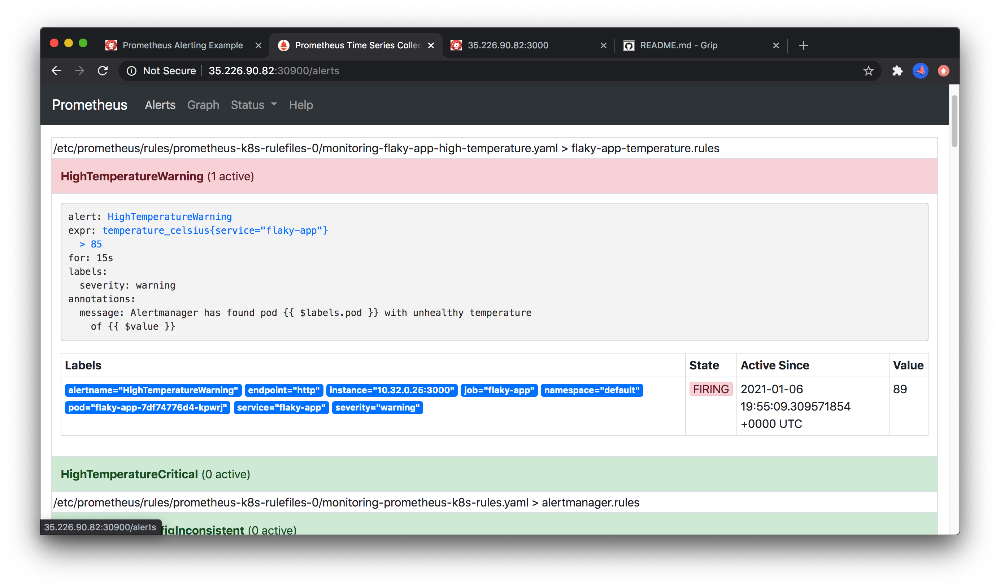
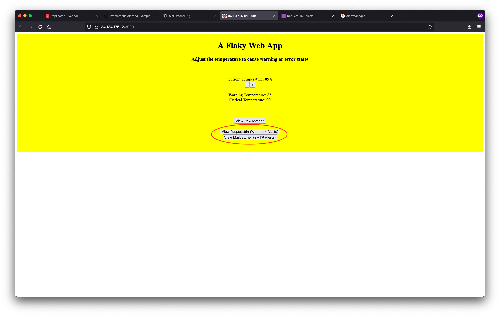

Lab 1.11: Monitoring
=========================================

In this lab, we'll use the application installer to deploy a demo application onto the kURL kubernetes cluster. Once installed, we'll use prometheus add-on to configure alerts on certain application changes.  

* **What you will do**:
    * Learn to deploy a k8s application.
    * Learn to work with prometheus and alert manager.
* **Who this is for**: This lab is for anyone who will deploy KOTS applications **plus** anyone who will be user-facing
    * Full Stack / DevOps / Product Engineers
    * Support Engineers
    * Implementation / Field Engineers
    * Success / Sales Engineers
* **Prerequisites**:
    * Basic working knowledge of Linux (SSH, Bash)
* **Outcomes**:
    * You will be able to deploy k8s applications onto a kURL cluster using KOTS
    * You will be ready to use the prometheus add-on in kURL
    * You will be able to setup monitoring and alerts for you multi-prem application.

> **NOTE**: to complete this lab, you will need to ensure you've set 
> `REPLICATED_APP` and `REPLICATED_API_TOKEN` as you did in [Lab 0](../lab00-hello-world) to add an analyzer.
If you haven't completed Exercise 0, you should go back and do that now.
It will take **15-30 minutes**.

## Overview

This lab covers an advanced topic and is meant to be hands-on. The documentation for the topics covered in this lab can be found [here](https://kots.io/kotsadm/monitoring/prometheus/) and it is recommended you review them prior to getting started. In this lab, we are going to deploy a flaky app called flaky-app. The app will allow to change the temperature and we'll use that metric to create alerts using the kURL promtheus add-on.

## Monitoring Lab Overview

1. Deploy the flaky-app using kots
1. Add a ServiceMonitor
1. Add a graph to the kotsadm dashboard
1. Add Prometheus Rules for the temperature
1. Configure Alert Sinks

## Deploy the flaky-app using kots

### About the Flaky App

The deployment and service can be found in [./manifests/flaky-app.yaml](./manifests/flaky-app.yaml). The golang source code can be found in [./cmd/flaky-app](./cmd/flaky-app). The frontend is static HTML in [bad_javascript.go](./cmd/bad_javascript.go) (it certainly cannot be described as good javascript by any measure). The container image is stored in [github container registry](ghcr.io/replicatedhq/kots-field-labs/lab11-monitoring:latest).

The application stores a single temperature value in memory and has controls and API endpoints to modify the temperature up or down.

#### 1. Vendor Portal

We'll be using the lab11-monitoring channel.


The channel already has a release promoted to it.


And we'll be using the already defined kURL kubernetes installer


We'll be using the embedded cluster throught the rest of the lab. The VM for this lab has the Embedded cluster already pre-installed, so all we will need is a Customer license to kick-of the installation process.

Go to Customers and click the download button:

   

#### 2. Accessing the Application Installer

1. You can open the KOTS admin console on your node by navigating to

    ```
    http://IP_ADDRESS:8800
    ```

    in a browser. For example, if your IP address is `34.134.22.12`, open your browser to
    
    ```
    http://34.134.22.12:8800
    ```
    
    **Advanced:** If you have [configured /etc/hosts](../../doc/01-architecture.md#terraform), you can access the server at at [http://lab11-monitoring:8800](http://lab11-monitoring:8800).

1. Click **Continue to Setup** in the browser to navigate to the secure admin console.

   

1. Click **Skip & continue** to accept the unsecure certificate in the admin console.
    > **Note**: For production installations we recommend uploading a trusted certificate and key, but for this tutorial we will proceed with the self-signed certificate.

   

1. On the login screen use the password provided as part of the lab. or you can reset by SSHing the node and running

    ```bash
    export FIRST_NAME=...
    export SERVER_IP=... 

    ssh ${FIRST_NAME}@${SERVER_IP}

    kubectl kots reset-password -n default
    ```

1. Upload the license (previously downloaded from the vendor portal)

    

1. Check the Configuration and click Continue (nothing to enable yet)

    

1. Check the Preflights and click Continue

    

1. Once the application is deployed, you can go to the flaky-app and change the temperature. The application stores a single temperature value in memory and has controls and API endpoints to modify the temperature up or down.

    

    

    Changing the temperature will show a visual state change in the application, and we'll explore how this affects the monitoring systems on the backend.

    

    Most notably, the applicaiton will expose the value of this temperature at `/metrics` for prometheus to pick up

    


## Add a ServiceMonitor

Now that we have a metric we can control, it's time to wire it up to prometheus. To do this we need a [ServiceMonitor custom resource](./monitoring/flaky-app-servicemonitor.yaml) for the Prometheus operator. We'll deploy this to the `monitoring` namespace so our default prometheus instance will pick it up automatically.

```yaml
apiVersion: monitoring.coreos.com/v1
kind: ServiceMonitor
metadata:
  name: flaky-app
  namespace: monitoring
  labels:
    app: flaky-app
    k8s-app: flaky-app
spec:
  namespaceSelector:
    matchNames:
      - '{{repl Namespace }}'
  selector:
    matchLabels:
      app: flaky-app
  endpoints:
    - port: http
      interval: 5s
```

When this is added to our kots manifests, we should see the prometheus configuration updated with a scrape job for this service. For instructions how to add/change manifests and deploy new releases, see [lab 0](../lab00-hello-world#9-iterating).


When this configuration is picked up, an additional prometheus target should be available


We can now graph the value of value of `temperature_celsius` over time using the graph viewer:


## Add a graph to the kotsadm dashboard

The Application Installer allows to add [custom graphs](https://kots.io/vendor/config/dashboard-graphs/) to the kotsadm dashboard. To add custom graphs, use the `graphs` property of the kots.io Application spec. Add the following `graphs` field to [kots-app.yaml](./manifests/kots-app.yaml).

```yaml
  graphs:
    - title: Flaky App Temperature (Celsius)
      query: 'temperature_celsius'
```

For instructions how to add/change manifests and deploy new releases, see [lab 0](../lab00-hello-world#9-iterating).


## Add Prometheus Rules for the temperature

In order to add an alerting rule for this temperature to match our `85` and `90` degree alert thresholds, we'll add the [./monitoring/flaky-app-alertrules.yaml](./manifests/flaky-app-alertrules.yaml) alert rules:

```yaml
apiVersion: monitoring.coreos.com/v1
kind: PrometheusRule
metadata:
  labels:
    app: kube-prometheus-stack
    release:  '{{repl ConfigOption "prometheus_version" }}'
  name: flaky-app-high-temperature
  namespace: monitoring
spec:
  groups:
    - name: flaky-app-temperature.rules
      rules:
        - alert: HighTemperatureWarning
          annotations:
            message: Alertmanager has found pod {{ $labels.pod }} with unhealthy temperature of {{ $value }}
          expr: temperature_celsius{service="flaky-app"} > 85
          for: 15s
          labels:
            severity: warning
        - alert: HighTemperatureCritical
          annotations:
            message: Alertmanager has found pod {{ $labels.pod }} with unhealthy temperature of {{ $value }}
          expr: temperature_celsius{service="flaky-app"} > 90
          for: 5s
          labels:
            severity: critical
```

For instructions how to add/change manifests and deploy new releases, see [lab 0](../lab00-hello-world#9-iterating).
Once this yaml is applied, we should see two alerts in the prometheus dashboard:



Navigating to alert manager on `:30903`, we can also see this alert firing in AlertManager:


## Configure Alert Sinks

By default, no alerts are configured in alert manager. In this project, we'll configure sending alerts to both a webhook sink and an SMTP email sink.

To demonstrate this easily, the project includes an optional [request bin](http://requestbin.net) container to capture and inspect webhook payloads, and a [MailCatcher](https://mailcatcher.me) container to capture and inspect email alerts. We'll take a look at these shortly. For now, the first step is to write our [kots-config.yaml](./manifests/kots-config.yaml) to display these alerting options to the user:


To convert this config into something alertmanager understands, we create [flaky-app-alertmanager-secret.yaml](./monitoring/flaky-app-alertmanager-secret.yaml) which configures the alerting rules for AlertManager:

```yaml
apiVersion: v1
kind: Secret
metadata:
  name: alertmanager-prometheus-alertmanager
  namespace: monitoring
stringData:
  alertmanager.yaml: |
    global:
      resolve_timeout: 5m
      smtp_from: {{repl ConfigOption "smtp_from"}}
      smtp_smarthost: {{repl ConfigOption "smtp_smarthost" | trim }}
    {{repl if ConfigOptionEquals "smtp_alert_target" "smtp_target_external" }}
      smtp_auth_username: {{repl ConfigOption "smtp_auth_username" | trim }}
      smtp_auth_password: {{repl ConfigOption "smtp_auth_password" | trim }}
    {{repl end}}    
      smtp_require_tls: false
    receivers:
      - name: "null"
      - name: webhook
        webhook_configs:
          - url: {{repl ConfigOption "webhook_alert_target_actual" | trim }}
      - name: smtp
        email_configs:
          - to: {{repl (ConfigOption "smtp_to") }}
    route:
      group_by: ["job"]
      group_interval: 10s
      group_wait: 30s
      receiver: "null"
      repeat_interval: 5m
      routes:
    {{repl if ConfigOptionEquals "enable_webhook_alerts" "1"}}
        - match:
            service: flaky-app
          receiver: webhook
          continue: true
    {{repl end}}{{repl if ConfigOptionEquals "enable_smtp_alerts" "1"}}
        - match:
            service: flaky-app
          receiver: smtp
          continue: true
    {{repl end}}
```

For instructions how to add/change manifests and deploy new releases, see [lab 0](../lab00-hello-world#9-iterating).

Note that this is deployed to the `monitoring` namespace and effectively patches the default AlertManager config that ships with kube-prometheus. An alternative CRD-based AlertManagerConfig method might work, but has not been tested.

Once this is deployed, we can confirm the configuration in AlertManager (it can sometimes take up to 5 minutes to AlertManager to pick up new configuration changes):


To view the actual alerts we can use the links from the flaky-app UI, or the kotsadm dashboard:




In requestbin, we can see the alert payloads:


In mailcatcher, we can see the email alerts:


Congrats! You've completed Exercise 11! [Back To Exercise List](https://github.com/replicatedhq/kots-field-labs/tree/main/labs)
