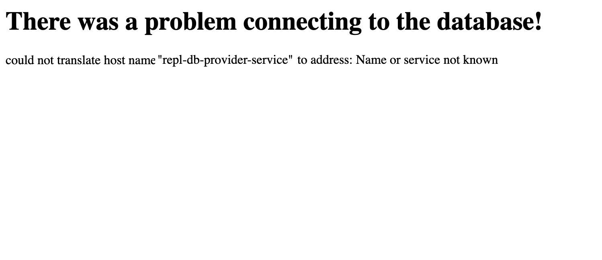
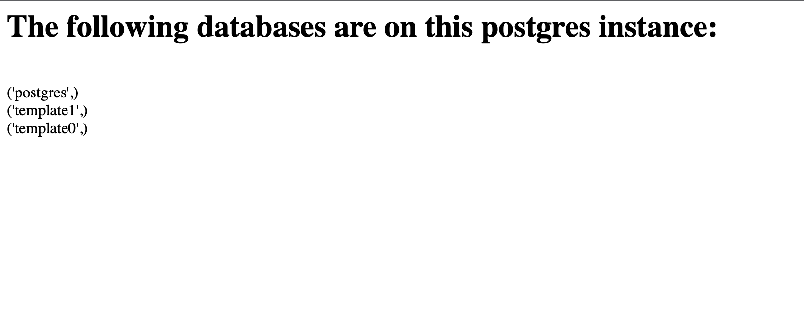

Lab 1.17 Persistent Storage
==============================

In this lab, we'll review best practices for integrating persistent stores like databases, queues, and caches. 
We'll explore ways to give your end user the option to either embed an instance with the application, or connect your appplication to an external instance that they will manage. x

In this lab we will use a sample app that will consume data from a database, which in this lab will be PostgreSQL. The app displays the list of databases available on the instance that it is connected to.

The latter part of this lab, we will explore advanced topics like custom preflight checks, workload coordination, credential management, init containers and refactoring your application's user-facing configuration.

It is split into 5 sections:

- [The Example Application](#the-example-application)
- [User-Facing Configuration](#user-facing-configuration)
- [Embedding a Database](#embedding-a-database)
- [Connecting to an External Database](#connecting-to-an-external-database)

### Prerequisites

We will be creating a few releases of our application. Creating releases is covered in the [Lab00-hello-world]((../lab00-hello-world)) lab, so make sure to complete it before starting this one.

## The Example Application

For demonstration purposes, we'll use a simple flask app that connects to a postgres database and retrieves the list of databases and displays them in a browser. 
Once you've finished this guide, you should feel confident replacing it with any Kubernetes workload(s) that need to connect to a database.

For this lab, the first release of this application has already been created and deployed to the VM that was provisioned for you. The files used to create the first release are also available in the [manifests](./manifests) folder. For reference, we have also included the files with the modifications covered in this lab in the [DBClientApp/manifests](./DBClientApp/manifests) directory

### Database Consumer vs Database Provider

In this guide you will see throughout the use of a 'database consumer' and a 'database provider'. The former refers to the workload(s) that consume the database content, and the latter refers the workload(s) that provide the database content to the consumer.

## Before you start

> **NOTE**: If you have configured your <span style="color:#1E90FF;">**/etc/hosts**</span> file with the instance(s) names and IP address(es) you can use the lab name, i.e. lab17-persistent-storage in place of the node IP address. 

You can open the Replicated Admin Console for your node by navigating to https://lab17-persistent-storage:8800 in a browser. Otherwise use `https://<Instance IP Address>:8800`. The password to your instance will be provided as part of the lab, or you can reset by SSHing into the node and running the below `kubectl kots` command. 


```bash
export FIRST_NAME=... # your first name
ssh ${FIRST_NAME}@<Instance IP Address>
kubectl kots reset-password -n default
```

## Inspecting the example application

On the Application Dashboard of the Replicated Admin Console, click on the **Open Lab 17** button to see the UI of our sample application. You should see the following in your browser window:

</img>

As we can see, the application is not able to connect to a postgres service. Our application at this time only contains the 'database consumer' portion. In the next steps, we will correct this by adding the 'database provider'. 

## Adding the Database

To get the app to a 'working order', we need a database. We will start simple and throughout the lab, we will make modifications based on best practices and real world scenarios. 

To start, we will add a database to our deployment and will hard code most values. To get us started we will add the following to our application:

* A PVC for Postgres to use for storage
* A Service that will allow our app to connect to Postgres
* A Postgres StatefulSet Deployment

As covered in the [Hello World Lab](../lab00-Hello_World), we need to get our local dev environment set up. As mentioned earlier, use the files found [here](./manifests) as a starting point. Make sure to set your ```REPLICATED_API_TOKEN``` and ```REPLICATED_APP``` environment variables.

The StatefulSet definition will include references to the PVC and Service, we'll define these first.

### Adding the PVC

The database needs somewhere to store its data, so let's define the Persistent Volume Claim. Use the file located [here](./DBClientApp/manifests/db-provider-pvc.yaml) or create a new file in your manifests directory with the content included below:


```yaml
#db-provider-pvc.yaml
kind: PersistentVolumeClaim
apiVersion: v1
metadata:
  name: postgres-pvc
  labels:
    app: repl-db-pvc
spec:
  accessModes:
    - "ReadWriteOnce"
  resources:
    requests:
      storage: "100Gi"

```

### Adding the Service

Our sample application needs to be able to connect to the database, so let's define the service. Use the file located [here](./DBClientApp/manifests/db-provider-service.yaml) or create a new file in your manifests directory with the content included below:


```yaml
#db-provider-service.yaml
apiVersion: v1
kind: Service
metadata:
  name: repl-db-provider-service
  labels:
    app: repl-db-service
spec:
  type: ClusterIP
  ports:
  - name: postgresql
    port: 5432
    targetPort: postgresql
  selector:
    app: repl-db-provider

```

### Adding the StatefulSet

Lastly, we add the Postgres StatefulSet. This is basically our 'database provider'. Create a new file in your manifests directory with the content included below:


```yaml
# db-provider.yaml
apiVersion: apps/v1
kind: StatefulSet
metadata:
  name: repl-db-provider
  labels:
    app: repl-db-provider
spec:
  replicas: 1
  selector:
    matchLabels:
      app: repl-db-provider
  serviceName: repl-db-provider-service
  template:
    metadata:
      labels:
        app: repl-db-provider
    spec:
      containers:
      - env:
        - name: PGDATA
          value: /var/lib/postgresql/data/pgdata
        # create a db called "postgres"
        - name: POSTGRES_DB
          value: "postgres"
        # create admin user with name "postgres"
        - name: POSTGRES_USER
          value: "postgres"
        - name: PGUSER
          value: "postgres"
        # use admin password from secret
        - name: POSTGRES_PASSWORD
          value: "postgres"
        - name: POD_IP
          valueFrom: { fieldRef: { fieldPath: status.podIP } }
        ports:
        - name: postgresql
          containerPort: 5432  
        image: postgres:10
        name: postgres
        volumeMounts:
        - mountPath: /var/lib/postgresql/data
          name: postgres-pvc
      volumes:
      - name: postgres-pvc
        persistentVolumeClaim:
          claimName: postgres-pvc
  volumeClaimTemplates:
  - metadata:
      name: postgres-pvc
    spec:
      accessModes:
      - ReadWriteOnce
      resources:
        requests:
          storage: 1Gi
```

### Verify Changes

Create a new release of the application with these changes, and update the deployed application in the Replicated Admin Console.

Clicking on the 'Open Lab 17' button should now display the databases available in the instance deployed with the application. It should display something similar to the screenshot below:

</img>

### Best Practice: Use a Secret for the Postgres

In our initial deployment, we hard coded the password used to connect to Postgres. To add a little layer of security, we are going to randomly generate a string that we'll add to a secret which will be used by the Postgres StatefulSet and also the application.

To generate a random string we'll take advantage of the `{{repl RandomString }}` Template Function.

Create a new file to define the secret with the following contents:

```yaml
#kots-config.yaml
apiVersion: kots.io/v1beta1
kind: Config
metadata:
  name: config-sample
spec:
  groups:
    - name: database
      title: Database
      items:        
        - name: embedded_postgres_password
          type: password
          value: "{{repl RandomString 32}}"
```

We then need to reference this value in the secret definition.

we'll create a secret to store the root password for our embedded postgres instance.

```yaml
# postgres-secret.yaml
apiVersion: v1
kind: Secret
metadata:
  name: postgres
data:
  DB_PASSWORD: '{{repl ConfigOption "embedded_postgres_password" | Base64Encode }}'
```

Now that we have the secret defined, we need to let the database provider to use this as the password for the 'postgres' user.


```yaml
            - name: DB_PASSWORD
              value: postgres
```

and replace it with

```yaml
            - name: DB_PASSWORD
              valueFrom:
                secretKeyRef:
                  name: postgres
                  key: DB_PASSWORD
```

The full Deployment should now look like:

```yaml
# db-provider.yaml
apiVersion: apps/v1
kind: StatefulSet
metadata:
  name: repl-db-provider
  labels:
    app: repl-db-provider
spec:
  replicas: 1
  selector:
    matchLabels:
      app: repl-db-provider
  serviceName: repl-db-provider-service
  template:
    metadata:
      labels:
        app: repl-db-provider
    spec:
      containers:
      - env:
        - name: PGDATA
          value: /var/lib/postgresql/data/pgdata
        # create a db called "postgres"
        - name: POSTGRES_DB
          value: postgres
        # create admin user with name "postgres"
        - name: POSTGRES_USER
          value: postgres
        # use admin password from secret
        - name: POSTGRES_PASSWORD
          valueFrom:
            secretKeyRef:
              key: DB_PASSWORD
              name: postgres
        image: postgres:10
        name: postgres
        volumeMounts:
        - mountPath: /var/lib/postgresql/data
          name: pgdata
      volumes:
      - name: postgres-pvc
        persistentVolumeClaim:
          claimName: postgres-pvc
  volumeClaimTemplates:
  - metadata:
      name: postgres-pvc
    spec:
      accessModes:
      - ReadWriteOnce
      resources:
        requests:
          storage: 1Gi
```

## Supporting An External Database

In many enterprises, you may be required to connect to their own database instance that is supported by their DBAs. In order to support this, we will need to do the following:

1. Provide User Interface for the end user to choose type of database (embedded vs external).
1. Provide User Interface to Enter Database Information if they select external.
1. Update the `db-consumer` deployment to use the values provided if they select external.
1. Update the workloads associated to the PostgreSQL `statefulset` so they will only be deployed when they select embedded.

### User-Facing Configuration


The first step here is to present that option to the user, then we'll walk through implementing each scenario in KOTS. 
The `kots.io/v1beta1` `Config` resource controls what configuration options are presented to the end user. 
We already created the `kots-config.yaml` to create our secret. We'll modify it to include some database settings. 

Modify your yaml to include this database section:

```yaml
apiVersion: kots.io/v1beta1
kind: Config
metadata:
  name: config-sample
spec:
  groups:
    - name: database
      title: Database
      items:
        - name: postgres_type
          help_text: Would you like to use an embedded postgres instance, or connect to an external instance that you manage?
          type: select_one
          title: Postgres
          default: embedded_postgres
          items:
            - name: embedded_postgres
              title: Embedded Postgres
            - name: external_postgres
              title: External Postgres
        - name: embedded_postgres_password
          hidden: true
          type: password
          value: "{{repl RandomString 32}}"
```

This creates a toggle to allow the user to choose between an embedded or external Postgres instance, along with our previously created `hidden` field to generate a unique password for the embedded instance.

### Validating Config Changes

Even though the options aren't wired, let's create a new release to validate the configuration screen was modified. 
Create a release by pushing a commit to your [ci-enabled repo](/vendor/guides/ci-cd-integration) or by running `replicated release create --auto` locally. 
Then head to the Admin Console instance and click "Check for Updates" on the "Version History" tab to pull the new release:

Once the update is deployed, we can head over to the "Config" tab and review our new toggle. 
You might also notice that we've removed the Ingress settings to simplify things for this guide:

Now that we have the configuration screen started, we can proceed to implement the "External Postgres" option.

* * *
### Validating the embedded Database


* * *

## Connecting to an external Database

In this section, we'll expand our configuration section to allow end users to bring their own postgres instance.

### Modifying the Config Screen

Let's update our config screen to allow an end user to input some details about their database. 
We'll add the following YAML, noting the use of the `when` field to conditionally hide or show fields in the user-facing config screen.

```yaml
        - name: external_postgres_host
          title: Postgres Host
          when: '{{repl ConfigOptionEquals "postgres_type" "external_postgres"}}'
          type: text
          default: postgres
        - name: external_postgres_port
          title: Postgres Port
          when: '{{repl ConfigOptionEquals "postgres_type" "external_postgres"}}'
          type: text
          default: "5432"
        - name: external_postgres_user
          title: Postgres Username
          when: '{{repl ConfigOptionEquals "postgres_type" "external_postgres"}}'
          type: text
          required: true
        - name: external_postgres_password
          title: Postgres Password
          when: '{{repl ConfigOptionEquals "postgres_type" "external_postgres"}}'
          type: password
          required: true
        - name: external_postgres_db
          title: Postgres Database
          when: '{{repl ConfigOptionEquals "postgres_type" "external_postgres"}}'
          type: text
          default: sentry
```

Your full configuration screen should now look something like

```yaml
apiVersion: kots.io/v1beta1
kind: Config
metadata:
  name: config-sample
spec:
  groups:
    - name: database
      title: Database
      items:
        - name: postgres_type
          help_text: Would you like to use an embedded postgres instance, or connect to an external instance that you manage?
          type: select_one
          title: Postgres
          default: embedded_postgres
          items:
            - name: embedded_postgres
              title: Embedded Postgres
            - name: external_postgres
              title: External Postgres
        - name: embedded_postgres_password
          hidden: true
          type: password
          value: "{{repl RandomString 32}}"
        - name: external_postgres_host
          title: Postgres Host
          when: '{{repl ConfigOptionEquals "postgres_type" "external_postgres"}}'
          type: text
          default: postgres
        - name: external_postgres_port
          title: Postgres Port
          when: '{{repl ConfigOptionEquals "postgres_type" "external_postgres"}}'
          type: text
          default: "5432"
        - name: external_postgres_user
          title: Postgres Username
          when: '{{repl ConfigOptionEquals "postgres_type" "external_postgres"}}'
          type: text
          required: true
        - name: external_postgres_password
          title: Postgres Password
          when: '{{repl ConfigOptionEquals "postgres_type" "external_postgres"}}'
          type: password
          required: true
        - name: external_postgres_db
          title: Postgres Database
          when: '{{repl ConfigOptionEquals "postgres_type" "external_postgres"}}'
          type: text
          default: postgres
```

Let's save this and create a new release. After deploying the release in the Admin Console, head to "Config" and set the toggle to "External Postgres" to see the new fields:

In order to demonstrate that these are working, let's add some values that we know won't work, and just check to confirm that checking "External Postgres" will remove our embedded postgres instance

Save these settings, and then you'll be directed back to the "Version History" page to apply the change:

Once this is deployed, we should see that the postgres statefulset has been removed, and that our sample application is back to failing.


You'll note that it is failing, but it is still using our hardcoded environment variables, not the user-entered config. 
In the next step, we'll wire the end-user configuration values into our service.

```text
$ kubectl logs -l app=pg-consumer
psql: could not translate host name "postgres" to address: Name or service not known
```

### Mapping User Inputs

To map the user-supplied configuration, we'll start by expanding our secret we created before, adding fields for additional variables, using `{{repl if ... }}` blocks to switch between embedded/external contexts. 
To start we'll add a field for hostname, using the yaml `>-` to collapse the multiline string into a single line.

```yaml
apiVersion: v1
kind: Secret
metadata:
  name: postgres
data:
  DB_PASSWORD: '{{repl ConfigOption "embedded_postgres_password" | Base64Encode }}'
  DB_HOST: >-
    {{repl if ConfigOptionEquals "postgres_type" "embedded_postgres" }}
      {{repl Base64Encode "postgres" }}
    {{repl else}}
      {{repl ConfigOption "external_postgres_host" | Base64Encode }}
    {{repl end}}
```

Now that we have the value in our Secret, we can modify our deployment to consume it. 
Replace

```yaml
            - name: DB_HOST
              value: postgres
```

with

```yaml
            - name: DB_HOST
              valueFrom:
                secretKeyRef:
                  name: postgres
                  key: DB_HOST
```

Your full deployment should look something like:

```yaml
apiVersion: apps/v1
kind: Deployment
metadata:
  name: pg-consumer
spec:
  selector:
    matchLabels:
      app: pg-consumer
  template:
    metadata:
      labels:
        app: pg-consumer
    spec:
      containers:
        - name: pg-consumer
          image: 'postgres:10'
          # connect to the database every 20 seconds
          command:
            - /bin/sh
            - -ec
            - |
              while :; do
                 sleep 20
                 PGPASSWORD=${DB_PASSWORD} \
                 psql --host ${DB_HOST} \
                      --port ${DB_PORT} \
                      --user ${DB_USER} \
                      --dbname ${DB_NAME} \
                      --command 'SELECT NOW()'
              done
          env:
            - name: DB_HOST
              valueFrom:
                secretKeyRef:
                  name: postgres
                  key: DB_HOST
            - name: DB_PORT
              value: "5432"
            - name: DB_USER
              value: postgres
            - name: DB_NAME
              value: postgres
            - name: DB_PASSWORD
              valueFrom:
                secretKeyRef:
                  name: postgres
                  key: DB_PASSWORD
```

From here, let's create and deploy a release, and verify that the secret has the customer-provided value, base64 decoding the secret contents

```text
$ kubectl get secret postgres -o yaml | head -n 4
apiVersion: v1
data:
  DB_HOST: ZmFrZQ==
  DB_PASSWORD: ajNVWDd1RnRfc0NkVTJqOFU3Q25xUkxRQk5fUlh3RjA=
```

You can verify we pulled in our user-provided config by base64-decoding the `DB_HOST` field:

```text
$ echo ZmFrZQ== | base64 --decode
fake
```

Checking on our service itself, we can verify that it's now trying to connect to the `fake` hostname instead of `postgres`:


```text
$ kubectl logs -l app=pg-consumer
psql: could not translate host name "fake" to address: Name or service not known
```

We'll optionally wire this to a real external postgres database later, but for now we'll proceed to add the rest of the fields.

### Extending this to all fields

Now that we've wired the DB_HOST field all the way through, we'll do the same for the other fields. 
In the end, your Secret and Deployment should look like:

```yaml
# postgres-secret.yaml
apiVersion: v1
kind: Secret
metadata:
  name: postgres
data:
  DB_HOST: >-
    {{repl if ConfigOptionEquals "postgres_type" "embedded_postgres" }}
      {{repl Base64Encode "postgres" }}
    {{repl else}}
      {{repl ConfigOption "external_postgres_host" | Base64Encode }}
    {{repl end}}
  DB_PORT: >-
    {{repl if ConfigOptionEquals "postgres_type" "embedded_postgres" }}
      {{repl Base64Encode "5432" }}
    {{repl else}}
      {{repl ConfigOption "external_postgres_port" | Base64Encode }}
    {{repl end}}
  DB_USER: >-
    {{repl if ConfigOptionEquals "postgres_type" "embedded_postgres" }}
      {{repl Base64Encode "postgres" }}
    {{repl else}}
      {{repl ConfigOption "external_postgres_user" | Base64Encode }}
    {{repl end}}
  DB_PASSWORD: >-
    {{repl if ConfigOptionEquals "postgres_type" "embedded_postgres" }}
      {{repl ConfigOption "embedded_postgres_password" | Base64Encode }}
    {{repl else}}
      {{repl ConfigOption "external_postgres_password" | Base64Encode }}
    {{repl end}}
  DB_NAME: >-
    {{repl if ConfigOptionEquals "postgres_type" "embedded_postgres" }}
      {{repl Base64Encode "postgres" }}
    {{repl else}}
      {{repl ConfigOption "external_postgres_db" | Base64Encode }}
    {{repl end}}
```

```yaml
# pg-consumer.yaml
apiVersion: apps/v1
kind: Deployment
metadata:
  name: pg-consumer
spec:
  selector:
    matchLabels:
      app: pg-consumer
  template:
    metadata:
      labels:
        app: pg-consumer
    spec:
      containers:
        - name: pg-consumer
          image: 'postgres:10'
          # connect to the database every 20 seconds
          command:
            - /bin/sh
            - -ec
            - |
              while :; do
                 sleep 20
                 PGPASSWORD=${DB_PASSWORD} \
                 psql --host ${DB_HOST} \
                      --port ${DB_PORT} \
                      --user ${DB_USER} \
                      --dbname ${DB_NAME} \
                      --command 'SELECT NOW()'
              done
          env:
            - name: DB_HOST
              valueFrom:
                secretKeyRef:
                  name: postgres
                  key: DB_HOST
            - name: DB_PORT
              valueFrom:
                secretKeyRef:
                  name: postgres
                  key: DB_PORT
            - name: DB_USER
              valueFrom:
                secretKeyRef:
                  name: postgres
                  key: DB_USER
            - name: DB_PASSWORD
              valueFrom:
                secretKeyRef:
                  name: postgres
                  key: DB_PASSWORD
            - name: DB_NAME
              valueFrom:
                secretKeyRef:
                  name: postgres
                  key: DB_NAME
```

Optionally, you can be extra concise and collapse each individual `env` `valueFrom` into a single `envFrom` `secretRef` entry:

```yaml
# pg-consumer.yaml
apiVersion: apps/v1
kind: Deployment
metadata:
  name: pg-consumer
spec:
  selector:
    matchLabels:
      app: pg-consumer
  template:
    metadata:
      labels:
        app: pg-consumer
    spec:
      containers:
        - name: pg-consumer
          image: 'postgres:10'
          # connect to the database every 20 seconds
          command:
            - /bin/sh
            - -ec
            - |
              while :; do
                 sleep 20
                 PGPASSWORD=${DB_PASSWORD} \
                 psql --host ${DB_HOST} \
                      --port ${DB_PORT} \
                      --user ${DB_USER} \
                      --dbname ${DB_NAME} \
                      --command 'SELECT NOW()'
              done
          envFrom:
          - secretRef:
              name: postgres
```


after deploying this, you should see all fields in the secret:

```text
$ kubectl get secret postgres -o yaml
apiVersion: v1
data:
  DB_HOST: ZmFrZQ==
  DB_NAME: ZmFrZQ==
  DB_PASSWORD: ZXh0cmEgZmFrZQ==
  DB_PORT: NTQzMjE=
  DB_USER: ZmFrZQ==
kind: Secret
# ...snip...
```

We can also print the environment in our sample app to verify all the values are piped properly:

```text
$ kubectl exec $(kubectl get pod -l app=pg-consumer -o jsonpath='{.items[0].metadata.name}' ) -- /bin/sh -c 'printenv | grep DB_'
DB_PORT=54321
DB_NAME=fake
DB_PASSWORD=extra fake
DB_HOST=fake
DB_USER=fake
```

### Testing Config Changes

Now let's make some changes to the database credentials. In this case, we'll use a postgres database provisioned in Amazon RDS, but you can use any external database. 
To start, head to the "Config" screen and input your values:


Let's save and apply this config and check in our pod again:

```text
$ kubectl exec $(kubectl get pod -l app=pg-consumer -o jsonpath='{.items[0].metadata.name}' ) -- /bin/sh -c 'printenv | grep DB_'
DB_PORT=54321
DB_NAME=fake
DB_PASSWORD=extra fake
DB_HOST=fake
DB_USER=fake
```

Uh oh, It appears that our values did not get updated! If you've worked with Secrets before, you may know that there's a [long-standing issue in Kubernetes](https://github.com/kubernetes/kubernetes/issues/22368) where pods that load config from Secrets or ConfigMaps won't automatically restart when underlying config is changed. 
There are some tricks to make this work, and in the next step we'll implement one of them, but for now we can delete the pod to verify that the configuration is being piped through to our sample application:

```text
$ kubectl delete pod -l app=pg-consumer
pod "pg-consumer-6df9d5d7fd-bd5z6"" deleted
```

If the pod is crashlooping, you might need to add `--force --grace-period 0` to force delete it. 
In either case, once a new pod starts, we should now see it loading the correct config:

```text
$ kubectl exec $(kubectl get pod -l app=pg-consumer -o jsonpath='{.items[0].metadata.name}' ) -- /bin/sh -c 'printenv | grep DB_'
DB_PORT=5432
DB_NAME=postgres
DB_PASSWORD=<redacted>
DB_HOST=10.128.0.12
DB_USER=postgres
```

### Triggering restarts on changes

In order to automate this restart on changes, we're going to use a hash of all database parameters to trigger a rolling update whenever database parameters are changed. 
We'll use a `hidden`, `readonly` field to store this in our config screen:

```yaml
        - name: external_postgres_confighash
          hidden: true
          readonly: true
          type: text
          value: '{{repl (sha256sum (print (ConfigOption "external_postgres_host") (ConfigOption "external_postgres_port") (ConfigOption "external_postgres_user") (ConfigOption "external_postgres_password") (ConfigOption "external_postgres_db") ))}}'
```

The `hidden` flag will hide it from the UI, and the `readonly` flag in this case will cause the value to be re-computed any time an upstream `ConfigOption` value changes.

Next, let's add this as an annotation to our deployment's pod template at `spec.template.metdata.annotations`:

```yaml
annotations:
  kots.io/config-hash: '{{repl ConfigOption "external_postgres_confighash"}}'
```


It's worth noting here that there's nothing special about the `kots.io/config-hash` annotation.
We could have just as easily called this annotation `my-app-something-fake` instead.
What matters here is that when the value in a Deployment annotation changes, it will cause Kubernetes to roll out a new version of the pod, stopping the old one and thus picking up our config changes.



Your full deployment should now look like

```yaml
apiVersion: apps/v1
kind: Deployment
metadata:
  name: pg-consumer
spec:
  selector:
    matchLabels:
      app: pg-consumer
  template:
    metadata:
      labels:
        app: pg-consumer
      annotations:
        kots.io/config-hash: '{{repl ConfigOption "external_postgres_confighash"}}'
    spec:
      containers:
        - name: pg-consumer
          image: 'postgres:10'
          # connect to the database every 20 seconds
          command:
            - /bin/sh
            - -ec
            - |
              while :; do
                 sleep 20
                 PGPASSWORD=${DB_PASSWORD} \
                 psql --host ${DB_HOST} \
                      --port ${DB_PORT} \
                      --user ${DB_USER} \
                      --dbname ${DB_NAME} \
                      --command 'SELECT NOW()'
              done
          envFrom:
            - secretRef:
                name: postgres
```


### Integrating a real Database

If you'd like at this point, you can integrate a real database in your environment, just fill out your configuration fields. You'll know you did it right if your pg-consumer pod can connect!


<!-- Coming Soon!

* * *

## Validating User-supplied Configuration with Preflight Checks

* * *

## Using an InitContainer to Coordinate Workloads

* * *

## Preparing for Disaster Recover with Snapshots

-->
