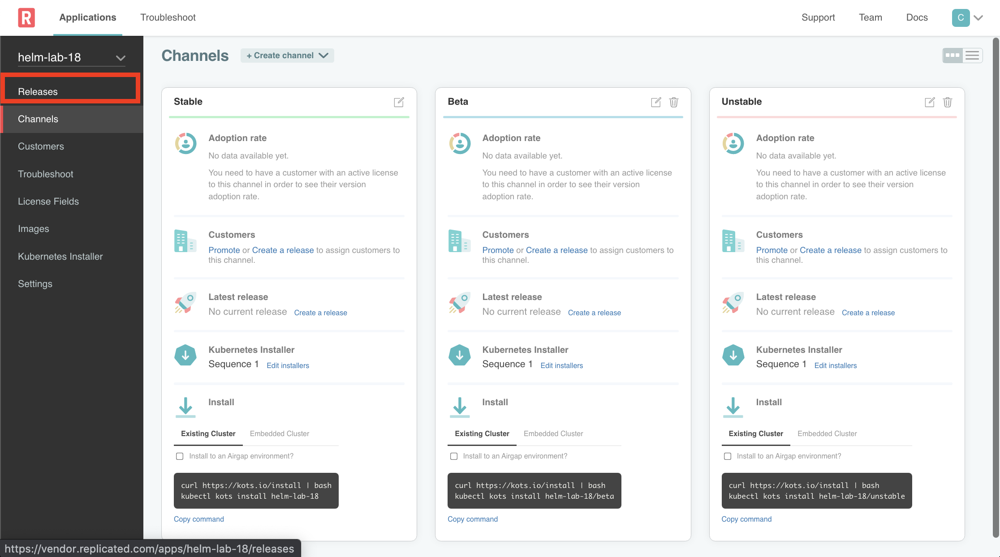
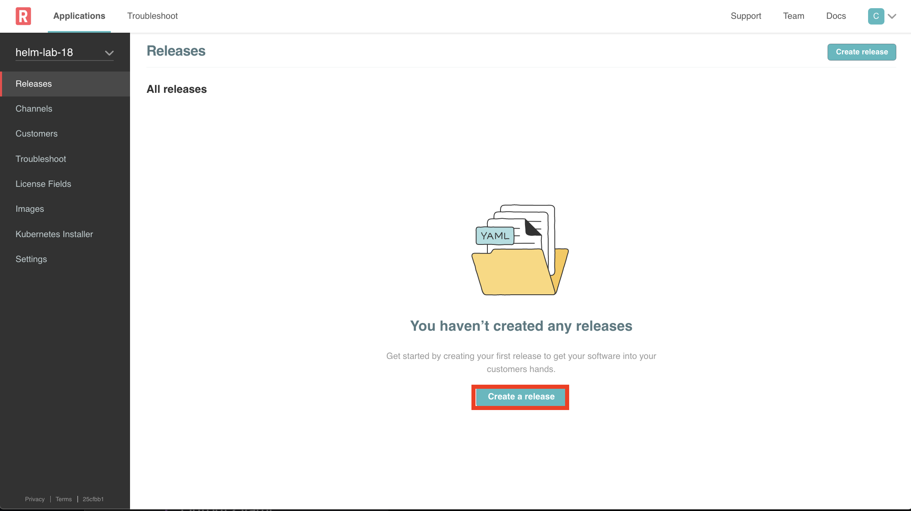
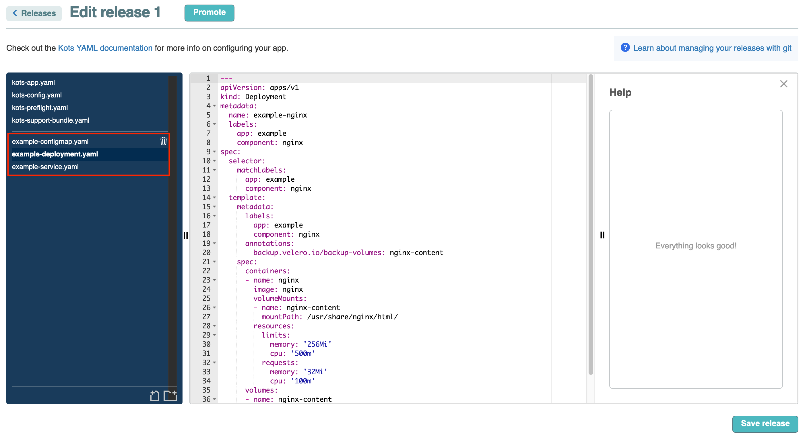
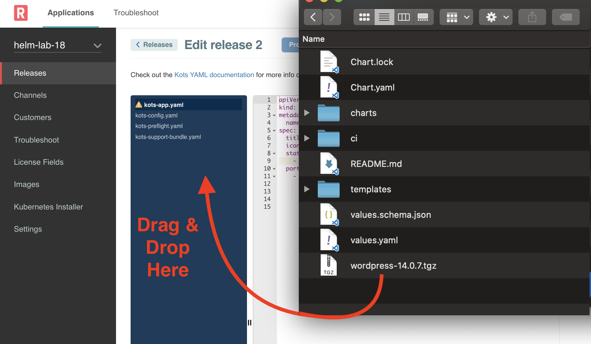
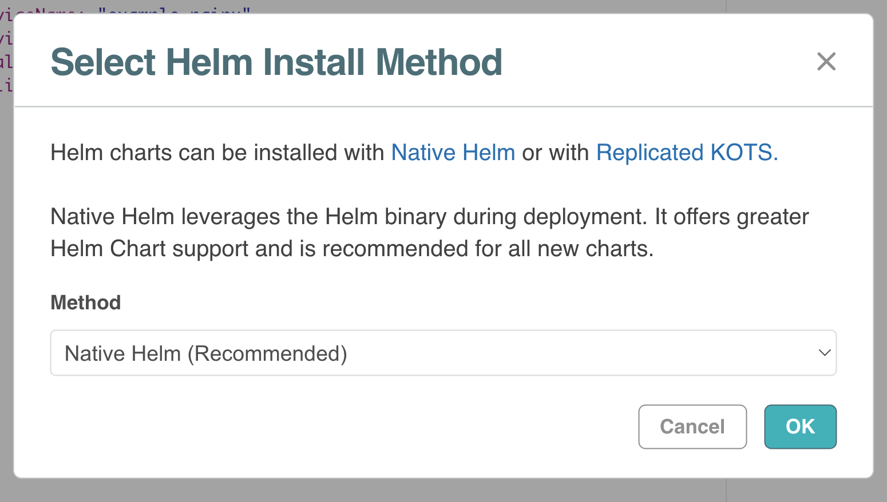
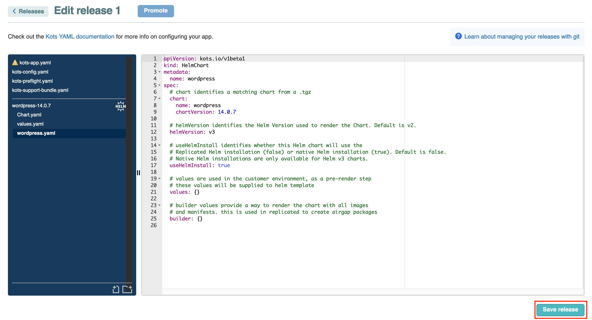
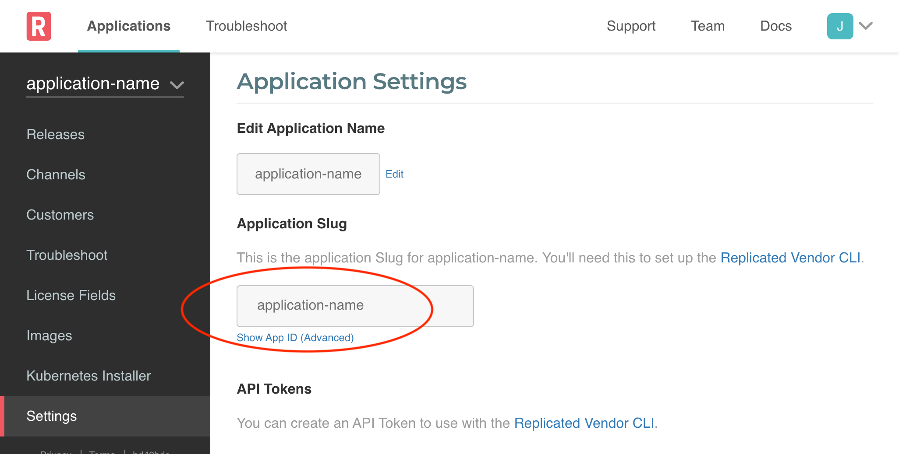
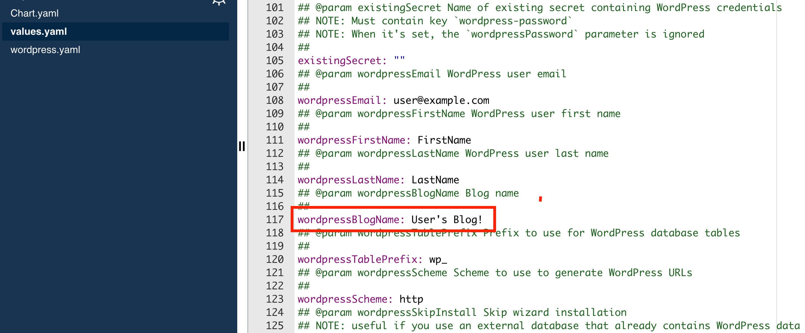

Lab 18: Using Helm Charts
=========================================

In this lab, you will learn how to include a Helm Chart in your Replicated Application. For this lab we wil use a simpler HelmChart, but the concepts covered here should help you understand how to handle larger and more complex charts. 

In this lab, we'll cover the following:

* Packaging a Helm Chart from source
* Adding a Helm Chart to a Replicated Application Release
* Mapping config fields to fields in the Values file
* Deploying the Helm Chart using the Replicated Application Manager
* Managing private images
* Managing multiple HelmCharts in a single Replicated Application Release

## Prerequisites

While not an absolute requirement, this lab is written with *nix workstations in mind, not Windows. If you are following this lab on a Windows machine and find gaps, please let us know.

You will need to have the following installed:

* Lastest version of Helm - In the writing and testing of the lab, we used version 3.8.2
* Git

You also should have received an invite to join Replicated. Make sure you accepted and activated your account.

## Packaging Helm Chart

For this lab we are going to use the WordPress [Helm Chart](https://github.com/bitnami/charts/tree/master/bitnami/wordpress) available from Bitnami. The Helm Chart includes a couple of sub charts (common and MariaDB) as dependencies. In order to ensure that future updates won't break this lab, we are going to be using a specific version of the chart, 14.0.7.

### 0. Get Dev Environment ready

We will be running some commands on the terminal and will download some files. Let's create a directory where we'll do our work

```bash
mkdir repl-helm-lab
cd repl-helm-lab

```
Next, we are going to download the nescessary files to package our Helm Chart.

### 1. Clone the Bitnami Repo

The repository we are about to clone contains multiple Helm Charts. While this lab will focus on one chart, you could follow the same steps covered in this lab with other charts. Since we want a specific release we are going to fetch using a commit hash.

```bash
git clone https://github.com/bitnami/charts.git
cd charts
git fetch origin 5277d698528bc4a78389f83c7e6fa4c42a6e63ad
git reset --hard 5277d698528bc4a78389f83c7e6fa4c42a6e63ad
```

The above commands should result in a message similar to:

```
HEAD is now at 5277d6985 [bitnami/wordpress] Release 14.0.7 (#10066)
```

This command will have downloaded all the bitnami helm chart files. In order to include a Helm Chart in Replicated, we have to package it first.

### 2. Change Directory to the Wordpress Chart

As mentioned above, this repo contains several Helm Charts, and we want to only package WordPress, so we need to change directory:

```bash
cd bitnami/wordpress/
```

We are now at the root of the Wordpress Helm Chart. If you list the contents of this directory, you will see that it contains a `Chart.yaml` and `Values.yaml` file. The `Chart.yaml` contains details about the chart, and the `Values.yaml` contains fields that the end user can override with their own values. Fields in this file can also be passed as parameters when you run `helm install`.

Let's verify that we are using the correct version of the chart by looking at the contents:
```bash
cat Chart.yaml
```

At the end of the file we should see the following:

```bash
...
name: wordpress
sources:
  - https://github.com/bitnami/bitnami-docker-wordpress
  - https://wordpress.org/
version: 14.0.7
```

### 3. Package the Helm Chart

To package the chart, we are going to run the `helm package` command.

As mentioned above, this Helm Chart includes some dependencies. To ensure that these are included in this Chart, include the `-u` option. Also note that we are passing a `.` for the location of the chart. This argument indicates the path to a directory containing the top level ```Chart.yaml``` file. For more details on `helm package`, please refer to the [Helm Documentation](https://helm.sh/docs/helm/helm_package/#helm).

```bash
helm package -u .
```
The command may display some warnings, but ultimately should display an output similar to

```
Successfully packaged chart and saved it to: /Users/fernandocremer/test/tests/charts/bitnami/wordpress/wordpress-14.0.7.tgz

```

We will include this file in our Replicated Application Release.

## Adding the Helm Chart to a Release

You should have received an invite to log into https://vendor.replicated.com -- you'll want to accept this invite and set your password. 

In this lab, an application has already been created but there are no releases yet. We are going to cover creating the release with the UI and through the CLI. Attaching your chart through the UI is easier and better if you just want to understand the basic concepts as it will automatically create resources for you. Later in this lab, we'll cover using the Replicated CLI to create and update releases in a helm-based application.

### Using the UI

* Log in to the Vendor Portal using your email and password.
* On the navigation menu, select **Releases**

    <p align="center"></img></p>

* Click on **Create Release**

    <p align="center"></img></p>

* We will not use the default nginx app, so let's delete the following files:
    * example-configmap.yaml
    * example-deployment.yaml
    * example-service.yaml

    <p align="center"></img></p>

* Now we are ready to add the Chart! Open a window and browse to the directory where the Helm Chart we created is located. From your terminal on macos, you can use `open .` to quickly get a Finder window open.
* Drag and Drop it where the Replicated Release Files navigator as shown below
    <p align="center"></img></p>

* You will be prompted to select which method to use when deploying the Helm Chart:
   
    <p align="center"></img></p>

   * **Native Helm** - This should be the default option and should be the one selected. With this option, App Manager will use Helm to deploy the Helm Chart in the customer's environment.
   * **Replicated** - This option will eventually be depecrated and should not be selected. With this option, App Manager will first generate Kubernetes Manifests from the Helm Chart (i.e., run `helm template`) before they are deployed to the cluster as manifests.

* Note how a new file is automatically created by Replicated that includes details about the chart we just added.

<p align="center"></img></p>

As a last step, save the release we've created 
<p align="center"></img></p>

### Using the CLI

Before working with the Replicated CLI, you should have already completed the [Hello World Lab](https://github.com/replicatedhq/kots-field-labs/blob/main/labs/lab00-hello-world/README.md) which covers how to set up a local dev environment with the Replicated CLI.

Make sure to update your environment variables to interact with this application. See [Get Started -> Steps 1 and 2](https://github.com/replicatedhq/kots-field-labs/blob/main/labs/lab00-hello-world/README.md#2-configure-environment)


`REPLICATED_APP` should be set to the app slug from the Settings page.
ahead of time.

<p align="center"></img></p>


`REPLICATED_API_TOKEN` should be set to the previously created user api token. See [Get Started -> Steps 1 and 2](https://github.com/replicatedhq/kots-field-labs/blob/main/labs/lab00-hello-world/README.md#2-configure-environment)

Once you have the values, set them in your environment. If you are still in the `charts` directory, let's get back to the root of the directory we created earlier

```bash
cd ../../..
```
If you haven't already, set your environment variables:

```bash
export REPLICATED_APP=...
export REPLICATED_API_TOKEN=...
```

We need a directory that will contain the Helm Chart and the Replicated manifests. Let's create a directory for our application, and in there a `manifests` directory that will contain the manifests and helm chart.

```bash
mkdir helm-wordpress
cd helm-wordpress
   $ mkdir manifests
```

We need to move the helm chart package we created previously to the manifests directory we just created. Depending on where your helm chart was created, the path in the example command below may be different.

```bash
    $ mv ../charts/bitnami/wordpress/wordpress-14.0.7.tgz manifests
```

Next, let's create a couple of manifests to finish our first release. Both of these manifests are Replicated [Custom Resources](https://docs.replicated.com/reference/custom-resource-about) and should be created in the `manifests` directory.

#### Adding kots-app.yaml

The first Custom Resource we'll create is [Application](https://docs.replicated.com/reference/custom-resource-application). This manifest includes details about the application we created.

``` yaml
#kots-app.yaml
apiVersion: kots.io/v1beta1
kind: Application
metadata:
  name: helm-wordpress
spec:
  title: Helm Wordpress
  icon: https://upload.wikimedia.org/wikipedia/commons/9/93/Wordpress_Blue_logo.png
  statusInformers:
    - deployment/wordpress

```

#### Adding wordpress.yaml

The second Custom Resource we'll create is [Helm Chart](https://docs.replicated.com/reference/custom-resource-helmchart). This file has information about the Wordpress Helm Chart. This file is specific to the Helm Chart, so if your application contains multiple, separate charts, you will need a manifest for each Helm Chart. You do not need to define a `Helm Chart` manifest for any chart included as a sub-chart.

```yaml
#wordpress.yaml
apiVersion: kots.io/v1beta1
kind: HelmChart
metadata:
  name: wordpress
spec:
  # chart identifies a matching chart from a .tgz
  chart:
    name: wordpress
    chartVersion: "14.0.7"
  # helmVersion identifies the Helm Version used to render the chart. Default is v2.
  helmVersion: v3

  # useHelmInstall identifies whether this Helm chart will use the
  # Replicated Helm installation (false) or native Helm installation (true). Default is false.
  # Native Helm installations are only available for Helm v3 charts.
  useHelmInstall: true

  # weight determines the order that charts with "useHelmInstall: true" are applied, with lower weights first.
  weight: 0

  # values are used in the customer environment, as a pre-render step
  # these values will be supplied to helm template
  values: {}
```

Before we create our release, let's initialize git. We will use a command line option that uses Git metadata to determine the version label, channel to promote to and more.

```bash
    $ git init
    $ git add .
    $ git commit -m "this is my first commit"
```
Now we are ready to create our first release:

```bash
    $ replicated release create --auto --promote lab18-helm-charts -y
```

## Deploy the Application

We now have something we can deploy! As part of this lab, you were provided with the IP address of a Virtual Machine. Log in using `ssh kots@{IP-Address}` using the IP address provided. The password will be provided during this lab.

Once you are on the terminal, copy the "Embedded Cluster" install command from the channel (`lab18-helm-charts`). It should look like
```
curl -sSL https://k8s.kurl.sh/YOUR-APP-NAME-lab18-helm-charts | sudo bash
```

Go through the installation steps in kotsadm to install the application. You should have already completed [Lab0: Hello World](https://github.com/replicatedhq/kots-field-labs/blob/main/labs/lab00-hello-world/README.md), so this should be familiar.

## Mapping Field Values

Let's take some of the field values and map them to the ui!

We are going to make two changes:
* Map the `wordpressBlogName` field in the Values.yaml file to a UI field.
* Override the default port of 80 to 8080.

### Copy the field name from the Values file

For this lab we are going to use the `wordpressBlogName` field in the values file and expose it in the UI. For reference, we are going to be referencing fields in the ../charts/bitnami/wordpress/values.yaml file.



### Create a field in the Config.yaml file

Create a file under `manifests` named `kots-config.yaml` file with the following contents:

```yaml
apiVersion: kots.io/v1beta1
kind: Config
metadata:
  name: wordpress-config
spec:
  groups:
    - name: wordpress
      title: Wordpress
      description: Wordpress Defaults
      items:
        - name: wordpressBlogName
          title: Wordpress Blog Name
          type: text

```

As you can see, we are using the values field name as the config field name and used for the title, which is what the end user will see.


### Map the Config file field with the field in the Values file

Edit the `wordpress.yaml` file and scroll down to the values section and make the following changes:

```diff
# values are used in the customer environment, as a pre-render step
# these values will be supplied to helm template
-- values: {}
++ values:
++   wordpressBlogName: '{{repl ConfigOption "wordpressBlogName"}}'
```

Now we are ready to create our next release:

```bash
    $ replicated release create --auto --promote lab18-helm-charts -y
```

## Update the Application

Let's see our changes on the Admin Console. Click on Check for Update as shown below.

Before you click on Deploy, note that now you have a Config tab with our field in it.

Deploy the new version of our app

### Random Password Generation

If you were paying close attention to the update we did in the previous step, you would have noticed that the credentials that are generated for MariaDB get generated again. When you perform an intial install or a subsequent upgrade, App Manager will use `helm upgrade -i` and will let Helm determine if there are any changes in the Chart.

Obviously we don't want this password to be reset each time we do an upgrade, so to solve this we are going to create a hidden config field which will have a random string value. We will use this value for the password that is used with MariaDB.

#### Create the field

Update the `kots-config.yaml` file we created earlier with the content below. We are now going to create a field that will generate a random string.

```yaml
# config.yaml
apiVersion: kots.io/v1beta1
kind: Config
metadata:
  name: wordpress-config
spec:
  groups:
    - name: wordpress
      title: Wordpress
      description: Wordpress Defaults
      items:
        - name: wordpressBlogName
          title: Wordpress Blog Name
          type: text
        - name: wordpress-db-secret
          hidden: true
          type: password
          value: "{{repl RandomString 16}}"
```

Next, we need to map this value to the field in the Values file. Note that if this field was not exposed in the Values file, we would likely need to change the chart so the field would be exposed in the values file.

```yaml
# wordpress.yaml

apiVersion: kots.io/v1beta1
kind: HelmChart
metadata:
  name: wordpress
spec:
  # chart identifies a matching chart from a .tgz
  chart:
    name: wordpress
    chartVersion: "14.0.7"
  # helmVersion identifies the Helm Version used to render the chart. Default is v2.
  helmVersion: v3

  # useHelmInstall identifies whether this Helm chart will use the
  # Replicated Helm installation (false) or native Helm installation (true). Default is false.
  # Native Helm installations are only available for Helm v3 charts.
  useHelmInstall: true

  # weight determines the order that charts with "useHelmInstall: true" are applied, with lower weights first.
  weight: 0

  # values are used in the customer environment, as a pre-render step
  # these values will be supplied to helm template
  values:
    wordpressBlogName: '{{repl ConfigOption "wordpressBlogName"}}'
    mariadb:
      auth:
        rootPassword: '{{ repl ConfigOption "wordpress-db-secret"}}'

```

## Make Update to Access Wordpress UI

By default, Wordpress runs on port 80 but given that it is a pretty popular port it may already be in use. Also, Wordpress by default uses a service of typy LoadBalancer. In the `values.yaml` file, this is exposed like this:


```diff
    values:
      wordpressBlogName: '{{repl ConfigOption "wordpressBlogName"}}'
++    service:
++    type: NodePort
++    ports:
++      http: 8080
++    nodePorts:
++      http: "8080"
      mariadb:
        auth:
          rootPassword: '{{ repl ConfigOption "wordpress-db-secret"}}'
```

## Update and Test Change

Create our next release using the `replicated` cli:

```bash
    $ replicated release create --auto --promote lab18-helm-charts -y
```

Now that we have a new release available, let's update our deployed application to test the change.

Click on **Check for Update** and click on **Deploy** once available. Once deployed, you should be able to browse to port `8080` and see Wordpress.

# Additional Info

## Airgap: Optional Images

Another thing to consider about images is making sure that all of them will be available in an airgap install. For example,  you may have a service like database that they customer has the option to deploy or connect to their own instance. In an airgap installation, you would need to make sure that the image is included in the bundle in case a user selects to deploy the service. You can include optional charts in the Airgap bundle, by using the `builder` attribute. For more details on how Replicated creates the airgap bundles automatically, see the [Helm Air Gap Builder](https://docs.replicated.com/vendor/helm-airgap-builder).


## Using Multiple Charts

In this lab we have used a single chart that contained two sub-charts. Note that a Replicated Application Release can contain more than one Helm chart. If you do need to include more than one Helm chart, it is important to understand the sequence by which these charts are deployed. 

Starting with version 1.69* of App Manager, charts are deployed in alphanumeric order. If this is not the sequence that you desire, you can use the `weight` field in the corresponding Replicated `kind:helmchart` file. The default value is 0 for any charts that do not have this field specified. Charts will be deployed in ascending numeric order based on this field. *For charts that have the same weight specified, then alpha numeric order takes precendence.
