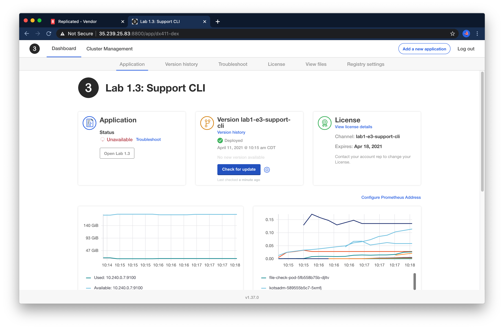
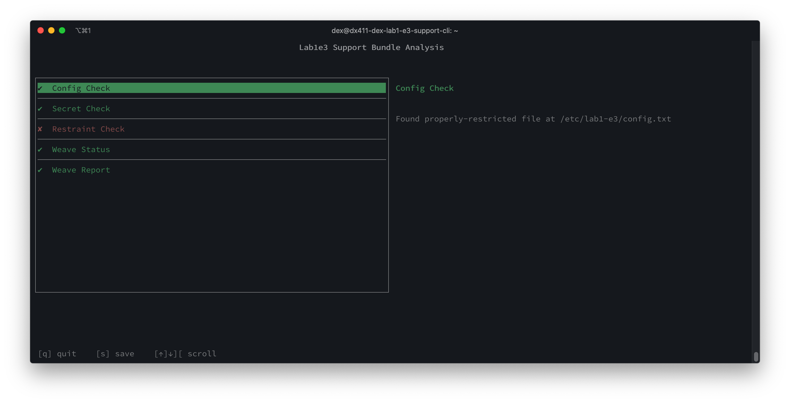
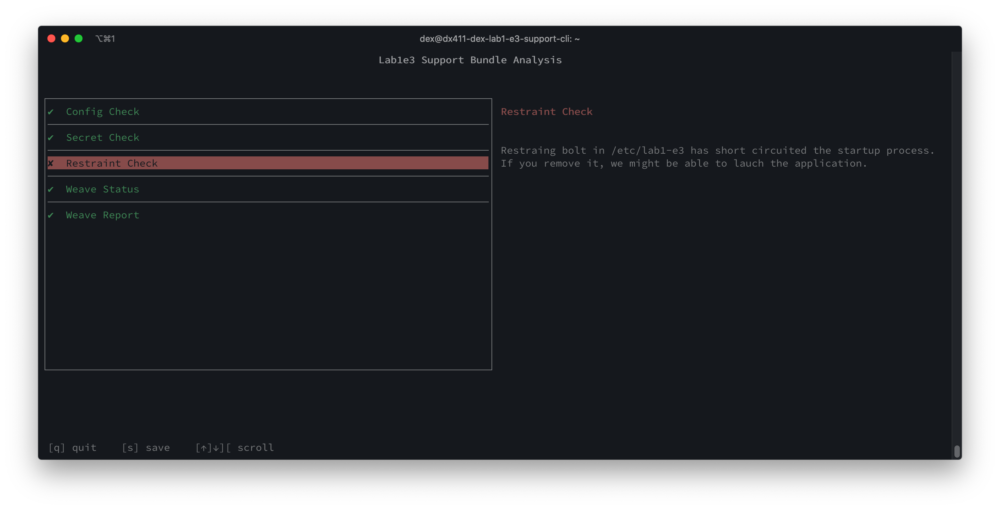
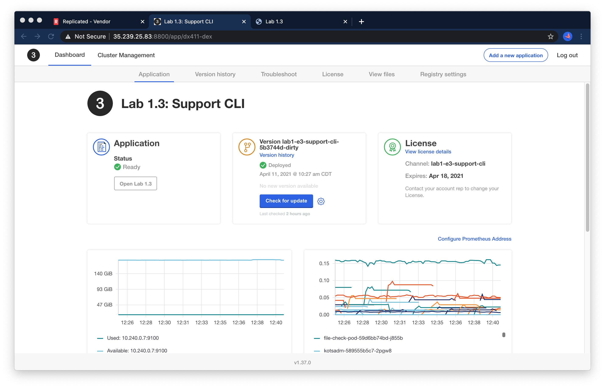

Lab 1.3: Support CLI
=========================================

In this lab, we'll learn how to debug and diagnose support problems when the KOTS admin console is unavailable.

You can open the KOTS admin console* for your node by navigating to https://lab3-support-cli:8800 in a browser. The password to your instance will be provided as part of the lab, or you can reset by SSHing into the node and running

```shell
kubectl kots reset-password -n default
```


### Ground Rules

In this lab and most of those that follow it, some of the failure scenarios are quite contrived.
It is very possible to reverse-engineer the solution by reading the Kubernetes YAML instead of following the lab steps.
If you want to get the most of out these labs, use the presented debugging steps to get experience with the toolset.

### Investigating

*At first glance, you may notice that something is entirely wrong with this instance. You may even get a 502 error 
when trying to open kotsadm.


In this exercise, we'll review how to collect a support bundle when these types of errors arise. However, to start, you should be able
to access the KOTS UI for about 30 seconds at a time in between errors. So you'll want to *start by refreshing a few 
times* until the UI itself loads.

Logging into the instance, we see, as you might expect, that the application is unavailable:



Our first instinct by now should be to try to collect a bundle. However, you may notice something entirely new is going on:
there are issues with the kotsadm console itself. You will likely see 502 or 401 errors, and be unable to view the bundle:


While the goal of this lab is to show you how to get rich diagnostic information without using granular `kubectl` CLI
commands, we'll pause for a second here to do some very basic inspection of what's happening with `kubectl get pod`.

```text
$ kubectl get pod 
NAME                                  READY   STATUS        RESTARTS   AGE
file-check-pod-5fb558b75b-djltv       1/1     Running       0          5m25s
kotsadm-589555b5c7-6c96r              0/1     Init:0/4      0          2s
kotsadm-589555b5c7-t78q8              1/1     Terminating   0          53s
kotsadm-operator-674545cbb6-66xfp     1/1     Running       0          6m50s
kotsadm-postgres-0                    1/1     Running       0          6m49s
kurl-proxy-kotsadm-5bd9b6956d-c8xpn   1/1     Running       0          6m48s
nginx-8b679cd99-zmv2w                 0/1     Init:2/3      0          5m25s
```

It appears that our app pod is stuck initializing, and the KOTS admin console is in the middle of terminating/re-initializing.


### Getting a Support Bundle when KOTS is crashing

This brings us to our next key takeaway:

<div align="center"><blockquote><h3>When the KOTS admin console is unavailable, the <code>kubectl support-bundle</code> command should be used to collect a support bundle.</h3></blockquote></div>

The CLI bundle command can be grabbed from the UI on the "Analyze App" page.
Note that the `kubectl support-bundle` plugin will always be pre-installed on kURL instances, so the `curl https://krew.sh/support-bundle | bash` command can 
and should be omitted in this case. 


In the case that the UI is totally unreachable, the command will follow the pattern below. 
Note that this pattern is subject to change in future KOTS versions and you should prefer to copying the command from the UI.
The below was built from a KOTS instance running version 1.37.0.

```shell
export REPLICATED_APP=... # your app slug
kubectl support-bundle \
  secret/default/kotsadm-${REPLICATED_APP}-supportbundle \
  --redactors=configmap/default/kotsadm-redact-spec/redact-spec,configmap/default/kotsadm-${REPLICATED_APP}-redact-spec/redact-spec
```


When running the support bundle command, you will likely see some warnings and deprecation errors. These can be ignored:

```text
$ kubectl support-bundle secret/default/kotsadm-dx411-dex-supportbundle --redactors=configmap/default/kotsadm-redact-spec/redact-spec,configmap/default/kotsadm-dx411-dex-redact-spec/redact-spec

 * failed to run collector "ceph": rook ceph tools pod not found
 * failed to parse collector spec "copy/spec-dx411-dex": extract copied files: unexpected EOF
 Collecting support bundle ⠴ cluster-resourcesW0413 15:48:43.411664   12085 warnings.go:70] extensions/v1beta1 Ingress is deprecated in v1.14+, unavailable in v1.22+; use networking.k8s.io/v1 Ingress
W0413 15:48:43.414900   12085 warnings.go:70] extensions/v1beta1 Ingress is deprecated in v1.14+, unavailable in v1.22+; use networking.k8s.io/v1 Ingress
W0413 15:48:43.417006   12085 warnings.go:70] extensions/v1beta1 Ingress is deprecated in v1.14+, unavailable in v1.22+; use networking.k8s.io/v1 Ingress
W0413 15:48:43.418910   12085 warnings.go:70] extensions/v1beta1 Ingress is deprecated in v1.14+, unavailable in v1.22+; use networking.k8s.io/v1 Ingress
W0413 15:48:43.420759   12085 warnings.go:70] extensions/v1beta1 Ingress is deprecated in v1.14+, unavailable in v1.22+; use networking.k8s.io/v1 Ingress
W0413 15:48:43.422549   12085 warnings.go:70] extensions/v1beta1 Ingress is deprecated in v1.14+, unavailable in v1.22+; use networking.k8s.io/v1 Ingress
W0413 15:48:43.424275   12085 warnings.go:70] extensions/v1beta1 Ingress is deprecated in v1.14+, unavailable in v1.22+; use networking.k8s.io/v1 Ingress
W0413 15:48:43.426010   12085 warnings.go:70] extensions/v1beta1 Ingress is deprecated in v1.14+, unavailable in v1.22+; use networking.k8s.io/v1 Ingress
W0413 15:48:43.428156   12085 warnings.go:70] storage.k8s.io/v1beta1 StorageClass is deprecated in v1.19+, unavailable in v1.22+; use storage.k8s.io/v1 StorageClass
 Collecting support bundle ⠦ cluster-resourcesW0413 15:48:43.552917   12085 warnings.go:70] apiextensions.k8s.io/v1beta1 CustomResourceDefinition is deprecated in v1.16+, unavailable in v1.22+; use apiextensions.k8s.io/v1 CustomResourceDefinition

```

Eventually you'll be presented with the same analyzer results you'd have seen in the kotsadm UI:



<div align="center"><blockquote><code>`kubectl support-bundle` can be used to review the same application analysis that is usually available in the KOTS admin console</code></blockquote></div>

Upon exiting with `q`, you may also notice this error. 

```
* Failed to upload support bundle: execute request: Put "http://kotsadm.default.svc.cluster.local:3000/api/v1/troubleshoot/1r7ImhqI0fmI89HcKCbGrIpsLq9/57j6mjj92v8v5274jgtr2rn55g5kt6h2": dial tcp: lookup kotsadm.default.svc.cluster.local on 127.0.0.53:53: server misbehaving
```

As a last step, the support CLI will try to upload the generated bundle to the KOTS admin console so it can be reviewed there as well,
but as we well know, the kotsadm console is in a restart loop so it's expected that this step might fail.
Of course if you time things right, your bundle may complete while the KOTS admin console *is* available :slightly_smiling_face:

In any case, the `Failed to upload support bundle` error is expected and can be ignored.


### Diagnosis

Review the failing checks to understand what is wrong with the server and correct the problem.

<details>
  <summary>Open for a hint</summary>

Scrolling to the failing check, we can review the error message:



Specifically, you'll see the error message:

```shell
Restraining bolt in /etc/lab3 has short circuited the startup process. If you remove it, we might be able to launch the application.
```

We can remove this file with

```shell
sudo rm /etc/lab3/restraining-bolt.txt
```

</details>

* * *

When you're done making changes, you should see the pods recover and stabilize

```text
$ kubectl get pod
NAME                                  READY   STATUS    RESTARTS   AGE
file-check-pod-59d6bb74bd-j855b       1/1     Running   0          132m
kotsadm-589555b5c7-2tlz4              1/1     Running   0          54s
kotsadm-operator-674545cbb6-66xfp     1/1     Running   0          145m
kotsadm-postgres-0                    1/1     Running   0          145m
kurl-proxy-kotsadm-5bd9b6956d-c8xpn   1/1     Running   0          145m
nginx-8b679cd99-zmv2w                 1/1     Running   0          144m
```


After a few minutes, we should see that the app becomes available



If you leave the instance for a while, you should also notice the CPU graphs settle down


### Additional exercise: Sharing the Bundle

As part of the CLI collection, a support bundle will be dropped in your current working directory.


```text
$ ls -l
total 1388
-rw-rw-r-- 1 dex dex   3944 Apr 13 13:23 license.yaml
-rw-rw-r-- 1 dex dex 461852 Apr 13 15:44 support-bundle-2021-04-13T15_43_47.tar.gz
```

Use `scp` or some other means to copy the bundle off the server to your workstation, upload it to vendor.replicated.com, and review the analyzers there as well.


You'll see at least one analyzer populated in the UI, about KOTSadm being unreachable.


### What if KOTS is failing before an app is installed?

You may notice that the support bundle CLI command we used above relies on an application-specific secret:

```shell
export REPLICATED_APP=... # your app slug
kubectl support-bundle \
  secret/default/kotsadm-${REPLICATED_APP}-supportbundle \
  --redactors=configmap/default/kotsadm-redact-spec/redact-spec,configmap/default/kotsadm-${REPLICATED_APP}-redact-spec/redact-spec
```

What can we do if KOTS is misbehaving before a license is installed and the application-specific support secrets are configured?
In general this means "escalate the problem to Replicated", but you want to make sure to provide as much detail as possible.
There is another more generic support bundle that can *always* be collected, and the command to collect it is always the same:

```text
kubectl support-bundle https://kots.io
```

This is another important takeaway:

<div align="center"><blockquote><h3><code>kubectl support-bundle https://kots.io</code> can be used to collect generic information about the KOTS admin console</h3></blockquote></div>


Again, as before, you will see some warnings and failures that can be ignored:

```text
$ kubectl support-bundle https://kots.io
 Collecting support bundle ⠴ cluster-resourcesW0413 15:43:50.339969   25323 warnings.go:70] extensions/v1beta1 Ingress is deprecated in v1.14+, unavailable in v1.22+; use networking.k8s.io/v1 Ingress
W0413 15:43:50.343939   25323 warnings.go:70] extensions/v1beta1 Ingress is deprecated in v1.14+, unavailable in v1.22+; use networking.k8s.io/v1 Ingress
W0413 15:43:50.346433   25323 warnings.go:70] extensions/v1beta1 Ingress is deprecated in v1.14+, unavailable in v1.22+; use networking.k8s.io/v1 Ingress
W0413 15:43:50.348449   25323 warnings.go:70] extensions/v1beta1 Ingress is deprecated in v1.14+, unavailable in v1.22+; use networking.k8s.io/v1 Ingress
W0413 15:43:50.350910   25323 warnings.go:70] extensions/v1beta1 Ingress is deprecated in v1.14+, unavailable in v1.22+; use networking.k8s.io/v1 Ingress
W0413 15:43:50.354544   25323 warnings.go:70] extensions/v1beta1 Ingress is deprecated in v1.14+, unavailable in v1.22+; use networking.k8s.io/v1 Ingress
W0413 15:43:50.356733   25323 warnings.go:70] extensions/v1beta1 Ingress is deprecated in v1.14+, unavailable in v1.22+; use networking.k8s.io/v1 Ingress
W0413 15:43:50.360514   25323 warnings.go:70] extensions/v1beta1 Ingress is deprecated in v1.14+, unavailable in v1.22+; use networking.k8s.io/v1 Ingress
W0413 15:43:50.363264   25323 warnings.go:70] storage.k8s.io/v1beta1 StorageClass is deprecated in v1.19+, unavailable in v1.22+; use storage.k8s.io/v1 StorageClass
 Collecting support bundle ⠦ cluster-resourcesW0413 15:43:50.505621   25323 warnings.go:70] apiextensions.k8s.io/v1beta1 CustomResourceDefinition is deprecated in v1.16+, unavailable in v1.22+; use apiextensions.k8s.io/v1 CustomResourceDefinition
 * failed to run collector "ceph": rook ceph tools pod not found
```


**Note** -- using this technique this requires outbound internet access to pull the spec from kots.io. 
The SupportBundle spec that is used in this case is at https://github.com/replicatedhq/kots/blob/master/support-bundle.yaml.
In [Lab 5 - airgap](../lab5-airgap) we'll learn to run this generic bundle when there is no outbound internet access.

Congrats! You've completed Exercise 3! [Back To Exercise List](https://github.com/replicatedhq/kots-field-labs/tree/main/labs)


