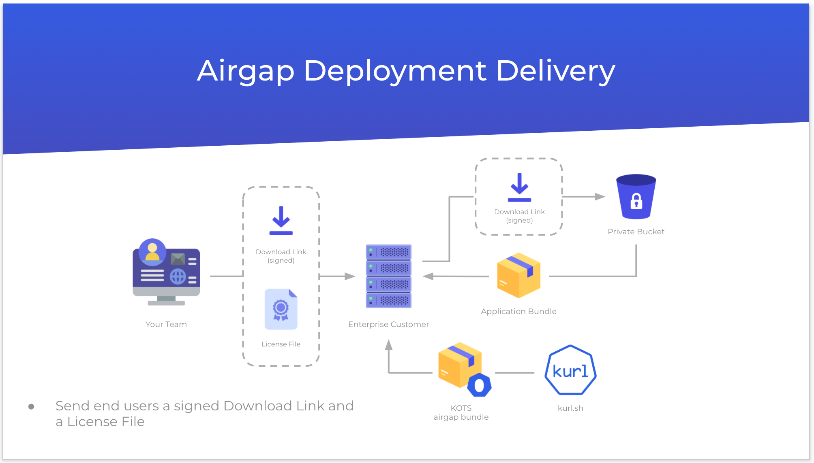
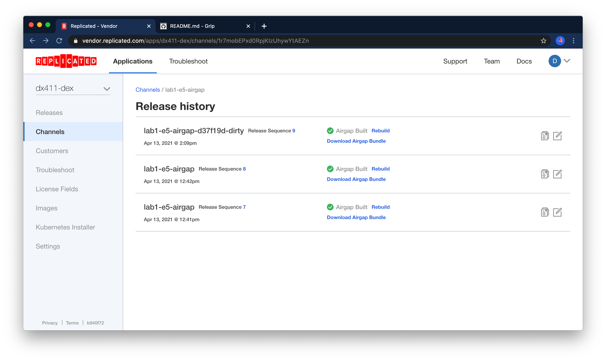
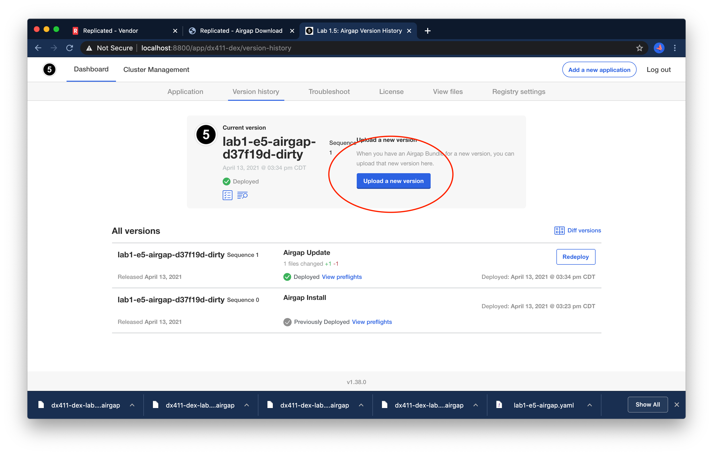

Lab 1.5: Airgap
=========================================

In this lab, we'll review how to perform installations in airgapped environments, and
how to collect support bundles in airgapped environments.

In this case we'll start with a bare airgapped server with no KOTS installation, so you can
get practice performing an airgap install from scratch.

Once that's done, we'll explore how some of the support techniques differ between online and airgapped environments. 

### Airgap Workflow Overview

First, we'll push a release -- in the background, Replicated's airgap builder will prepare an airgap bundle.


Next, we'll collect a license file, a download link, and a public kURL bundle.



From there, we'll move all three artifacts into the datacenter via a jump box.


The above diagram shows a three node cluster, but we'll use only a single node.
While the KOTS bundle will be moved onto the server via SCP as in the diagram,
the app bundle and license file will be uploaded via a browser UI through an SSH tunnel.

### Instance Overview

You will have received the IP of a jump box and the name of an airgapped server.
For example, you may have received:

```text
dx411-dex-lab1-e5-airgap-jump = 104.155.131.205
dx411-dex-lab1-e5-airgap
```

In general, the name of the private server will be the same as the jump box, with the characters `-jump` removed from the suffix.
Put another way, you could construct both instance names programatically as

```shell
${REPLICATED_APP}-lab5-airgap-jump
```

and

```shell
${REPLICATED_APP}-lab5-airgap
```

### Connecting

First set your application slug, and the public IP of your jump box:

```shell
export JUMP_BOX_IP=...
export REPLICATED_APP=... # your app slug
```

Next, you can SSH the airgapped server with

```shell
ssh -J dex@${JUMP_BOX_IP} dex@${REPLICATED_APP}-lab5-airgap
```

Once you're on, you can verify that the server indeed does not have internet access. Once you're convinced, you 
can ctrl+C the command and proceed to the next section

```shell
curl -v https://kubernetes.io
```

### Moving Assets into place

If you haven't already, you can log out of the airgapped instance with `exit` or ctrl+D. 
Our next step is to collect the assets we need for an airgapped installation:

1. A license with the airgap entitlement enabled
2. An airgap bundle containing the kURL cluster components
3. An airgap bundle containing the application components

(2) and (3) are separate artifacts to cut down on bundle size during upgrade scenarios where only the application version 
is changing and no changes are needed to the underlying cluster.

#### Building an Airgap Release

By default, only the Stable and Beta channels will automatically build airgap bundles

- manually build
- set channel to auto build

For a production application, airgap releases will be built automatically on the Stable channel, so this won't
be necessary.

In this case, since we're working off the `lab1-e5-airgap` channel, you'll want to enable airgap builds on that channel.

You can check the build status by navigating to the "Release History" for the channel.


You can build invividual bundles on the Release History page, but you'll likely want to edit the channel and enable "build all releases for this channel".


Now you should see all the bundles building or built on the release history page:



#### Enabling Airgap for a customer

The first step will be to enable airgap for the `lab1-e5` customer:


#### Download Airgap Assets 


After saving the customer, scroll to the bottom of the page to the `Download Portal` section.


Generate a new password and save it somewhere in your notes.
Next, click the link to open the download portal. 
This is a link you would usually send to your customer, so from here on we'll be wearing our "end user" hat.


Navigate to the "embedded cluster" option and review the three downloadable assets.


Download the license file, but **don't download the kURL bundle**.
While you can download the kURL bundle directly to your workstation and copy it to the remote server, you'll
likely be able to go much faster if you copy the URL and download the assets directly onto the jump box.
You can copy each URL as shown below:


You'll want to download the other bundle `Latest Lab 1.5: Airgap Bundle` to your workstation.

Now, let's SSH our jump box (the one with the public IP) and download the kurl bundle.
We'll use the `-A` flag to the `ssh` command to forward our agent so we can interact with the airgapped node as well.
Replace the URL with the one you copied above

```text
dex@dx411-dex-lab1-e5-airgap-jump ~$ curl -o kurlbundle.tar.gz https://kurl.sh/bundle/dx411-dex-lab1-e5-airgap.tar.gz
```

When it's finished, copy it to the airgapped server. 
You can use the DNS name in this case, as described in [Instance Overview](#instance-overview).
In this example we've SSH'd the jump box with the -A flag so the SSH agent will be forwarded.

```text
dex@dx411-dex-lab1-e5-airgap-jump ~$ scp kurlbundle.tar.gz dex@dx411-dex-lab1-e5-airgap:/home/dex
```

**Note** -- we use SCP via an SSH tunnel in this case, but the airgap methods in this lab also extend to
more locked down environments where e.g. physical media is required to move assets into the datacenter.

Now we'll SSH all the way to airgap node. If you still have a shell on your jump box, you can use the instance name.

```text
dex@dx411-dex-lab5-airgap-jump ~$ ssh dx411-dex-lab5-airgap
```

Otherwise, you can use the above 

```shell
ssh -J dex@lab5-airgap-jump dex@${REPLICATED_APP}-lab5-airgap
```

Once you're on the "airgapped" node, untar the bundle and run the install script with the `airgap` flag.
kURL install flags are documented [in the kurl.sh docs](https://kurl.sh/docs/install-with-kurl/advanced-options).

```shell
tar xvf kurlbundle.tar.gz
sudo bash install.sh airgap
```

At the end, you should see the familiar `Installation Complete` message. 
Since the instance is airgapped, we'll need to create a port forward to access the UI from our workstation in the next step.

### Accessing the UI via SSH tunnel, Configuring the instance

You'll want to create a port forward from your workstation in order to access to UI locally.
Again we'll use `REPLICATED_APP` to construct the DNS name but you can input it manually as well.

```shell
export JUMP_BOX_IP=lab5-airgap
export REPLICATED_APP=... # your app slug
ssh -NL 8800:${REPLICATED_APP}-lab5-airgap:8800 dex@${JUMP_BOX_IP}
```

This will run in the foreground, and you wont see any output, but you can test by navigating to http://localhost:8800

From here, you can proceed with the standard setup steps, until we get to the post-license install step.
Remember that this is a fresh install so you'll need to grab the password from the install script output:


After you upload your license, you'll be greeted with an Airgap Upload screen. Use the "application bundle" that you
downloaded to your workstation using the customer portal here.


You'll see the bundle uploaded and images being pushed to kURL's internal registry:


We'll find that the application is unavailable. 


While we'll expore [support techniques for airgapped environments](#collecting-a-cli-support-bundle) 
below, in this case you should observe that our deployment is simply not valid, specifically, the
standard nginx entrypoint has been overriden:

```yaml
      containers:
        - name: nginx
          image: nginx
          command:
            - exit
            - "1"
```

So we'll need to create a new release in order to fix this.


### Deploying a new version

From the `labs/lab1-e5-airgap` directory, remove the command override.


```diff
diff --git a/labs/lab1-e5-airgap/manifests/nginx-deployment.yaml b/labs/lab1-e5-airgap/manifests/nginx-deployment.yaml
index fa29e8d..3a66405 100644
--- a/labs/lab1-e5-airgap/manifests/nginx-deployment.yaml
+++ b/labs/lab1-e5-airgap/manifests/nginx-deployment.yaml
@@ -16,9 +16,6 @@ spec:
       containers:
         - name: nginx
           image: nginx:latest
-          command:
-            - exit
-            - "1"
           volumeMounts:
             - mountPath: /usr/share/nginx/html
               name: html
```

Once you're satisfied with your `nginx-deployment.yaml` create a new release with `make release`.
You'll need to ensure you've got `REPLICATED_APP` and `REPLICATED_API_TOKEN` set.


```shell
make release
```

Once the release is made, you should be able to navigate back to the customer download portal we accessed from the customer page.
Scrolling to the bottom, you can click "show older bundles" to see the history of releases on the lab1-e5-airgap channel.
The new release may take a minute or two to build, so you're want to refresh the make until you see one
with a timestamp that matches when you ran `make release`.


Once you've downloaded the new version, select "upload a new version" from the main dashboard and select your bundle.



You'll see the bundle upload as before and you'll have the option to deploy it once the
preflight checks complete.
The app should now show as ready on the main dashboard.

In order to access the application though, you'll need to create another SSH tunnel for the app's port (8888).

<details>
    <summary>Click for a hint</summary>

From your workstation, run

```shell
export JUMP_BOX_IP=lab5-airgap
export REPLICATED_APP=... # your app slug
ssh -NL 8888:${REPLICATED_APP}-lab5-airgap:8888 dex@${JUMP_BOX_IP}
```

</details>

Congrats! You've installed and then upgraded an airgapped instance!

### Collecting a CLI support bundle

As a final step, we'll review how to collect support bundles

Of course, since our app is installed, we can use the command from [lab 3](../lab3-support-cli):
  
```shell
export REPLICATED_APP=... # your app slug
kubectl support-bundle \
  secret/default/kotsadm-${REPLICATED_APP}-supportbundle \
  --redactors=configmap/default/kotsadm-redact-spec/redact-spec,configmap/default/kotsadm-${REPLICATED_APP}-redact-spec/redact-spec
```

However, what would we do in the case that the app installation itself was failing?
We can try our `kots.io` support bundle from the airgapped server.

```shell
kubectl kots support-bundle https://kots.io
```

As you might expect this will fail because we can't fetch the spec from the internet.

```text
Error: failed to load collector spec: failed to get spec from URL: execute request: Get "https://kots.io": dial tcp 104.21.18.220:443: i/o timeout
```

In this case, we'll want to pull in the spec from https://github.com/replicatedhq/kots/master/support-bundle.yaml.
How you get this file onto the server is up to you -- expand below for an option that uses `cat` with a heredoc.


<details> 

```shell
cat <<EOF > support-bundle.yaml
apiVersion: troubleshoot.sh/v1beta2
kind: SupportBundle
metadata:
  name: collector-sample
spec:
  collectors:
    - clusterInfo: {}
    - clusterResources: {}
    - ceph: {}
    - exec:
        args:
          - "-U"
          - kotsadm
        collectorName: kotsadm-postgres-db
        command:
          - pg_dump
        containerName: kotsadm-postgres
        name: kots/admin_console
        selector:
          - app=kotsadm-postgres
        timeout: 10s
    - exec:
        args:
          - "http://localhost:3030/goroutines"
        collectorName: kotsadm-goroutines
        command:
          - curl
        containerName: kotsadm
        name: kots/admin_console
        selector:
          - app=kotsadm
        timeout: 10s
    - exec:
        args:
          - "http://localhost:3030/goroutines"
        collectorName: kotsadm-operator-goroutines
        command:
          - curl
        containerName: kotsadm-operator
        name: kots/admin_console
        selector:
          - app=kotsadm-operator
        timeout: 10s
    - logs:
        collectorName: kotsadm-postgres-db
        name: kots/admin_console
        selector:
          - app=kotsadm-postgres
    - logs:
        collectorName: kotsadm-api
        name: kots/admin_console
        selector:
          - app=kotsadm-api
    - logs:
        collectorName: kotsadm-operator
        name: kots/admin_console
        selector:
          - app=kotsadm-operator
    - logs:
        collectorName: kotsadm
        name: kots/admin_console
        selector:
          - app=kotsadm
    - logs:
        collectorName: kurl-proxy-kotsadm
        name: kots/admin_console
        selector:
          - app=kurl-proxy-kotsadm
    - logs:
        collectorName: kotsadm-dex
        name: kots/admin_console
        selector:
          - app=kotsadm-dex
    - logs:
        collectorName: kotsadm-fs-minio
        name: kots/admin_console
        selector:
          - app=kotsadm-fs-minio
    - logs:
        collectorName: kotsadm-s3-ops
        name: kots/admin_console
        selector:
          - app=kotsadm-s3-ops
    - secret:
        collectorName: kotsadm-replicated-registry
        includeValue: false
        key: .dockerconfigjson
        name: kotsadm-replicated-registry
    - logs:
        collectorName: rook-ceph-agent
        selector:
          - app=rook-ceph-agent
        namespace: rook-ceph
        name: kots/rook
    - logs:
        collectorName: rook-ceph-mgr
        selector:
          - app=rook-ceph-mgr
        namespace: rook-ceph
        name: kots/rook
    - logs:
        collectorName: rook-ceph-mon
        selector:
          - app=rook-ceph-mon
        namespace: rook-ceph
        name: kots/rook
    - logs:
        collectorName: rook-ceph-operator
        selector:
          - app=rook-ceph-operator
        namespace: rook-ceph
        name: kots/rook
    - logs:
        collectorName: rook-ceph-osd
        selector:
          - app=rook-ceph-osd
        namespace: rook-ceph
        name: kots/rook
    - logs:
        collectorName: rook-ceph-osd-prepare
        selector:
          - app=rook-ceph-osd-prepare
        namespace: rook-ceph
        name: kots/rook
    - logs:
        collectorName: rook-ceph-rgw
        selector:
          - app=rook-ceph-rgw
        namespace: rook-ceph
        name: kots/rook
    - logs:
        collectorName: rook-discover
        selector:
          - app=rook-discover
        namespace: rook-ceph
        name: kots/rook
    - exec:
        collectorName: weave-status
        command:
        - /home/weave/weave
        args:
        - --local
        - status
        containerName: weave
        exclude: ""
        name: kots/kurl/weave
        namespace: kube-system
        selector:
        - name=weave-net
        timeout: 10s
    - exec:
        collectorName: weave-report
        command:
        - /home/weave/weave
        args:
        - --local
        - report
        containerName: weave
        exclude: ""
        name: kots/kurl/weave
        namespace: kube-system
        selector:
        - name=weave-net
        timeout: 10s

  analyzers:
    - textAnalyze:
        checkName: Weave Status
        exclude: ""
        fileName: kots/kurl/weave/kube-system/weave-net-*/weave-status-stdout.txt
        outcomes:
        - fail:
            message: Weave is not ready
        - pass:
            message: Weave is ready
        regex: 'Status: ready'
    - textAnalyze:
        checkName: Weave Report
        exclude: ""
        fileName: kots/kurl/weave/kube-system/weave-net-*/weave-report-stdout.txt
        outcomes:
        - fail:
            message: Weave is not ready
        - pass:
            message: Weave is ready
        regex: '"Ready": true'
EOF
```
</details>

Once this is present, you can use the following to collect a bundle as usual.

```shell
kubectl support-bundle ./support-bundle.yaml
```

Congrats! You've completed Exercise 5! [Back To Exercise List](https://github.com/replicatedhq/kots-field-labs/tree/main/labs)


### Extra exercises

If you finish the lab early you can:

1. Experiment with copying the CLI-generated bundle off the server and uploading it to https://vendor.replicated.com
1. Experiment with expanding or building your own `support-bundle.yaml` and using it to collect other information about the host
