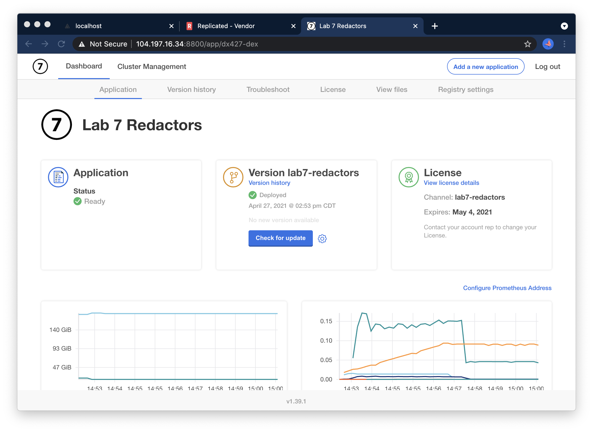

Lab 1.7: Redactors
=========================================

In this lab, we'll explore how Redactors work and learn the workflows that end customers can use to review and customize redaction of support bundles.
We'll study an app that has a container that logs sensitive information, and how to ensure that information is excluded from support bundles.

You can open the KOTS admin console* for your node by navigating to https://lab3-support-cli:8800 in a browser. The password to your instance will be provided as part of the lab, or you can reset by SSHing into the node and running

```shell
kubectl kots reset-password -n default
```

 
### The application

Unlike some of the other labs, you'll notice that in this case, the app is up and running but that there's no "open". 

That's to be expected.




### Redactors Overview

Let's straight away head to the Troubleshoot tab and collect a support bundle.

### Adding a Custom redactor

Once it's collected, navigate to the File Inspector tab and find the application logs.

You'll notice there's a secret being logged.


```shell
Tue Apr 27 19:54:00 UTC 2021 [info] the secret code is SW0RDF!SH

```

Reviewing the redactor documentation in the [troubleshoot.sh documentation](https://troubleshoot.sh/docs/redact/redactors/), we'll write a custom redactor to hide this 


If you need a hint, you can reveal an example redactor to hide the "secret code" from the logs.

<details>
    <summary>Reveal</summary>

```yaml
TO DO -- a Redactor
```
</details>